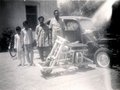

 A view of the first motorcycle/scooter built in Pakistan. Built by Hamid Omar, inspired by plans from Popular Mechanics.

It was built from pine wood because in those days I had no tools available, nor access to welding, steel etc. I needed a transport, and couldn’t buy one.

These were the days when nobody ever checked for things like licenses, etc – the old Lahore of 1960s. I used this bike for a few months.

The engine was a 4-stroke 200cc engine commonly used for pumps and small electric generators.

The motorcycle/scooter had no suspension, except for a coil spring under the seat.