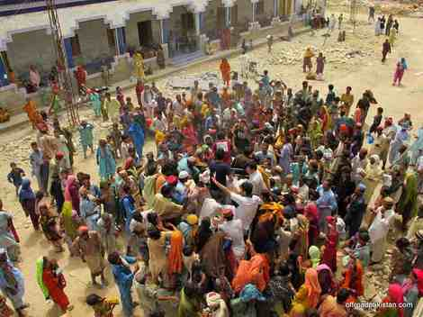
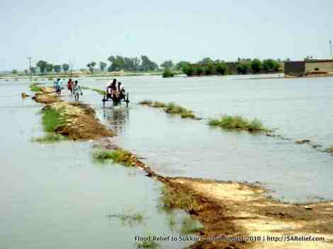
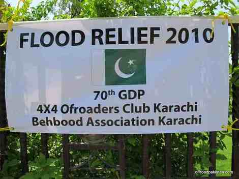
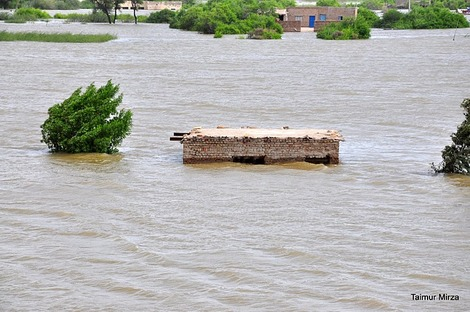
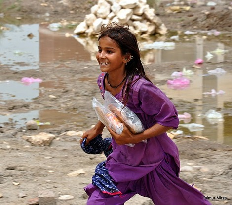
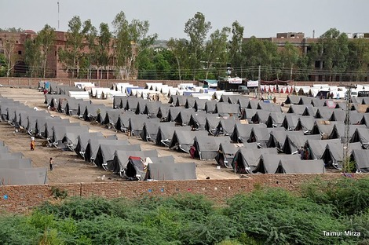
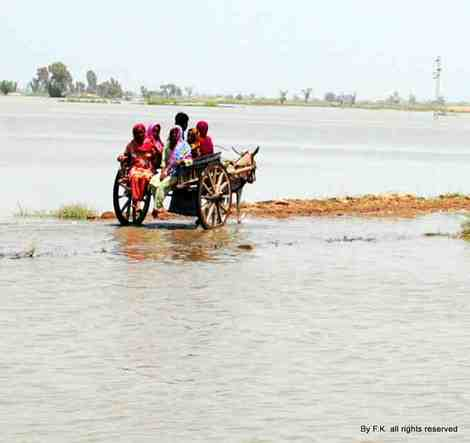

OffroadPakistan and friends have put together an effort to help people effected by the floods in Pakistan. We are providing relief ourselves (delivery and distribution) in Sindh area. Right now it’s food and essentials and temporary shelter. Next we would support run a refugee camp (our choosing of location) providing food, water, medicines/medical camps, clothing etc. Later help some really needful families to rebuilt their homes etc.

Since we are not an NGO, we have got the help of Behbood Association (local NGO) working far last 35 years – they have set up a separate account for us, they will manage, supervise and audit for us.

If any one wants to help contribution can be sent to this account ([details here](https://docs.google.com/document/edit?id=1GPRjRQwPkbHEcaVaXsTlxssa6_ZtALP7SIpdir1kNvk&hl=en#))

Please pass it on to friends!

Hamid Omar

To find out more check these out:

- [CNN on our relief efforts:](http://edition.cnn.com/2010/WORLD/asiapcf/08/24/pakistan.floods/index.html) [OffroadPakistan] club members, family and friends raised money for supplies to the neediest survivors.

- [OffroadPakistan member Awab Alvi AKA Teeth Maestro’s blog](http://teeth.com.pk/blog/) has regular updates on our relief efforts.

- [Faisal Kapadia’s Deadpan Thoughts](http://deadpanthoughts.com/) has frequent updates, as well as articles on DAWN Blog: [Unity needed](http://blog.dawn.com/2010/08/10/unity-needed/) and [A battle against time](http://blog.dawn.com/2010/08/16/without-a-roof-over-their-heads-2/).

- [SA Relief: Coordinating Disaster Relief for South Asia](http://www.sarelief.com/) also has updates.

- [Pictures from our 2nd relief trip](http://www.facebook.com/album.php?aid=242389&id=132462363668) are up on Facebook. Additional [pictures by Awab here](http://www.facebook.com/album.php?aid=213062&id=500836195). Some are posted here.

