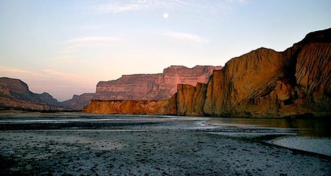
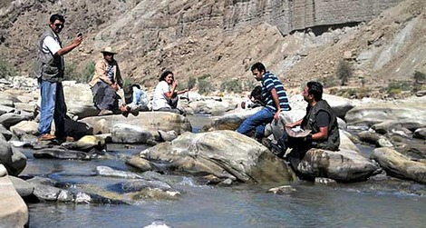
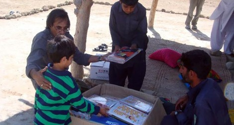
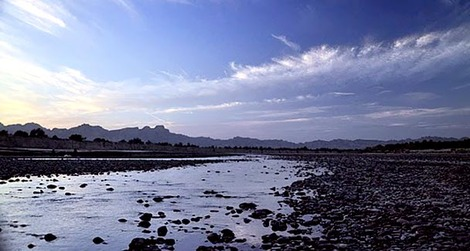
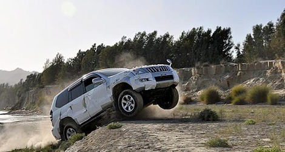
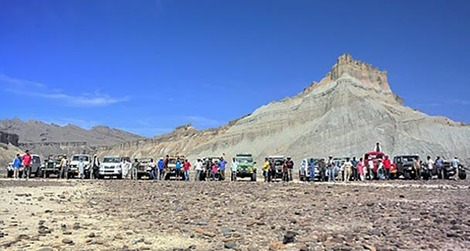

I stood there amongst the trees, the wind moving through the leaves, making a whistling sound. The entire campsite was bathed in bright moonlight, so bright that you did not need a torch to cook something. Before me, the [Hingol River](http://en.wikipedia.org/wiki/Hingol_River) flowed along lazily between the mountains, a silver serpent in a landscape that is otherwise harsh.

This reads like an excerpt from a fiction novel, does it not? Well one need only travel 240 kilometres from Karachi to make this fiction a reality. That is, if you have the gumption to make it out to [Hingol National Park](http://www.dawn.com/wps/wcm/connect/dawn-content-library/dawn/news/media-gallery/17-off+the+beaten+track-ek-01) in Balochistan.

I recently had the chance to do so with the team of adventure travellers known as [Offroad Pakistan](./along_the_hingol_river.html). I refer to them as a team and not a group of individuals because that’s what they are, and that’s what one needs to make it through the terrain of Balochistan, which comprises bogs, jungle, mountains, and quicksand with a few wahgus (local slang for crocodiles) standing in as an audience. On this trip, the team included inventors, photojournalists, lawyers, doctors and a few lowly scribes such as myself, all with one thing in common: “the love of nature.”

Off-roading is a peculiar pastime—it is neither camping nor hunting, but sometimes requires the use of both to survive. Off-roading involves a triumvirate of man, machine, and terrain, with the last pitting itself against the first two to see who will win. Well, we won, but it took us about a day of jolts, stuck jeeps, winching, and general mayhem to do so.

Our adventure began at around 8:00 a.m. on a Friday morning, and we made it to our campsite in [Hingol National Park](http://www.hingol.com/) by nightfall. Along the way we visited some schools where the ‘off-roaders’ distributed books and toys to children as well as planted saplings. The first school was just off the coastal highway near the Aghore coast guard base and was aptly named Aghore Secondary School. The other school, Hinglaj Secondary School, was in the middle of nowhere, in a part of Hingol from where villagers have to trek for eight hours to get water every single day. To my pleasant surprise, both schools were functioning and the children seemed bright and alert, excited about the books and stationary, but reluctant due to a lack of exposure to strangers.

Besides getting school books to the happy recipients, the point of this recent expedition was to off-road to a remote mountain gorge known as [Pol Dat](http://teeth.com.pk/blog/2010/03/03/offroad-expedition-poldat). This site was about 28 kilometres upstream from our campsite in the national park and is the point at which five different rivers merge to create the Hingol River, which then flows in to the Arabian Sea. About five years ago, some off-roaders from the group, which included Dr Mansoor, Taimur Mirza and Hamid Omar, had arrived at this location with some difficulty. Now it was our turn.

We started the climb up to Pol Dat early Saturday morning, stopping along the way for rest and strategic discussions. People think off-roading is similar to dune bashing practiced in the Middle East. On the contrary, off-roading requires strategising about how to navigate vehicles in and around a difficult landscape.

Suffice to say it took us about four hours to reach the dead end which the gorge before Pol Dat represents. The gorge is home to a blue lagoon and is surrounded by majestic mountains. The spot is absolutely untouched and so beautiful that it sets something primal racing within a person. Not being satisfied with this final hurdle, some members of the group made a further 40-minute-long trek to get to the other side of the gorge and the actual Pol Dat point beyond it.

This wasn’t the last of our thrills, though. On the way back to Karachi, we stopped at a [5,000-year-old Hindu temple called Nani Mandir](http://www.dawn.com/wps/wcm/connect/dawn-content-library/dawn/news/pakistan/provinces/16-between-devis-and-dams-hs-14). At the mandir, Hindu yatris from all over the world sang bhajans that echoed in the mountains, producing a very sombre and spiritual effect. The [temple](http://www.dawnnews.tv/wps/wcm/connect/dawn-content-library/dawn/news/media-gallery/02-a-hindu-mandir-in-hingol-02also)  boasts a fertility tunnel through which those who desire children pass to earn their wish.

A couple who had travelled from Mumbai to visit the mandir explained that the entire yatra involves visiting all three temple altars, passing through the tunnel, trekking up into the mountains, and finally bathing in a waterfall.

Hearing about my trip, some people may be tempted to ask, so, what’s the point? In response I can only say, what is the point of getting to a place where hardly a handful of people from this city will ever go, seeing nature in its full glory, eating food cooked on a camp fire made by pulling branches from trees, and bathing in a river dotted with crocs along its banks? One achieves a sense of being out of touch that only the wild can provide, where there are no laptops and no mobile phones, where the day does not revolve around Facebook or Twitter.

As a fellow off-roader quipped, “the rules of society do not apply here.” A brief sojourn such as this makes one wonder about the true worth of our greedy, rat-race societies. One also realises somewhere along the way that what we seek on vacations all over this world is available at a stone’s throw from one’s doorstep. All you need is the spirit to let go and off-road to the glory of nature.

Faisal Kapadia is a Karachi-based entrepreneur and writer. He blogs at [Deadpan Thoughts](http://deadpanthoughts.com/). This article was first published on [DAWN Blog on 17 March 2010](http://blog.dawn.com/2010/03/17/off-roading-to-hingol/).