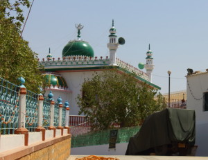
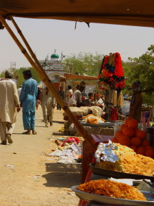

The *ghutter gou, ghutter gou* call of pigeons carries me into another dimension. An instant calm descends as I park my jeep and walk down a dirt path, through the wrought iron gates of a tiny green domed, white washed building which stands at a slight angle in its grounds. I have seen it from afar, a deep green, jumping out of the golden brown stretch of land that is being developed at break neck speed. A tiny mazar, I presume, like the many small ones that dot Karachi.

 The green dome that has drawn me doesn’t belong to a mazar after all, but to a mosque. Caught unaware by the stillness, the lack of devotees, or a congregation of any sort, I feel I have walked into a secret fragment of the past. A sense of peace prevails as pigeons swoop in great circles around the mosque, alighting, resting, taking off again. Opposite the mosque a short flight of steps lead to a large raised terrace, bordered by filigreed walls and shaded by trees. I imagine a moonlit night, incense and the sound of qawals reciting verses of Khusro. For a moment I forget where I am.

The mosque is located in a soon to be developed stretch of land which attracts people who are seeking to escape the claustrophobia of a haphazard metropolis that suffocates them with a toxic cocktail of threats. This space still affords a sliver of freedom and a glug of fresh air which skims across the sea as if it’s newly born. On weekends, bikers race against the wind recklessly vying with each other for attention, high on adrenalin, oblivious to danger. It’s a place where four wheeling off roaders, with their hankering for wilderness, find a quick fix. They nose their vehicles precariously into katcha ditches where keekar trees have not yet been burnt, and where like the teetar who find refuge here, they too can forget that they are on the edge of a concrete jungle and not a pristine nature reserve. This will not be possible to do for much longer. Over the years the natural landscape and the shoreline here has succumbed to the insatiable hunger of urbanisation which can be heard in the growl of bull dozers and sand diggers eating away at the last stretch of open land between the city and the sea.

The caretaker of the mosque informs me that there is no electricity here and that if I want to pray, I should do so before night falls and it becomes dark. I open the netting door and venture in, wrapping my duppata around me. There is a man in jeans who has just finished praying and he seems quite unruffled as I take my place on the immaculately clean carpet. A faint scent of incense wafts through and once again I am overtaken by a deep sense of calm.

Over a cup of tea from the langar, the caretaker proceeds to tell me the story of the man who built the mosque in the 80s. He was a holy man, a saint, says the caretaker. He lived here in a shack when this land was completely undeveloped and the sea was still unclaimed. He owned a jeep and possessed mystical powers which enabled him to drive the vehicle over and under the ocean waves as if he was traversing sand dunes. This ability earned him the title of Samandari Baba. I can’t believe my ears. I am sitting in this serene little mosque, which was built by the ultimate off roader, a mystic jeep owner, a free spirit, an adventurer saint. He had roots in Iran and Kashmir, and trekked from Lahore to Karachi as part of his spiritual journey, making stops at Lal Shahbaz Qalandar’s shrine in Sehvan, at Shah Noorani and Mango-Pir. His mosque appears to be free of all prejudice and bias, open to all, a space where one can pray, relax, meditate and contemplate regardless of gender or sect.

Curious to know more I return to the mosque several times and discover that Samandari Baba who passed away in the nineties is buried off the National Highway and his jeep stands alongside. I also come to know that Baba’s Urs will be taking place shortly. Determined to close this loop and make sure that he was indeed a jeep owning mystic sufi saint, I set off to find Samandari Baba’s resting place.

The narrow road to Samandari Baba’s Mazar swerves off a link road, this too on land that’s on the verge of being devoured by construction. Apparently the place was once Samandari Baba’s secluded meditation spot, but now the city is closing in, and residential plots have already been carved out. I pass groups of women and children trekking to the mazar on foot and feel reassured that there are others like me making this journey. While most Sufi saints’ mazars that dot Sindh are centuries old, this one is in its infancy. I realise that those that are flocking here for the Urs are the first generation to do so.

 Unlike the secluded quaint mosque, the mazar appears to be modern and urbanised. Vendors line the track leading to the entrance. On offer are nuts and dry fruit and surprisingly delicious melt in your mouth nan khatai, kept warm on coals. There are clay diyas and utensils coloured with sparkly paint. Pale pink watery pomegranate juice is available, as well as fluorescent orange orange juice. Instead of fresh flower garlands, colourful ones made from yarn strung with tassles and pom poms are on display. Just inside the gates, three turbaned and bearded men sit behind a table adorned by plastic flowers that quiver in time with the music blasting from speakers nearby. Conversation with them is out of the question because of the music and the disdainful looks on their faces.

A hard sun beats down to compliment the equally harsh rules that are in place. Segregation, no cameras, no visits inside the shrine by women during the urs. Sadly the peaceful and egalitarian spirit of the little green mosque does not prevail here. I am sure that Samandari Baba wouldn’t have welcomed me or the other women who are trekking here bare foot, by closing his doors to us. However the shrine is now in the hands of a dogmatic and conservative group of people steeped in their own biases and notions.

I turn away, disappointed.

As I leave I catch a glimpse of a jeep behind closed gates, hidden under a canvas cover. All at once the locked gate, the unbending rules and regulations, the mullahs orchestrating the urs seem meaningless. In my mind’s eye I see a man with a flowing white beard, eyes sparkling, escorted by seagulls above and fish below, as he cuts through the waves of a blue green ocean.

“You won’t understand - It's a Jeep thing” I silently say to the turbaned men as I leave.

Perhaps one day, I will return on a normal day when there are no crowds and no rules. The terrain around the mazar is perfect for off-roading and I have once camped nearby a few years ago with my Offroad Pakistan friends. Whether I return or not, I smile at the thought that perhaps a few centuries down the road, Samandari Baba’s Mazar will be a historic site and his jeep an ancient relic to be marveled at by future generations who visit the mazar in their futuristic all purpose vehicles, good to go on land, sea and air!