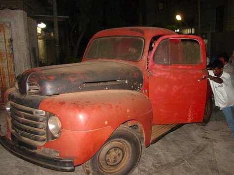
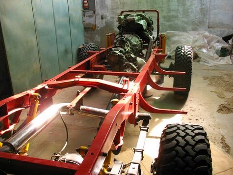
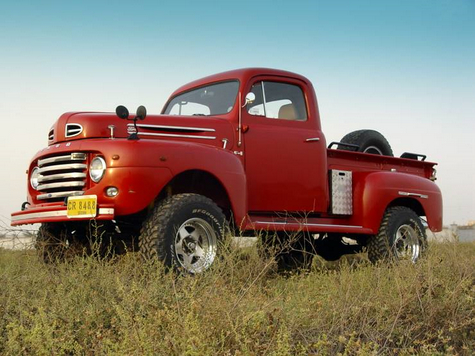

Soon after we got married, my wife Sabiha asked me to get a Ford F1 truck for her. I tried my best but could not find any in Pakistan. Some thirty years later, on one of her visits to America, she found one in a small town called Dry Town near Sacramento, California. She convinced the owner to sell it to her and I think she got it for $140 (exact amount she has not told me – only that it cost more to have it towed to our friend Javed Akber’s house in Sacramento). Till we could figure out how to have it shipped to Karachi, for over a year the Ford truck remained parked in Javed’s garage (while their own two cars remained out in the open).

For a while I thought it near impossible that we would be able to get the necessary paperwork done to import it into Pakistan. Then one day we happened to meet a friend in Karachi, who offered to have it delivered to our doorstep in two months. Not really believing him, we asked him to please do so, and to our surprise he did exactly that! There was some delay though at the port as the custom people could not figure out why someone would import such an old beat-up ugly truck. They thought there was something more to it than meets the eye! Eventually they said they will treat it like a new car and charge duty on it accordingly – they too were surprised when we got them the original new Ford F1 price from the Ford Motor Company, it was $1400 for the 1948 model! Eventually they let us take it – we did have one other small delay though, when we were exiting the dock’s gate, some guard thought we were actually smuggling out the new looking tow truck with the beat up truck on it as a disguise! Well once the truck was home, I realized that now I was finally faced with the gigantic task of rebuilding the truck to the high expectations of Sabiha!

First something about rebuilding of cars in Pakistan – many people rebuild 4×4 vehicles and that too mostly Jeeps with the original petrol engines replaced often by a rebuilt Toyota diesel engine and transmission. Toyota engines are very popular here as old engines and the new parts needed for them are commonly available and over time they have proven to be very reliable. Labor being relatively cheap, a lot of extensive work on the body, frame including modifications is possible. But it usually takes a long time and personal involvement to get the job done at commercial workshops so one needs to have a lot of patience! I am lucky to work at a place where I have my own workshop with a full time mechanic, electrician, denter and painter. The workshop also has access to an in house machining and fabrication facility.

After just sitting and staring at the old Ford F1 for quite a long time and finally having figured some basic things out with the help of my friend Taimur Mirza, the rebuilding started with dismantling the whole vehicle into its smallest parts. The major decision was to make the vehicle off-road capable (originally it is a two wheel drive with a rather low clearance and a small engine) by installing a 1992 Toyota Land Cruiser 4.2 liter turbo charged diesel engine, 4 speed automatic transmission and drive train. In other words, it would be a Ford F1 with a reliable Toyota Land Cruiser underneath – making it fit for the many future off-road trips.

All the parts were stripped clean to bare metal using paint remover, sand papers and lots and lots of physical effort! The chassis needed a bit of straightening and the engine mounts were modified to take the new bigger engine and transmission. The chassis was welded and strengthened where needed. The Land Cruiser differentials were originally coil spring mounted – they were modified to take leaf spring suspension. Initially all the welding and modifications was done on a temporary basis in case some changes were needed to be done. Engine, transmission, suspension and differentials were installed and drive shafts fitted. Radiator and transmission oil cooler mount was done within the space of front end grill. With not much space left, it was decided to mount the air conditioning cooling coil underside of the passenger cabin. This would also help keep the engine cooler – an important consideration in our hot climate here. Next the passenger cabin was fixed – the fire wall and the floor were modified to make space for the bigger engine and transmission. The steering wheel and brake pedals etc. was moved to the right hand side and this meant the modification of the whole dash board also. This was done to cater for driving on the left hand side of the roads in Pakistan. Power steering box was fitted taking into account that the linkage etc. did not interfere with anything else. Side walls off engine compartment and front grill were installed. Then in the remaining tight space installation of power assisted brake/master cylinder, air cleaner, radiator over flow water bottle as well as wiper water bottle, fuse box, diesel filter etc. were done.

Next came the work of figuring out the best straight through path for the silencer piping. To ensure longevity this was done all in stainless steel. Pipe used is of 3” diameter to minimize any back pressure. Silencer system was hung using rubber bushings and mounts similar to those used in shock absorbers to ensure no way the system could fail in the beating it gets in the tough off road conditions. On the off road trips, I have seen too many systems fall off literally so I made sure mine wouldn’t. All the body trims etc. were ordered from a shop near Sacramento. Nearly every part needed is available from there.

Once the whole truck had been assembled and checked for proper fitting, it was then disassembled again. All temporary welding were strengthened, parts cleaned and painted red and then the final reassembly was done. Then came the work of wiring, upholstery and installation of the rear body wooden floor. After taking a test ride round the block, the paint was rubbed and polished. The truck is now on the road and is being fine tuned to be ready for a trip to the northern areas next month. Meanwhile it can be spotted on the streets of Karachi painting the town red!

### Specifications of modified Ford F1:

* **Engine:** 1HD-T, a 4.2 liter, Turbo charged, in line 6 cylinders, Diesel, non EFI

* **Transmission:** 4 speed automatic with low/high gearing

* **Drive Train:** Fulltime 4 wheel drive with limited slip rear differential and electronically controlled center locking differential.

* **Suspension:** Leaf Springs front and rear, twin shocks

* **Steering:** Rack and pinion, power steering

* **Brakes:** Power-assisted 4 wheel disc brakes

* **Ground Clearance:** 20 inches

* **Silencer:** Straight through design, stainless steel

* **Fuel Tank:** 75 liters

* **Body Color:** Fire Engine Red

* **Water Tanks:** 2Nos. 30 liters each, for use while camping

* **Interior:** Bucket Seats – hydraulic mounted, air conditioned, coffee maker etc.

* **Winch:** Rear mounted, 5,700 Kgs pull, electrically operated

* **Tyres:** BFgoodrich Mud-Terrain T/A LT 285/75 R16

### links elsewhere

* [Jay Leno’s Garage](http://www.jaylenosgarage.com/your_garage/cars/5465.shtml)

* [Ford Trucks forums](http://www.ford-trucks.com/forums/658140-ford-f1-1948-rebuilt-in-pakistan.html)
