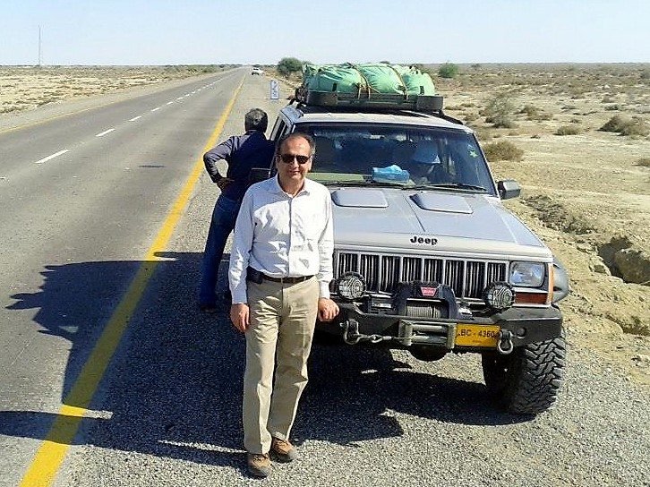
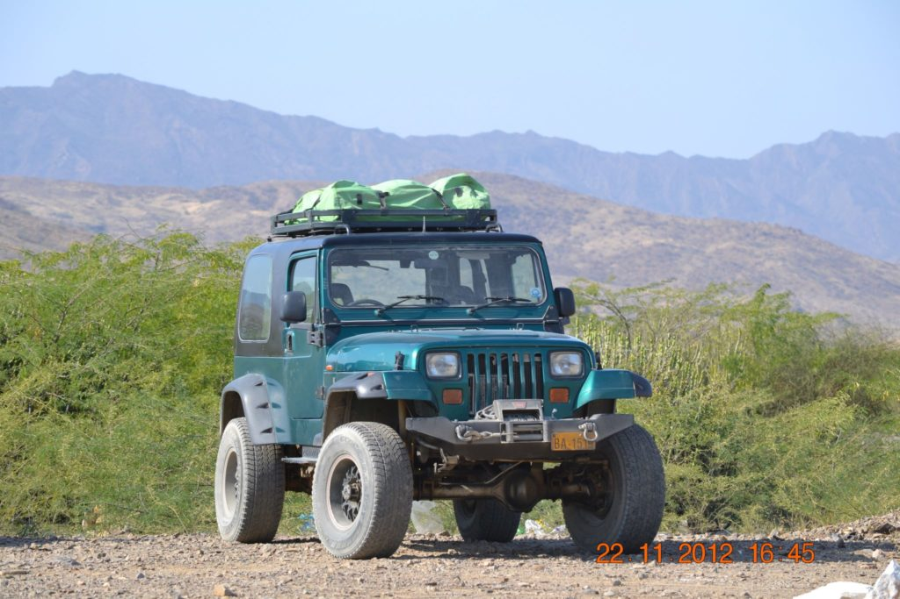

[caption id="attachment\_974" align="alignnone" width="726"] Photo credit - Khizar Rashid[/caption]

**Member Profile:** Pilot of the lifted Cherokee, and sometimes the dark green Wrangler YJ

**Vehicle #1:**1996 Cherokee XJ

**Engine:** 4.0L inline six

**Purchased:** 1998

**Gearbox:** Aisin 340H Automatic with overdrive

**Axles:** Dana 30 front, Dana 44 rear with ARB air locker differential and Moser axles

**Suspension:** Old Man Emu 3" lift

**Tires:** Cooper Discoverer STT MT 285/75R16

**Winch:** Warn XD9000i

**Vehicle #2:** 1994 Wrangler YJ

**Engine:** Toyota1KZTE 3.0 liter 4 cylinder turbodiesel

**Purchased: ???**

**Gearbox:** Aisin 340F automatic with overdrive

**Axles:** Toyota Prado with 4 wheel disc brakes

**Suspension:** Spring over axle suspension lift

**Tires:** Cooper Discoverer STT MT 285/75R16

**Winch:** Warn XD9000i

**Other specs:** Body extended 6" between door opening and rear wheel, roof rack integrated into hardtop.