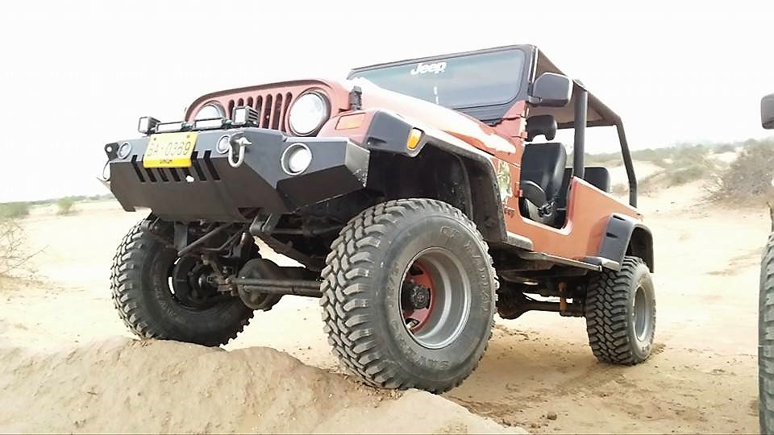
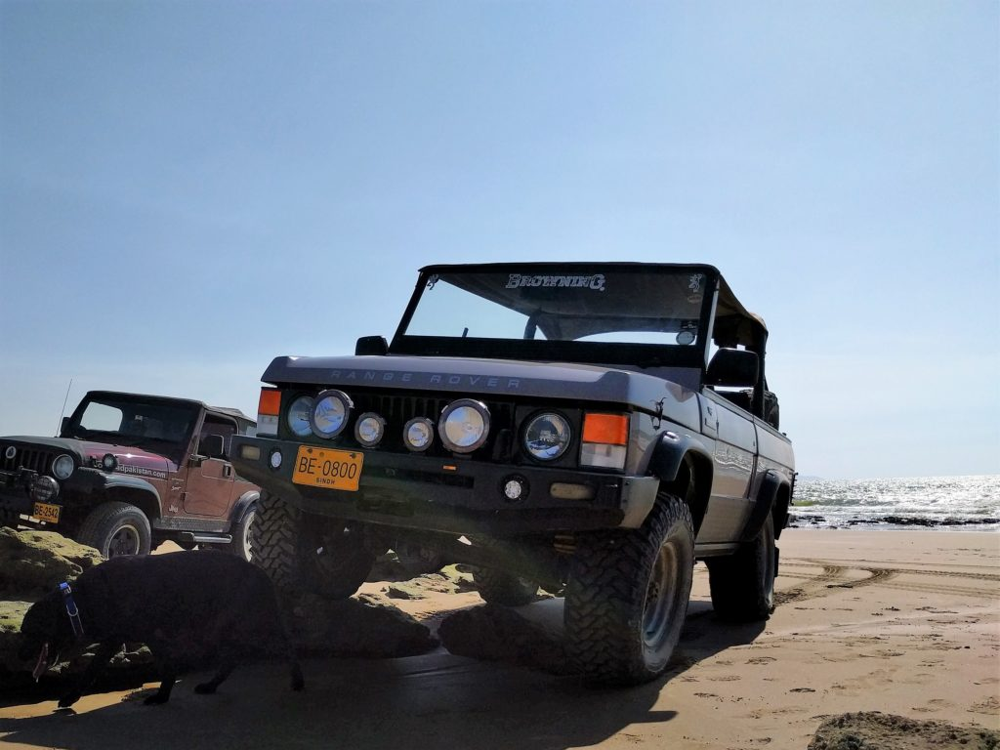

**Member profile:** Founder Member 4x4 Offroaders Club Karachi, Hunter, photographer, conservationist, occasional daredevil, and fulltime maxillofacial surgeon.

## **Vehicle #1:** CJ5

 Photo credit - Yaseen Ali

**Engine:** Toyota 2JZGE 3.0 liter inline six

**Purchased:** 1986

**Last Rebuilt:** 2013

**Transmission:** Toyota R151F 5-speed manual with Toyota t-case

**Axles:** Toyota Prado units front and rear with 4-wheel disc brakes, front electronic locking hubs and rear electronic locking differential

**Tires:** 33x12.50 Sumitomo MT on 15x10 steel wheels

**Lighting:** H4 headlamps, LED foglights, HID driving lights

**Other Specs:** Custom front bumper, custom spare tire carrier, custom roll bar, 12" extended wheelbase, spring over axle suspension lift

## **Vehicle #2:**Range Rover

 Photo credit - Imad Ali

**Engine:** 3.5 liter gasoline V8 converted to dual barrel single carb intake

**Transmission:**Toyota H151F 5-speed manual with on-the-fly 4x4

**Axles:** Stock Range Rover units

**Tires:** Cooper Discoverer STT MT 285/75R16

**Suspension:** 2" lift coil spring multilink front and back

**Lighting:** H4 headlamps, LED foglights, HID driving lights

**Other specs:** Ambulance spec body with rear bench seat converted to fully open style with roll bar with bikini top and pickup bed, extended fender flares, custom front bumper, work lights, field canopy system, and HD aluminium radiator