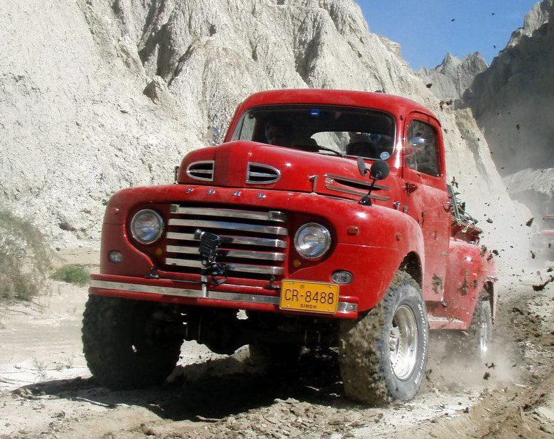

 Photo credit - Imad Ali

**Member Profile:** Founder Member 4x4 Offroaders Club Karachi. Prolific designer, inventor, builder of the most unique 4x4s, one-time sailor, all time rear guard on and off the road, and the official soup maker of the group!

**Vehicle:** 1948 Ford F1 pickup truck

**Engine:** Toyota 1HZT 4.2 liter inline six turbodiesel

**Purchased:** 2005

**Rebuilt:**2007

**Transmission:** Aisin A340 automatic transmission with full 4x4 t-case

**Axles:** Land Cruiser 80 series with 4 wheel disc brakes

**Tires:** Michelin 35x12.50

**Other Specs:** Spring over axle suspension lift, extended fuel tank, Toyota HD winch, under-bed water tanks, HD power inverter.