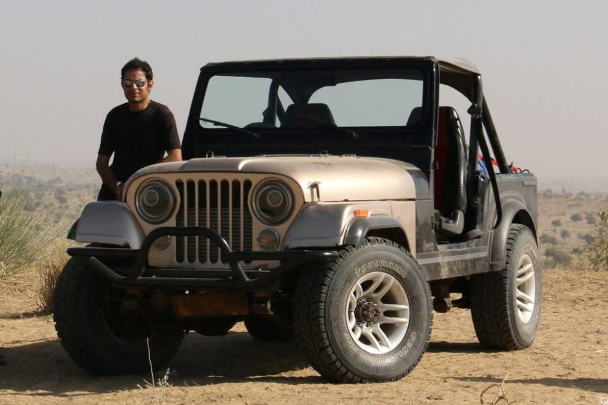
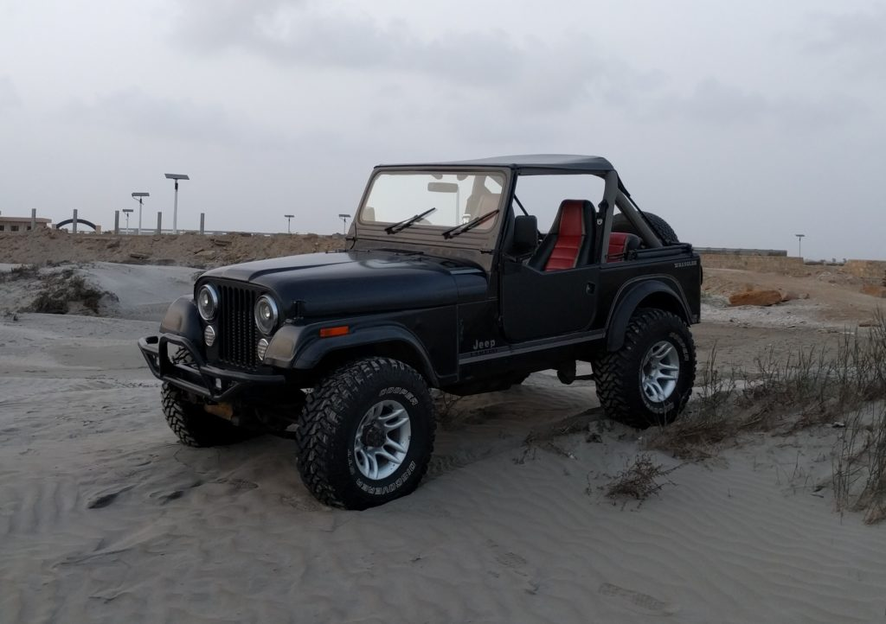

**Member Profile:** Founder Member 4x4 Offroaders Club Karachi. EFI wiring expert, master mechanic and fabricator. Also the resident mad scientist and speed freak of the group. Always in search of more torque.

**Vehicle:** 1979 Jeep CJ-7

**Purchased:** 1997

**Rebuilt:** June 2000, December 2013

**Engine:** Toyota 2JZGTE 3.0L twin turbocharged inline six

**Transmission:** Toyota R151F 5 speed manual

**Transfer Case:** Toyota Prado case with 2 Lo option

**Front Axle:** Toyota BJ40 Land Cruiser, 3.70:1 R/P ratio

**Rear Axle:** Toyota BJ40 Land Cruiser, 3.70:1 R/P ratio

**Brakes:** Front discs with 4-piston calipers and rear drums

**Tires:** Cooper Discoverer STT 33x12.50 on 15x8" alloy wheels

**Suspension:** 2"lift CJ-7 rear leaf springs all around with KYB shock absorbers, polyurethane bushings. Rear springs outboarded.

**Steering:** Power assisted, Momo steering wheel on Wrangler YJ tilt column

**Lighting:** Bosch D2S bixenon projectors in custom headlight housings with DDM slim ballasts and 8000K bulbs. Cree LED foglights.

**Sound system:** Cheap Chinese head unit with Pioneer and Alpine speakers and Kenwood amp with 12"  sealed enclosure subwoofer.

**Other specs:** Custom built bumper, Supertop by Bestop, Custom half doors, 3" exhaust system, fuel cut defender, boost controllers, boost gauge, Walbro 340 255 LPH fuel pump, Action 6 puck clutch HD pressure plate with custom flywheel.