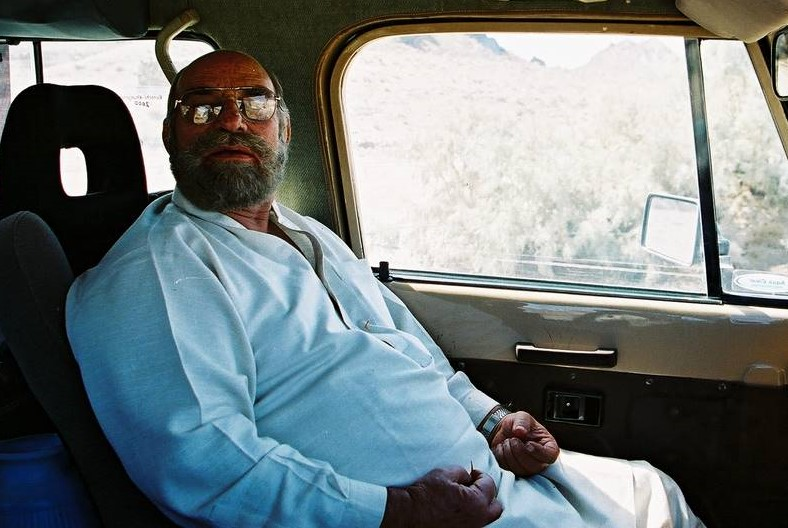

**Member Profile:** One of the oldest members of the club, Khan Sahib has done more offroading than one can imagine. Immensely popular with young and old alike, there's never a dull moment to be had in Khan Sahib's company. Also the original karahi cook of the group.

**Jeep:** M38A1

**Engine:** Toyota 3B 3.4 liter 4 cylinder diesel

**Purchased:** Too long ago to remember. Completely rebuilt

**Gearbox:** Toyota Dyna 5-speed manual

**Axles:** Dana 30 front, Dana 44 rear

**Tires:** MIlitary type 7x16

**Other Specs:** Many alterations. to be listed later.

**Jeep Profile:** A simple but reliable rig built for hunting and exploration.