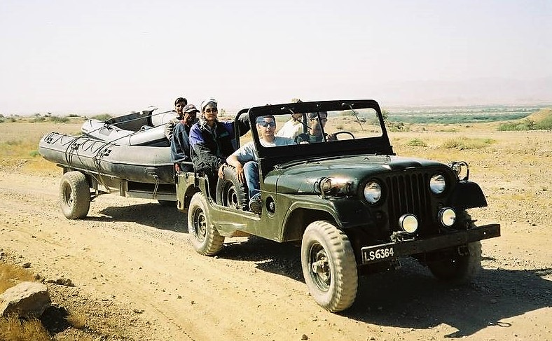

 Photo credit - Imad Ali

**Member Profile:** Founder Member 4x4 Offroaders Club Karachi. A falconer first and everything else a distant second. Also very fond of hunting, fishing, camping, traveling, writing and photography.  “Rover, wanderer, nomad, vagabond, call me what you will!”

**Vehicle #1:** 1963 Jeep M-170 military ambulance

**Purchased:** 2002

**Rebuilt:** 2004

**Engine:** Toyota 2L-T 2.4 liter 4 cylinder turbocharged diesel.

**Gearbox:** Toyota Dyna 5 speed.

**Transfer case:** Twin stick Spicer 20.

**Front Axle:** Dana 30, 4.11:1 R/P ratio, free wheel hubs.

**Rear Axle:** Dana 44, semi-floating, 4.11:1 R/P ratio.

**Brakes:** CJ-5 11” drums on both axles

**Tires:** Military style 7×15

**Wheels:** 15×7 factory steel rims

**Suspension:** Stock with BDL / Monroe shocks

**Steering:** Recirculating ball multilink

**Lighting:** European spec headlights 60/55W H4 bulbs; footwell, engine bay and under carriage worklights also

**Sound system:** Turbocharger mounted approx 3 ft from driver’s right ear

**Other specs:** Dual spare tyres,dual jerry cans, original two-piece military style fold-out split windshield, highest number of storage areas and tool boxes, double digit seating capacity

**Vehicle #2:** 1979 Jeep CJ-7

**Profile:** This Jeep was bought in 1997 from a friend whose wife said he could keep either her or the Jeep. So the good Samaritan that he is, he passed on the lesser burden to me. In September 1999, what started off as a month long paint job, ended up being a half-year long complete rebuilt, which saw the Jeep being stripped right down to the frame, and virtually every moving part was replaced. The only “old” part left at the end of the rebuilt was the frame, the body and the axle tubes

**Engine:** Toyota B, 3.0L 4-cylinder, naturally aspirated, indirect injection diesel

**Gearbox:** Toyota Land Cruiser, 5 speed, H-55

**Transfer case:** Toyota Land Cruiser, dual range with special 2 wheel drive low range option

**Front Axle:** Toyota Land Cruiser, closed knuckle, 4.11:1 R/P ratio, free wheel hubs.

**Rear Axle:** Toyota Land Cruiser, 3/4 floating, C-Clip, 4.11:1 R/P ratio.

**Brakes:** Dual circuit with power assist, discs with 4-piston calipers up front, 11”x 2.75” drums out back

**Tires:** Bridgestone 31×10R15 Desert Duelers.

**Wheels:** Mangel 5-spoke offset alloy rims.

**Suspension:** Rancho RS 9000’s 5-stage shock absorbers. Currie 2” lift greasable shackles, polyurethane bushings.

**Steering:** Saginaw power-assisted steering, 3.5 turns lock-to-lock. Momo steering wheel.

**Lighting:** Bosch off-road headlamps fitted with Sylvania Cool Blue 60/55W H4 bulbs; Hella 500 (100W) driving lights. Rear off-road lights 2×55W Hella lamps. Fully illuminated cabin, footwell, engine bay and under carriage.

**Sound system:** Pioneer head unit with cassette and radio, 7 band equalizer, Pioneer 3-way custom mounted 120W speakers

**Other specs:** Warn 8274 winch (8000 lbs load rated), custom built bumper and roll bar, K&N Filter Charger, Xenon 5” polyurethane fender flares, airconditioning, customized interior with front racing seats and rear bench seats, half doors, custom made full-top and bikini top.