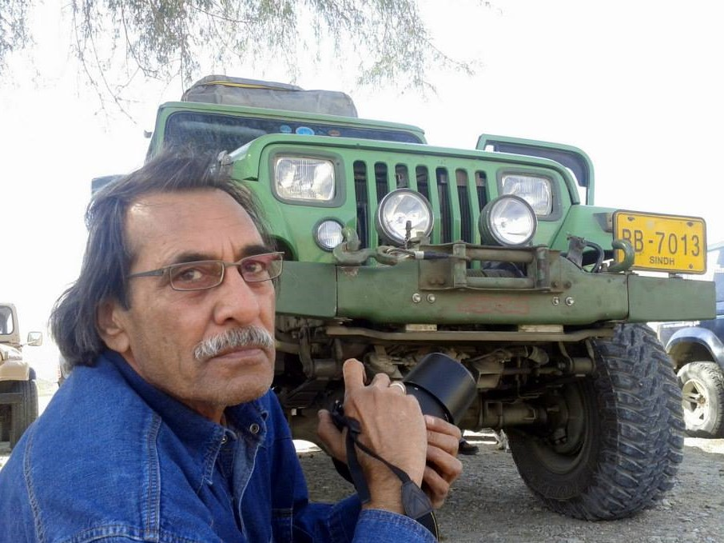
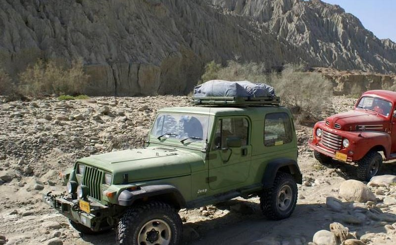

](./1013932_10153676888035577_2050943439_n1.jpg) Photo credit - Khizar Rashid

**Owners Profile:**Founder Member 4×4 Offroaders Club Karachi. Angler, conservationist, photographer, explorer, innovator & guru of all things mechanical, as well as master scrounger of Shershah and other assorted scrapyards with an uncanny ability for procuring the hardest to find parts. Also the unofficial karahi cook of the group.

**Jeep:** Wrangler YJ

**Engine:** 1KZ-TE (EFI-EGRV)

**Purchased:** 1997 (Re-built). Last rebuild: 2011

**Gearbox:** 4 Speed Automatic Aisin 340H

**Axle:** Toyota Prado axles with 4.56:1 ratio R/P

**Tires:** Cooper Discoverer STT MT 285/75R16

**Other Specs:** Body extended 6" between door opening and rear wheels, spring over axle suspension lift,  Toyota Prado axles, 4 wheel disc brakes, HD Toyota winch, Water-to-air intercooler, bucket seats, power windows, multispeaker sound system, extended fender flares.