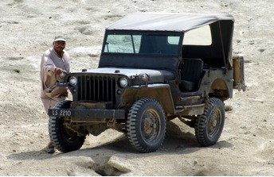
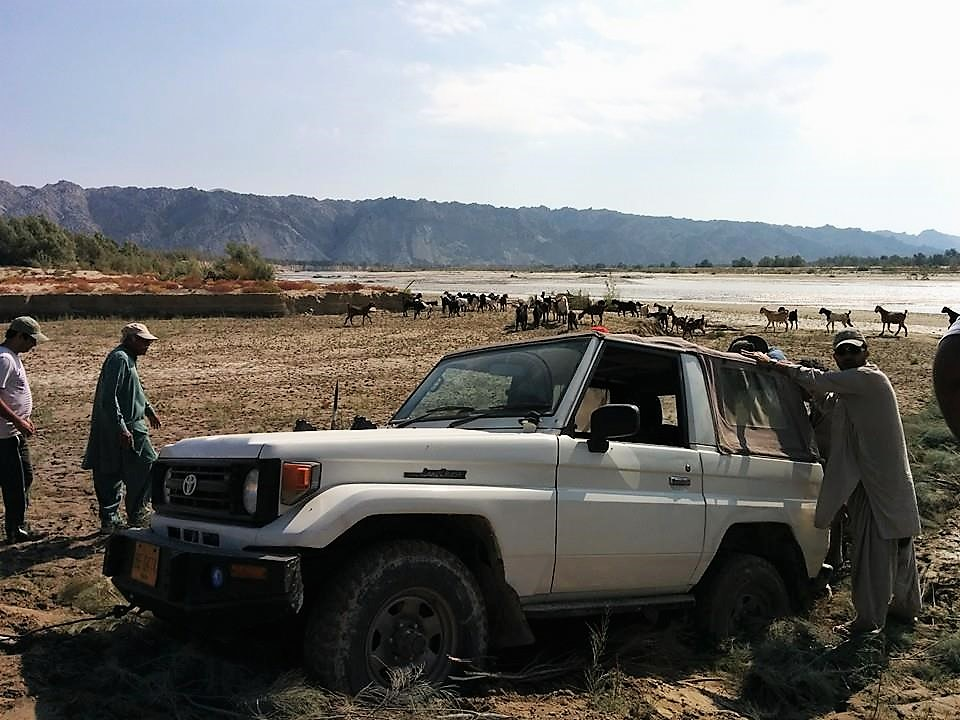

 Pappu Saheb and his WW-II Jeep!

**Member Pr****ofile:** Intrepid traveller, fearless offroader, from the old school of outdoor adventure, the eldest member of the group,   

**Jeep:** 1942 Ford GPW  WWII vintage Jeep

**Engine:** Toyota 2C engine

**Purchased:** A few decades ago.

**Gearbox:** Original Ford gearbox

**Axles:** Original

**Tires:** Military tyres

**Other Specs:** Nearly unstoppable

 

Photo credit - Imad Ali

**Vehicle #2:** 1986 Toyota RKR Land Cruiser

**Engine:** 3B 4 cylinder diesel

**Transmission:** H55F 5-speed manual

**Tires:** General 7x16 MT on steelies

**Other specs:** Soft top with fold down windshield and rear barn doors.