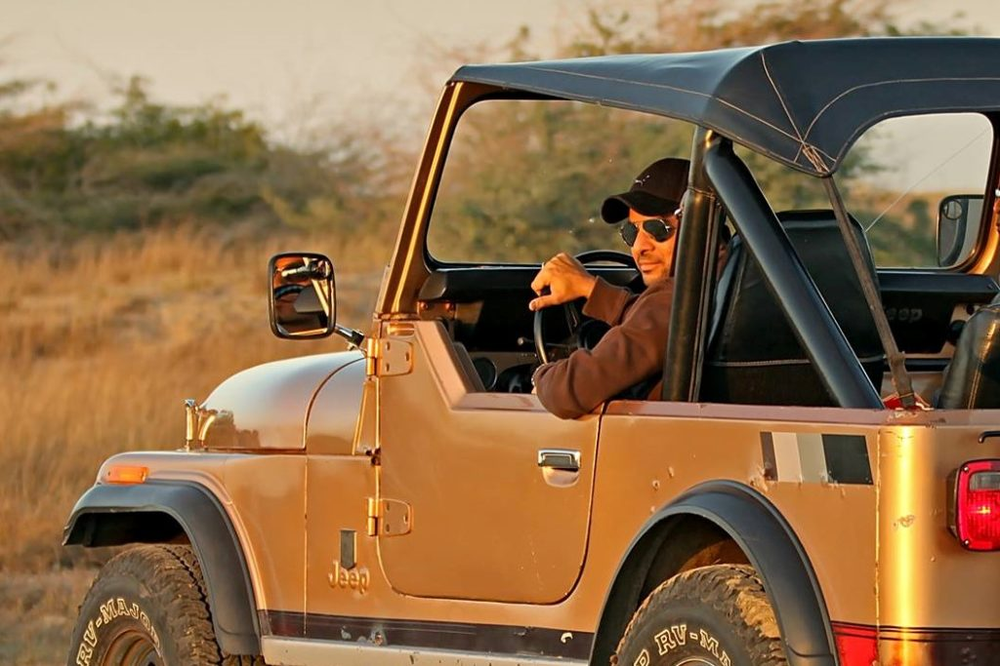
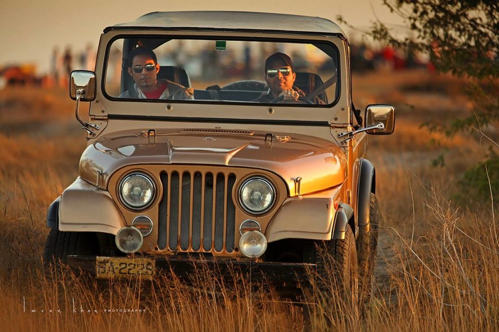

[caption id="attachment\_970" align="alignnone" width="474"] Photo credit - Imran Khan Photography[/caption]

**Member Profile:**Founder Member 4x4 Offroaders Club Karachi. The youngest of the Mir brothers is an outdoors addict, long distance driver ready to go anywhere at the drop of a hat, avid photographer, sometimes hunter, party animal, resident tikka barbeque-ist, and above all, a Jeep aficionado since infancy. "I like my life in the city because it makes me long for the outdoors. I enjoy creature comforts but working on my Jeep on a Saturday afternoon has its own pleasure."

**Vehicle:** 1982 Jeep CJ7 Jamboree 30th Anniversary Commemorative Edition Issue No. 0044 of 2500

[caption id="attachment\_972" align="alignnone" width="474"] Photo credit - Imran Khan Photography[/caption]

**Purchased:** 2004

**Rebuilt:** Not yet

**Engine:** Toyota 1UZ-FE 4.0L 32 valve V8

**Transmission:** Borg-Warner T5 5-speed manual

**Transfer Case:** Dana 300

**Front Axle:** Dana 30, 2.73:1 R/P ratio

**Rear Axle:** AMC 20, 2.73:1 R/P ratio

**Tires:** Dunlop SP/RV Major 31×10.50

**Wheels:** Original Jeep 15x8” chrome wheels

**Suspension:** Stock CJ7 leaf springs with KYB shock absorbers

**Steering:** Factory tilt column with recirculating ball Mercedes steering box

**Lighting:** Bosch H4 with Osram Silverstar bulbs, Hella Comet 500 driving lights

**Sound system:** Borla true dual exhaust

**Other Specs:** 4 wheel disc brakes with dual diaphragm booster, LED worklights, functional safety belts, factory center console, half doors, full doors, hard top and padded roll bar

**Jeep profile:** It’s copper in colour with a black hard top, chromed 15 inch steel wheels, stainless steel rear bumperettes, tow hitch and standard front bumper. Equipped with a T-5, it has extremely tall gear ratios, which make it feel car-like but the Dana 300’s granny low gearing makes it quite capable off-road. Originally acquired with an antiquated Toyota 3.0L NA diesel engine, the Jeep now has a V8. Apart from the engine, even after 23 years this Jeep has surprisingly retained most of its originality – it even came with the original space saver donut spare tire!