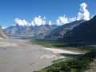

## K2 Base Camp trek diary, the introduction

In the summer of 2007, I went hiking to Concordia and onwards to the base camp of K2, along with 4 friends, a guide, and 13 porters. I maintained a diary throughout the hike so I could write a detailed article once I got back – the following is my diary for the K2 base camp trek.

Before setting out on the hike, I had looked up practically everything on the internet about the hike to Concordia, the acclaimed *'throne of the mountain gods'*. I wasn't too happy with the information available on the internet, so I wanted to write a comprehensive article on the whole experience. Eight months later, that article remains unwritten, and after much head scratching, the simple answer is that *words can't do the experience justice.*The pictures of the trip, while certainly nice, and some are downright amazing, fall short. So instead of a article, the following pages contain my notes from the my diary of the hike.

This was my first major hike, and it's made me into a convert - I plan to go explore as much of the world as I can by human powered means - really, it's the only way to see the world.
The plan is simple: Hike to K2 base camp, and back over the Gondogoro LA pass!! 26th June if all goes well we take the flight to Skardu – so stands the plan. You can [see our initial plan here](http://docs.google.com/Doc?id=a27fgdb8g4_29cj2xp9).

For what really happened, read on!

### The time up to June 18th, 2007

A lot of planning went into organizing everything. Nabil's recommendation of Mohd. Nazir of Indus Motel in Skardu made things a lot easier for us, as he gave us good and accurate advise on the actual hike.

#### The actual plan is outlined over here, but the three main sources used:

* Nabil (and others) – people who had previously done this trek, so their advise was very welcome
* The internet – there seem to be hundreds of companies arranging guided tours, so we used their pre-planned itineraries to chart our own.
* Mohd. Nazir - the most essential part of the planning process, he helped us to organize the porters, arrange the food and kitchen equipment, found us a reliable guide etc.

**Tents:** Mountaineering tents are available in Skardu at 7-10K, and we might just need to buy one. Though later on we found out that our best option was to have bought tents from Higher or Zuflah in Lahore.

#### Media Plan

* This trip diary, to be filled out daily, hopefully by all of us. *that didn't happen!* After the trip, this will be handy for putting up a travelogue.
* Photos - 2 Gigs by 4 memory cards means a lot of photos, about 3200 or so! *Ended up taking 2500 plus photos*
* MiniDVCamcorder – Bought by popular demand of the entire group, turned out not to be such a good idea. Took 18 hours of tape and enough battery. *ed: ended up in the river.*

Note: next time will take along a handcranked OLPC type laptop to type stuff out. Or a low power tablet with a small kb along with a solar charger and battery pack.

#### Preplanning, June 2007

The planning is always a major part of every trip, and this being the first time for everyone we had a lot to do, things to find out, equipment to purchase and in between try to get in some exercise.

Just a few days before we meet in Islamabad, everything is arranged by now, have booked a couple of rooms in Rawalpindi, borrowed a GPS, and did a final few calls to Skardu. Mhd. Nazir must have gotten sick of our calls, as we grilled him about every small detail!
The bad news is that 2 crevasses are blocking the route to Gondogorola, and 5 teams have returned without attempting the crossing.

Hopefully, by the time we get to Skardu it should be passable.
Another piece of advice: Locals are prone to exaggerating difficulties to extract money out of suspecting trekkers, so be aware. Keep noting the altitude every few hours, and if someone gets sick, it is very useful in figuring out what altitude caused the problem and thus what height to go back down to.

Were told that there is a hiking and mountaineering store in Rawalpindi called Gownhouse on Murree road, went there but found nothing particularly useful, the few good things were hideously overpriced.

More news from Skardu on the 25th: The route to Gondogorola is shut, but some professional expeditions have provided equipment (dynamite, portable bridges etc.) to reopen it. There is a 35 feet wide crevasse blocking the route. Might be impossible to cross this summer.

Four of the five team members are in Rawalpindi now, and booked on the morning flight to Skardu. The fifth person is going to arrive a day later.

## And we drive off to Skardu, June 26th

The day dawned bright and clear, and after hearing so much about how often the flights to Skardu got canceled, we were relieved at the almost cloudless day. Rolled up to the airport, got boarding passes, and sat about in the lounge, staring at the Skardu bound plane being prepared right outside the waiting room window. Murphy (or was it the weather) struck at the last minute – the flight got canceled, and there we were, stuck without an alternative!

After debating for a while about what to do, made a few phone calls and rented a Hiace van to Skardu, and set off at 12:30pm from Rawalpindi on the Motorway – very little traffic, fast going. The towns along the way:

* 1:22 PM: Reached Durhan Toll plaza
* 1:26 PM turned onto GT Road
* 1:32 PM crossed Hasan Abdal
* 1:36 PM 70 km from Abbotabad
* 2:00 PM Haripur
* 2:30 PM Havelian Cantt
* 2:48 PM Abbotabad – lot of rush here in the market
* 3:00 PM Stopped in front of Rahat bakery to go buy some hunter beef, biryani and assorted food items.
* 3:38 PM finally done with a not very nice lunch – quite bad really, and set off once again.
* 3:45 PM Starts drizzling, twisty roads
* Manshera
* 5:35 PM Chattar
* 5:40 PM Battagram
* 6:05 PM Stopped for Namaz, 3580 feet, N34,39.596, E73,03.110
* 6:26 PM Stopped in Battagram market for a diet coke, mango juice
* 7:00 PM Thakot – first sight of the Indus
* 8:05 PM Besham
* 8:15 PM Fuel stop
* 8:30 PM Kohistan
* 10:30 PM Dasu
* 11:30 PM Reached Sombul Nalla, stopped at truck hotel for dinner. Ate 7 plates Daal mash and 6 egged omelette. Decided to spend the night on the roof of the hotel, spread out sleeping bags and off to sleep about 12:30am
* 4:10 AM Woke up, got down by 4:30ish and had Karack chai (not tea, chai).
* 5:00 AM Back in the van, and off we go once again!
* 5:23 AM Shatial
* 5:46 AM Bhasha Diamer Dam is being constructed here, about 45 km from Chilas. It’s not a impressive sight at all, had expected more for the 8-10 billion USD being spent on it.
* 6:25 AM Chilas
* 7:00 AM Gunnar farm
* 7:30 AM Raikot bridge
* 8"00 AM Jaglot. Stopped at gateway hotel for breakfast of tea and parathas, In sight of Nanga Parbat, which is clearly visible from the hotel’s charpoys. Expected time to Skardu is now 5 hours!
* 8:30 AM Off we go, after the driver tightens the lugnuts
* 9:00 AM Turn for Skardu is approx 42 km from Gilgit
* 9:50 AM Stopped the car, once again the driver is tightening the wheel lugnuts. Always slightly worrying when the driver claims the car is wobbling all over a road 8 feet wide at best!
* 11:45 AM Dumadas
* 11:55 AM 60km to Skardu! It’s getting closer, the road is getting narrower, and the river faster now that we’re off the KKH
* 1:15 PM Reached the outskirts of Skardu, they’re much cleaner than the regular Pakistani town.
* 1:25 PM Reached the Indus Motel, from the outside it didn’t look like much, but inside it’s very nice – the place is super clean, and the rooms and bathrooms are tiny, but nice and clean. Finally met Mohd. Nazir, after so many calls on the phone!

We putter around for a bit, than our guide Baqar arrives, and we settle down to a long talk with him. We still have to buy the food, and various kitchen items, as well as deal with porters and what not, so that took up the entire day.
The next day spent buying various supplies, sleeping mats, finalizing the porters – all the nitty gritty. There is a Comsats internet cafe in Skardu with decent internet access.

## Visit to Deosai, June 29th

Woke up at 5am, ate a hearty breakfast and left at 6:30 AM in a extended CJ-5 with a old Toyota B1 diesel engine with a ‘silvertop’ gearbox. Too late we found out that our driver was somewhat senile…

The drive to Deosai is beautiful. I’ve driven all over Pakistan, and this drive ranks as one of the best drives in Pakistan. In the plains itself, the lush green meadows stretch out all around, meeting the snow capped mountain tops surrounding the plains, and as you get closer to the mountains, the green grass climbs all the way up up the mountains, to right where the snow buries it.

Satpara lake is the most wonderful green color, and as the road climbs up and up towards the plains, the scenery gets better and better.

[pictures] Checkpost at entrance to Deosai: N35,0.5.352 E7514,686

Had tea at Bara Pani, along with fruit for lunch. Went on till Sheosar lake. Kept drizzling the entire way, and was freezing cold. The drive was amazing – the plain is lush green every which way, interpersed with flowers now and then. Saw three marmots on the way – damn cute!

After some time at Sheosar, headed back – it’s a long drive, especially on the way back, and the rain had turned the road treachrous – and along with a mostly cracked driver, we had no wipers, so the driver was driving blind on hairpin turns while we shouted at him to turn left, right, and not drive off the cliff.

The fruit made me violently sick, and back at the Indus Motel the staff knowingly said, we told you not to eat the unripe fruit, it even gives us undigestion. A bit late for the advice…

## Day Zero - The day before setting out, June 30th

Atif finally arrived, and he was set the grueling task of sorting all our stuff – in fact, we had so much stuff that all of us got to it. By the end of the day everything was packed, and we were all set to go. I was still down with food poisoning, but we had to leave tomorrow as everything was arranged.

 There was a American tour operator staying at the Indus Motel waiting for his group to arrive back from a hike, he advised that I take 4 Flagyll’s in one go, he said the hiking term for it is the stomach “atom bomb” – it clears out everything! He had visited Pakistan for hiking, like it here, and lived in Gilgit, operating a tourism agency from there.

We calculated the average per day food requirements for us and the porters, and realized we still didn’t have enough food! So we sorted out the food, itemized everything, put it into bins or bagged it and set out to do some more shopping.

The final shopping was done today, with important things like toilet paper, ORS, tang, and other not so essential items like Atta, dal, chawal, cooking oil and kerosene bought. There was a slight panic when our guide said there isn’t enough food, but it was sorted with getting some more.

A number of people had told us that Skardu has a lot of hiking & mountaineering goods available, but the reality turned out to be different. There is some stuff available, but it’s all been used and abused, and there isn’t much worth the price.
We had already organized everything for tomorrow, so we decided sick or not, we’re going! Mohd. Nazir arranged for the jeeps, Baqar told the porters to meet us in the morning, and that was that.

# K2 base camp hike starts

## Day 1: Skardu to Askole, July 1st

This is the day where it all became real – the months of planning, of deciding, debating, preparing – it was all for this day, and here we were, setting off finally! We had two jeeps – one a large loader jeep with all our saman and porters, and one small one for us and our backpacks. The porters set off before us, and soon enough we followed at 7:30am.

 The way to Askole is very scenic, it is a really nice drive, the road winding through the mountains, hugging the side on a often too-narrow track which winds it way through farms, then through rockfaces hanging overhead down to the river raging below. In the beginning you pass the Indus, then the later part of the drive is alongside the Braldu river.

The road literally hugs the mountain, at places just barely wide enough for the jeep.
 There were a few roadblocks along the way, on the picture to the left the road is being cleared with jackhammers and dynamite.

 We stopped for lunch at a surprisingly nice hotel. Reached Askole at 4pm – our porters had reached before us, and were lounging around. There were four other groups camped there already, and they had taken all the best spots. The larger groups send some porters ahead with their tents to pre-book their places, and some even send them a day in advance to ensure the best spots!

 We pitched up tent a distance from the rest, than got down to distributing our saman to the 13 porters. It all has to be weighed, as they only carry a max. of 25kg each, and it turned out our weigh scale only went up to 25kg, so it wasn’t acceptable! After asking around, we borrowed a better scale from another group, and parceled out the saman.

There is a hotel at Askole, so we saved our supplies by eating there. It was surprisingly dingy, and the food tasted like shit – even our porters refused to eat there as they said it’ll make them sick! And if it the iron clad local porter couldn’t digest it, what would happen to us, someone wondered, before chomping down on the food.

Found out that all the campsites along the hike to K2 are very active – besides the three trekking groups camped alongside us, there was a very large group of porters taking saman for a Iranian expedition to Broad Peak, and another large group waiting for their principals.

Just to prove it’s a very small world, camped just a hundred feet away was a British/Pakistani group, amongst whom I bumped into a old classmate of my fathers, who had last met him back in the 70’s when they attended IBA together!

## Day 2: Askole to Jhola - the hiking begins!

Today was the first day of actual hiking! We set off at 6:55am, a lot later than the other groups who mostly set off by 6am. We got delayed by our porters and by us, as they reweighed the saman to fairly distribute it, than we took our sweet time putting on our backpacks for the very first time and trying to get them adjusted. For future reference, it's not a good idea to only try on your backpack on the day you're setting out on a 16 day hike!

Setting out from Askole, the initial stage is deceptively gentle, going past intense green fields, trees, and a few rocks; the trail winds through the valley on one side, while on the other there are mostly fields, with a village peeping amongst the trees across on the other side. Nice!

 /> Suddenly, the trek changes, and starts going up and down, as you get near the river Braldu, at times going almost into the river, than back up the mountainside. Up, down, we marched onwards, and I found out that carrying 12kg's is no joke - trekking is hard on the feet! We stopped for tea at Korophon at 10:20am for green tea and parathas, and gronala bars. Our porters had reached there well before us, and by the time we got there they were ready to leave.

It drizzled for half an hour along the way, and remained cloudy throughout; which was great, as otherwise with the sun out in full force this section can be killer-hot. With the clouds out, the temp dropped down to 12C, so it got pretty cold! Waterproof clothes are a must, as it can and did rain very suddenly. We were down in the valley, and the wind above was very fast; could see the clouds speeding across the sky, almost like a surreal painting.

It took us 8 hours to walk from Askole to the Jhola campsite. Once again, we reached late, and end up with a campsite far away from the rest. It was the first day walking, so everyone was tired - set up our tent, Khizer Rashid panicked a little as it was raining and it took a while to get the tent pitched to his liking, but it was finally done, and we crawled inside, waiting for food before dropping dead asleep. Ate Daal, chawal and achar, which was to be our staple food for the next 16 days; except the achar, which finished on the fourth day! *Note to self: take lots more achar next time.*

## Day 3: Jhola to Paiju

6am, and our group is showing no signs of moving, and we watch all the other groups stream by. According to our guidebook, today is a shorter walk than yesterday, so we're in no rush, and leave camp at 7am. This was one of the toughest walks, as we went up, down, up and up, while jumping across big and small rocks, many of which shifted underneath, so we had to walk very carefully.

Asad slipping on a river crossing, falling in the river; it was a action scene from a movie as a nearby porter (from another group) dropped his pack, jumped into the river and rescued him. They were both drenched, and Asad managed to hit his knee on the fall. Couldn't do much at the time, so we gave him two trekking poles and kept going on. The shorter walk than yesterday turned out to be 9 hours long & we reached Paiju at 4pm!

 /> Once again, we ended up camping outside the main Paiju campsite, as all the best spots were taken. The other groups send some of their porters ahead with their tent to book the best stops. Khiz managed to find us a camping spot smack in the middle of the campsite.

Tomorrow is a rest day, so we decided to see about Asad's knee than - though he did it no good by dancing the night away at the party that night! Paiju is a traditional rest day on the hike, so whenever a couple of groups are camped here together there is a big song and dance.

## Day 4: Traditional rest day at Paiju

There is a rest day at Paiju, after just 2 days of hiking. The rationale being that the first two days are the toughest, so you need a rest, and also after Paiju the going gets even tougher than the already tough going. The Baltoro glacier starts from Paiju, and from this point onwards till we reach back to Paiju we'll be walking and camping on the Baltoro glacier till Concrodia, where the Godwin Austin glacier starts and heads towards K2.

Asad's knee was really troubling him now - There is a doctor with the British TCF group, so took Asad to him. He gave him painkillers, and advise - which none of us could figure out whether he meant to say to continue walking or to turn back. He recommended Asad should walk one more day at a slow speed to decide himself, which is what we thought made the most sense.

 /> Clothes spread out to dry on our tent.
Melted glacier water is piped down to the campsite, and while in the sun it must have been 10C, the water was at least freezing cold! Still, took a bath, though it was so cold that I got brain freeze.

Pack of biscuits at Paiju after negotiations: 50Rs for being Pakistani, 100Rs for foreigners. Fortified with food, me and Khiz set off to climb Paiju peak, and made it almost 2000 meters up from the campsite, where we got stopped by impenetrable thorn bushes and slippery rock.

Found out the hard way the value of a good walking stick - without one its much harder to climb down, so cut two sticks from the bushes. One served us all the way to K2 and back!

 It was nice and green on parts of Paiju Peak.
A group of Russians walked through Paiju at midday, planning to camp a further stage back. Spoke to a couple who collapsed on entering Paiju campsite about the journey ahead - they said tough, but worth it.

A pressure cooker exploded in the distance, making a few people jump. Luckily no one got hurt, but it made me look warily at our own cheapest price pressure cooker.

## Day 5: Paiju to Liligo

Paiju to Liligo is particularly tough – the path goes every which way, and this is one of the longer stages to boot. The day dawned bright (and early), and we set off once again.

 We set out from Paiju aiming to reach Khoburtse, but this was perhaps the toughest stage, with the path climbing up and down, up and down, with the ups getting increasingly longer! Asad with his bad leg had it tough, so we went slowly, and soon everyone else who had been camped alongside us shot on ahead.

 We first glimpsed the Trango Towers way off in the distance during this portion, and they remained visible in parts between the mountain peaks all the way to Urdukas. We could just glimpse a camp at the base, at least thats what your guide said it was, it just looked like a black dot to the rest of us.

  
 We got to Lilligo in the afternoon, by which time not just Asad but everyone else wasn’t willing to go any further. We set up camp there after a bit of argument. The Liligo campsite is a bit sparse, huddled against a overhanging cliff, which looks like it might deposit a few big rocks at any moment on you – and you can’t move away from the cliff as there is a sheer drop on the other side. A stream runs down from the mountain, just-melted glacier water flowing down right by the campside.

A spanish hiker walked into camp later on in the evening, on his way from the Trango towers to Concordia, carrying 30kg’s of everything on his back! He sat up camp alongside, and we had dinner together.

Baqar told us the story of how the campsite got its name. The badly remembered gist is many years ago, once upon a time there was a hiker called Lily who fell ill at the campsite, and jumped or fell of the mountainside and died. Her guide rushed back to the rest of her group shouting Lily Go! Lily Go! And so it got the name Liligo.
*there is more to be added…*

## Day 6: Liligo to Urdukas

We had our usual tea with parathas for breakfast, and set off once again at 5:30am.
Walking, walking, walking reached Khoburtse at 8:20, walking pretty much non-stop. It's a very scenic walk..

\The walk form Liligo to Khoburtse is a scramble up and down boulders - the walk from Paiju to Urdukas is the toughest part of the whole hike. Part of the way walked on a glacier with exposed ice for half an hour, which was quite a experience!
Khoburstse: N 35, 42.970 E 76, 13.970, Altitude 3,844 meters.
Rested an hour at Khoburtse, by which time all the group gathered there, then left at 9:30am after green tea and a paratha saved from breakfast.

The way to Urdukas winds up and down, over rocks and ice. Most parts of the Baltoro glacier are covered with rocks, sand, dirt, so you get a overall greyish look to the whole glacier; but the parts which are naked are something else altogether. This part of the glacier is often exposed, the ice melting in the sun - making the hike tougher.
Me and Khizer took a wrong turn somewhere, and ended up walking up and down on white ice for an hour, a good distance parallel to the main path.

Met a Russian mountaineer heading back from the base camp, talked with him for a few minutes. A fellow mountaineer had died on K2 last year so a team of Russian mountaineers have gone this year to make a memorial for him. He said Pakistan is a lot more scenic than Nepal, and they're planning to head to Pakistan from now on, instead of their regular mountaineering haunts of Nepal and others. Asked him how much further ahead Urdukas was, and he gave a super precise answer, including the amount of declines and inclines left! He had a very nice mountaineering GPS watch, which told you just about everything possible. On a mountain walk the most important figure is the height you climb up and down, not the distance horizontally.

We reached Urdukas at 1:45pm; and after a super tough hike so far, the campsite literally made us sit down below and stare up at it in disbelief - the path winds up vertically a thousand feet up from the glacier! The Urudukas campsite is perched high up on the hillside, and the path is a killer.

Asad's knee was troubling him, so we decided to take another rest day at Urdukas. Asad cooked Mashed aloo fried with onions and spices - very delicious! It was served with our staple food every day, daal and chawaal.

## Day 7: Rest day at Urdukas

Asad's knee was acting up again, so we had an extra day at Urdukus to give him some rest, and decide whether he would go on or not. This turned out to be a good idea, as the Urdukas campsite is the most beautiful. The trango towers are right across the Baltoro glacier, and the aptly name Cathedral peak is right across the campsite.
For breakfast we had fluffy parathas - ingredients are flour, sugar, baking soda, milk powder and a pinch of sugar - dipped in tea, of course.

Me and Khiz took a freezing cold shower in the slow trickle of water coming down the piping system from the glacier above, and generally we just lazed about. It was a nice, relaxing day, with wonderful views up and down the Baltoro glacier.

A 10 member Singaporean / Malaysian group we had met in Paiju arrived today at Urdukas. A German group also arrive late in the day - both of them will be leaving with us in the morning on to Goro II. The German group leader is on his 16th visit to Pakistan!

## Day 8: Urdukas to Goro II

It rained most of the night, and from the clouds it looks like it'll rain much of today also. The really cloudy weather which all mountaineers fear (and hikers too, for it blocks the views!) had now arrived.
Left Urdukas at 7:05am.

It snowed most of the way, and at times visibility became really poor as the snow fell in sheets across the landscape, and the white glacier loomed up all around us - it was the closest I felt to being really out there, as the low visibility and the many chunks of exposed glacier loomed like icebergs around us. The clouds were dark and threatening, and the mountains were barely visible.

We finally arrived at Goro I, to see the welcome sight of our porters huddled in the shelter of some rocks with a blue tarp on top to keep out the snow and a kerosene stove blazing away in the middle. As we straggled in one by one we squeezed in, and had a cup of super hot tea.

We waited almost an hour for the snow to stop and the cold to life, and finally set off again, reluctantly turning the stove off and putting on backpacks once more.
[lots of walking amongst snow here]
Arrived at Goro II at 3pm. Soon as the tent was up everyone collapsed inside, where we waited for dinner, read a book (me and Khiz) and played some cards. Dinner was the usual daal chaawal, our aachar long finished.
N 35 44.741 E 76 24.264
We were sending back a couple of porters from Concordia, so were working out the amount due after dinner – the stages to Concordia:

1. Askole – starting point
2. Korophon
3. Jhola
4. Bardulman
5. Liligo
6. Khoburtse
7. Urdukas
8. Biango
9. Goro II
10. Concordia
11. Broad Peak basecamp
12. K2 basecamp

A total of 10 stages, and even though most days you cover 2 stages going up, the porters get paid by the stage, not by the day. Back in the old days when the path wasn't so well defined and the going tougher, hikers would do 1 stage at best.

## Day 9: Goro II to Concordia

It's a frozen wasteland out there - yesterdays snowfall has further frozen the already frozen landscape! Left Goro II at 8am, it's a long walk to Concordia from here, so our porters grumbled quite a bit at our late departure.
There is a lot of exposed white glacier on this part of the trek, and at times we walked through ice sharks, exposed fins of ice stretching up to 50 meters up, called ice sharks as some of they look similar to shark fins. The wind and snowfall carves the ice into fantastic shapes, so it was a veritable museum of ice shapes on the way!
There is a army check post on the way to Concordia, just 20 minutes short of the main camping grounds. The two army jawans posted there were sitting on the path, waiting for us - they had spotted us miles back and had figured only Pakistan's would be travelling so slow and with so few porters! Had a long talk with them, general gup shup. Everyone is friendly out here, so far from normal everyday contact with other people.
They invited us for tea, but we had to refuse as we were already running late, and no one wanted to do the extra walk to the army camp and back!
On the way to Concordia we met a couple of groups heading back - they had turned back from Concordia without even glimpsing K2, as the snowfall we had experienced on the way to Goro II had been fiercer at Concordia, and become a total “white-out”. Bad luck, but they were glad just to have made it all the way to Concordia.
One of the group members was in a very bad way, could barely see and walk and was being led by a guide and porter back down. It was a sobering reminder of altitude sickness…
Arrived a little after 3pm at Concordia. As luck would have it, just as we were getting closer to Concordia, the storm clouds dispersed, and when we got to the campsite itself there were just a few fluffy white clouds on the fringes of the horizon.
N35 44.70 E76 30.634

## Day 10: Concordia to Broad Peak Base Camp

Concordia has the best views of the entire trek - I got up in the morning and just looked around for a while - finally understanding why it's called the “throne of the mountain gods”. It is spectacular beyond words, and pictures don't do it justice. Don't take my word for it, go there and see for yourself!
We started walking early in the morning, and just an hour into the walk Asad's knee gave way. It had troubling him since Paiju where he had fallen into a river and bashed it on a rock, and the steep inclines from Concordia onwards were too much. We had a powwow, and Atif and Asad decided to stay at Concordia, while the rest of us went onwards to base camp. We spent an hour debating, than sent their stuff back with them, and moved onwards.
Reached Broad Peak base camp in the evening, and as were looking for someplace to camp, met Nadir Ali Shah of Nazir Sabir Expedition. He gave us a 2 hour overview of the entire mountaineering scene in Pakistan, and helped us clear out a spot on the glacier for our tent. It turned out we had come just the right time, as tomorrow was the Agha Khan's fiftieth coronation anniversary and there was going to be celebrations and feasting - and we were invited!
We are camped on top of the Godwin Austin glacier. The tent is right on top of the ice, with no insulating rocks, so it is damn cold.
It's strange, even after spending so many days on the ice to be sleeping directly on ice, with just a super thin mat beneath! When we were shopping in Skardu for mats, we bought the cheapest desi ones, for 100 and 150 Rs a month - and after a few days when they started falling apart the 100 rupee mat ones were wishing they had least bought the 150 rupee one, while the 150 rupee mat ones were dreaming for the 300 rupee mats!
While we were shivering at basecamp, Asad and Atif were nice and warm:
*Atif's diary from Concordia, where he and Asad had stayed back at the Army camp:*
> Asad has very bad condition with his knee. The soldier were very helpful, they provided us a campsite next to their camp, and served us energy drinks, and when we went back to our tent at night gave us sleeping bags for the night.
> Capt. Hassan offered us to come to the Army Camp at 5pm to have dinner and to watch a film. After that me and Atif went to their camp and had tea. Asad sang many a song, and Capt. Hassan appreciated a lot and together they sang many songs!
> Finally we started watching a Indian movie (a very sorry movie it was) and than we watched Hard Target. After that moved to our own tent, and slept in the army provided super sleeping bags, which worked a lot better than our own!
> We woke up next morning and had Paratha, jam and tea for breakfast with Zafar.

## Day 11: Broad Peak to K2 Base Camp and back to Concordia

This was a long day, so we set off decently early in the morning, before 7 towards K2 basecamp. The day dawn bright and clear, the sky stunningly blue and visibility went on forever.
It took as 2 and a half hours to reach K2 basecamp, where as we reached the Russian camp, we were just in time to see a spectacular avalanche on K1. Khizer filmed it, and at the end of the avalanche a Russian TV person rushed out with his gigantic camera, cursing his luck on missing the avalanche. He spotted us, and we gave him the tape to copy - their equipment tent was pretty neat, with satellite internet and a whole bunch of computers.
Had tea with a couple of high altitude porters, heard stories of the mountains the mountaineers, then moved onwards closer to K2, where there was a song and dance being held at the base of K2. A famous Italian mountaineer called 'Big Papa' was the guest of honor, along with a number of other mountaineers.
Walked back to Broad Peak basecamp in an hour and a half, where we were just in time for lunch with a whole bunch of people. Today was the fiftieth coronation anniversary of Prince Karim Agha Khan, and as most of the people working in the tour companies are Ismailies, they celebrate with great fervour.
Lunch was wonderful, especially after our spartan diet of rice and daal throughout! The company was great too, most interesting people! While we were having lunch everyone was on the lookout for a French climber who was going to paraglide down from Camp 3 (7,200 mtrs) on Broad Peak. At the end of the lunch, he was spotted, and we all rushed out to watch him fly.
We reluctantly set off from Broad Peak basecamp back to Concordia - took us 4 and a half hours - today was the longest day yet; we straggled back into camp at 6pm.
K2 & Broad Peak up close are something else altogether, and the people who attempt to climb these peaks are really something else. Once Polish climber made it to 8,400 meters on K2 in 2006, when an avalanche killer 4 out of 7 members. He survived, and next year was back once again, climbing Broad Peak now.

## Day 12: Concordia to Bianga

We had decided to head straight to Goro I / Bianga, and so planned to leave early in the morning - which didn't happen, as usual! 8:15 am and the tent is finally coming down, and we left at 8:30.

Retracing our steps backwards seemed a bit strange, as we had originally planned to go over the Gondogoro La pass into Hunza, but sadly this year the pass was closed. A number of teams had tried to bridge the crevasse blocking the route, but no one had succeeded so far. We had spoken to numerous people about attempting to cross the Gondogoro La, but as we passed group after group heading back the same way to Askole the realization slowly sank in that it was not to be.

Arrived Goro II at 1:30, so it's a five hour steady walk from Concordia. We stopped there for green tea and to wait for the rest of our group to catch up - Asad, Atif and Khizer R. had fallen behind.

Met the mountain company's group there- 12-14 people, along with Roland Hunter, their tour guide. Their group is from the UK & Norway mostly, interesting people. We had gone up to meet Roland Hunter, as we had been using the Mountain Companies guide as our reference throughout the trip, and he invited us in to their mess tent where their group was finishing lunch. It was an interesting half an hour, with much talk of far away places.

The weather is worsening, as we move further away from Concordia - it turns out we were lucky as we've had the best possible weather for trekking and mountain watching. It's getting cloudy now, so hopefully tomorrow won't be too sunny. Considering we're walking on a glacier with snow capped peaks all around, it gets surprisingly hot in the sun.

There was a 4 person Australian group camped at Goro I, spent some time with them. Had our usual Dal/Chaawal for dinner and turned in early.

## Day 13: Bianga to Khoburtse

Left 8:15 am, arrived 12:30 at Urdukas. Stopped at the army camp below Urdukas - it was raining, and they kindly invited us in for tea and pakoras. Took as 4 hours 15 minutes to Urdukas from Goro I, and we spent about an hour their waiting the rain out. It rained hard for a while, then petered out as we left.
Arrived at Khoburtse a bit late, and set up camp in the light rain.
*more to be added later*

## Day 14: Khoburtse to Paiju

14/7/07: This was another long walk -we left 7:45am from Khoburtse, and arrived 3pm at Paiju.

The Baltoro glacier ends just before Paiju, and as we left it and looked back, the exposed face is visible, with the underside melting away in a roar of water - it's a staggering amount of ice!

Met a swiss team at Paiju, who is here to summit all four 8000 meter peaks in the Baltoro glacier! Their group leader / captain is [Mike Horn](http://mikehorn.com).
Met Sharif, rescue master & guide. He conducts a one month course in rescue operations and more, funded by a Canadian NGO.

Asad cooked cooked aloo ka salaan for dinner, was nice. He managed to barter some potatoes from another group. The other dish was our regular daal/chaawal combo!
A climber died at Gasherbrum 1 basecamp from a heart attack, so there was lot of talk in the campsite about that. The porters know everything happening along the entire Baltoro - which team has reached where, which climbers are overusing their porters and not doing enough climbing themselves, who is planning what, and so on. Every time a local summits, they all celebrate - but generally that doesn't happen often, as the high altitude porters generally just go till the last camp to dump stuff, then head back down.

Tonight was a big day at Paiju, as many groups were camped here tonight - so there was a big song and dance after dinner.

## Day 15: Paiju to Jhola

At the tail end of the hike now, it finally sunk in that we had done it - made it to Concordia, and were now soon approaching the end of the hike.
Left 8:30am, arrived 6pm!

Stopped at Bardulman army camp for tea, parathas and army butter.
We ended up taking too many breaks along the way, and straggled into camp at 6pm - which is very very late!

Did an hour of accounting, as we were going to have to settle with the porters at Askole, as calculated all the moneys due - the totals are in this spreadsheet here.
Some notes: There are 9 stages from Askole to Concordia, then 2 more stages to K2 base camp. So if a porter goes all the way to K2 and back, it's 22 stages in all. For every 5 stages, they get paid for a rest day, regardless of whether there is an actual rest day or not.

Atif was our official treasurer, so we all handed him our money, and turned in for the night.

## Day 16: Jhola to Askole, and back to Skardu

Left Jhola just before 7am, arrive Askole at 1:45pm. After so many days of walking had finally toughened up, and me and Khiz made it to Askole before our porters, despite our many breaks along the way.

The trek is now over! Just have to negotiate a jeep back to Skardu, and settle with the porters. Our guide will be going back with us to Skardu.
Spent an hour negotiating with the porters, then finally settled and paid them off. In the meantime we found an empty jeep heading back to Skardu, negotiated a good rate and set off at 3pm for Skardu.

We stopped at Shigar Fort for dinner en route - the hotel manager gave us a tour of the entire fort, including all the suites - it's an amazing place, possibly the best hotel getaway in Pakistan. It's run by the Agha Khan foundation, and the restoration work on the fort is nicely done.

Dinner was great, a big change from daal chaawal! Expensive, but well worth it.
Set off once again, finally arrived at Indus Motel at 11pm, where Mhd. Nazir seemed a bit surprised to see us back, still in one piece with no complaints. He questioned us about the trek - I think he was checking to see if we actually went all the way or tuned back halfway.

## The end - back to reality

It felt strange to be back indoors, sleeping on a bed under a roof, with a bathroom attached right next to it!

Had breakfast with an injured American mountaineer staying at the Indus - he had been climbing Broad Peak when a climber above dislodged a rock and it went through his leg, taking along a good part of it - he was recovering back at the hotel before heading back home.

We went around Skardu trying to arrange a van back to ISB - the flights, of course, were not working, so after getting ridiculous rates from many people, I was walking back to the hotel when a car pulled alongside, the guy inside said "You're looking for a van , hop in". I hopped in, and we drove to the edge of the city where a nice brand new 20 seater van was parked. I took a look, called the other guys, and we finally settled on 12,500Rs back to ISB - which was a lot better than the 24K plus figures we had gotten earlier.

The van had a 9 speaker sound system with a subwoofer and cd system, so we searched Skardu Bazaar and came up with a Noori cd and a couple of others, which we blasted during most of the drive down. Left Skardu for Islamabad at 9:15am, heading back to our respective lives - but what a interlude this had been!

Strangely enough, it took us longer driving back down to Rawalpindi than the other way around, and once again our driver turned out to be cracked, falling asleep at the wheel.