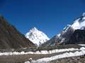

“ Like any long trip, we started planning this a long time ago. Some (Asad, me) had wanted to do a major hike for years, and Concordia was always at the top of the list of the many, many places to go hiking in Northern Pakistan. “The world’s greatest museum of shape and form” is how Italian mountaineer/author Fosco Maraini described Concordia in his book, Karakoram. Galen Rowell called it the “Throne of the Mountain Gods”. Come 2007, somehow or the other, 5 of us decided to finally go.
The pre-trip preparations involved a lot of research, finding hiking and cold weather equipment, and trying to get into shape for the long hike ahead. Our plan is detailed below, and hopefully anyone else looking for information on planning this hike on their own will find it helpful. The [pictures of the hike are up over here,](http://offroadpakistan.com/pictures/k2_base_camp_hike/) and an article about the actual trip will be up soon.
There are literally hundreds of companies geared up to take people hiking in the north, and they arrange everything – but the catch is that they all seem to be geared for the western tourist, and charge accordingly. We organized the trip ourselves, but that has it’s pros and cons. You save money, but there are a hundred and one things which can go wrong which one only realizes into the hike – and any good tour company would have already foreseen and planned for. A 16 day hike on a glacier is no joke, and extensive preparation is a must.
**Our [actual trip costing for the five of us to K2 Base camp and back is viewable here](http://spreadsheets.google.com/pub?key=puGkaR9MP9-ukVd7NNMSPZA).**
We bought all food and kitchen supplies in Skardu, which are listed in the spreadsheet above. All our personal equipment was bought from Lunda Bazaar in Karachi, and some from Sunday Bazaar.

### The basic arrangements

A good guide and porter sirdar is crucial. The porter sirdar manages the porters, and without a tour company, you have to deal closely with both the porter sirdar and the porters to make sure there are no mishaps on the way.
Some friends from the LUMS Adventure Society had done this trek previously – they recommended us to contact Mhd. Nazir at the [Indus Motel](./the-indus-motel-in-skardu.html) (Phone 05831-52608, 52296) to arrange a guide for us. We got in touch with Nazir, and he did a tremendous job, and not only found us a guide/coook/sirdar, but also bought most of our necessary supplies in advance along with the guide. The Indus Motel is a great place to stay, and very helpful. Met a lot of interesting people there also, as it’s one of the major mountaineering centers in Pakistan.
We hired Bakar, who did three jobs in one – cooking, guiding and was the porter sirdar. He arranged the porters, and calculated the amount of food and equipment we needed to take up with us. Food plus all necessary utensils, stove etc. were all purchased at Skardu with him.
Another great resource we used was [the Mountain Company’s K2 brochure](http://www.themountaincompany.co.uk/content/view/64/87/) which contained stage by stage details of the hike. I found this more useful than most of the guide books I saw. We met their group heading up towards K2 on our way back, and thanked their guide, Roland Hunter for their comprehensive guide.

### equipment

This being a cotton country, everyone had cotton shirts. All recent mountaineering literature strictly commands mountaineers to throw away and burn everything cotton, and buy polyester or polypropylene shirts.
Lunda bazaar in Karachi has all the used clothing one would ever want, but in the summer many of the better cold weather jackets are stored up, so they are a bit hard to find. A couple of people were lucky to find used hiking boots there, while 2 of us already had them, and 1 person went 3-4 times to Lunda bazaar before finally finding them. Proper boots with ankle support are a must.
Panaroma center in Saddar, just opposite Zainab market has good local winter wear, ranging from warm caps to jackets. Khizer bought his jacket from Panaroma, and it was more than than good enough. The best jacket are ones with a waterproof outer and a removable inner liner. Besides a jacket, a fleece jacket is highly recommended.
We already had a tent, a 5 man tent from [Zuflah](http://www.zuflah.com/) and while I would have been happier with a better quality tent, it proved it’s worth. Most of the trekking companies were using tents made by [Higher](http://higher.com.pk). There are a couple of other local companies in Pakistan making tents, but Higher seems to be the best one. It’s hard to find a used tent, and the prices in Skardu are so high for tents that it’s cheaper and better just to buy a new one.
We didn’t take a mess tent, basically basic we would have had to buy one, than add a extra porter to carry it, but next time I will get one, as it’s very useful. Still, since we had a large tent, it also served as our mess tent.
Lunda Market in Karachi is a used clothing haven. We got all our cold weather gear from there, and it’s cheap! If you’re lucky you’ll find a jacket for 500 Rs. which is worth 500 dollars new. There are jackets plenty available there, but good shoes are much tougher to find. A word of advice – buy new insoles for the shoes, which are available from most shoe stores these days.
Quite a few people had told us that we will be able to buy mountaineering equipment from Skardu, but it’s so scarce there, and prices extremely high that you can’t rely on getting anything from there – best to arrange everything before hand.

### Getting Fit

The fitter you are, the more enjoyable the hike will be, as the less aches and pains you’ll have, and you’ll be more ‘alive’! Hit Google for tons of getting fit resources.

### Actual Packing list

This is everything I packed in Karachi, and took on the hike.

1. Cotton pant for hiking (cargo pants would be better). Don’t buy very cheap ones from Zainab market as under tough use they fall apart, as Khiz discovered on day two, and had to borrow paints from me!
2. Very lightweight pant for hiking
3. Shorts
4. Cargo shorts
5. Ski pants
6. Four polyester sports t-shirts
7. boxers – about 8
8. Three knee braces – I have a bad knee, but ended up handing them all out. Everyone should carry a knee brace.
9. Backpack – 55 litres
10. Hiking shoes
11. Sandals – useful for campsites
12. Adidas joggers – the backup shoes if the boots die (this happens!)
13. Sunglasses – a must. The sun is so strong that you can burn your retinas without them.
14. head scarf – very useful, good sunshade, scarf, etc. etc.
15. Gloves, thick (new from Lunda Bazaar for 150Rs).
16. Scarf
17. Columbia sports Jacket with liner (from Lunda)
18. Nike jogging trackpants (almost waterproof, to use as rain protection over pants, in backpack)
19. Rain coat lightweight with hood (in backpack entire time)
20. Five polypropylene socks
21. One long sleeves cotton t-shirt (never used it, though)
22. Back support (also never used)
23. Six cotton socks
24. Hiking pole/stick
25. Two books, [Catch 22](http://www.amazon.com/Catch-22-Joseph-Heller/dp/0684833395/ref=pd_bbs_2/002-4163017-4181617?ie=UTF8&s=books&qid=1189064712&sr=8-2) and [Parallel Worlds](http://www.amazon.com/Parallel-Worlds-Journey-Creation-Dimensions/dp/1400033721/ref=pd_bbs_sr_1/002-4163017-4181617?ie=UTF8&s=books&qid=1189064721&sr=8-1)
26. Diary and pens
27. Harness with figure of eight and carabiners
28. Coils of rope – assorted – to give to porters to tie the saman, and also a climbing rope, which we never used. Gave it to the guide at the end of the trip.
29. Swiss army knife – never used!
30. A [Canon A640 digital camera](http://www.dpreview.com/reviews/canona640/)
31. 12 AA batteries for digital camera (it took 4 in one go)
32. handheld GPS with extra batteries
33. Three spare memory cards for camera, 2GB each
34. Sleeping bag, Northface, from Sunday Bazaar in DHA-8
35. About 20 Mars bars (which i gave away)
36. Petzel led headlamp, this is essential. After using a good headlamp for the first time, I’m never going to use a torch again. It lasted a month on the same batteries, and is far more usable than a torch.

This was the total stuff I took along on the hike. A strong waterproof duffel bag is necessary to put all this stuff in, which the porter than carrys. Not all of this was handed over to the porters, the following is the list of my own backpack.
The actual weight of the saman each of us handed over to the porters was around 8kg each, which was of the list above (minus the stuff we packed in our own backpacks) and our sleeping bags.

### Backpack packing list

One must have a backpack while hiking, as there are certain items which are absolutely essential. The porters walk at their own pace (they hate walking slow), so you can only access your stuff at camp – not during the hike itself. The only time a porter would walk with you if you pay him extra, or if you are injured.

1. A 1.5 liter bottle for water (A regular Nestle water bottle)
2. A 750ml wide neck water bottle.
3. Sunglasses – essential! Without them, even the retina gets burned!
4. Hat
5. A book to read (a must have for someone like me!)
6. Diary and pens
7. Camera – a Canon A640, with one extra memory card and 4 AA batteries
8. Track pants
9. Rain coat lightweight with hood
10. Scarf – very useful
11. Fleece Jacket
12. Energy bars
13. Cream Cheese
14. Sweets – Foxes
15. Trekking pole
16. Swiss Army knife
17. Raincover for backpack
18. Headlamp – not needed during the day, but it was too important in the evenings to entrust to a porter!
19. Sachets of ORS and Tang
20. A knee brace
21. A few medicines – Panadal Extra, Disprin etc.
22. Sunblock & chapstick
23. Soap – two types! one to use with water, the other a newage type which doesn’t need water

The total of the above, including the backpack, was around 9-10kg.
These are the minimum items I would always carry. I got a lot of advice from people to only carry 5kg at the maximum, but there is no way you can fit all the above in 5kg!
I used a Northface 55 litre hiking bag, and it was just the right size for all this. A couple of us had 65 litre bags and those were a bit big. I think a 45-55 litre is about the right size for all this.
Some people just use a school bag sized backpack, and basically carry only water a a few small items. The less weight the better, of course, but then I’d arrange to have a porter carrying my backpack to stay with me throughout the trek. On our limited budget that wasn’t a option, so all of us carried about 9-10kg each.
Carrying 10kg is no joke, so a good backpack is essential. The local option is Lunda Bazaar, from where 4 of us found used hiking bags for 400 to 800Rs each, and another is the Lahore based company [Higher](http://higher.com.pk/) which makes pretty good backpacks.

### Medical kit

We collected all the medicines listed [here](http://themountaincompany.co.uk/) and put them in a waterproof bag, and also kept a basic guide on how to use them! (very important). This was very useful, as not only we needed everything from painkillers to deep heat, the porters would also ask for medicine. One mistake – we didn’t take enough stomach medicines and painkillers, but were lucky enough to get them from a doctor we met on the trail.

### links

* [Karakorams](http://www.karakorams.com/) [#](http://www.karakorams.com/Essays/Initial_Impressions.htm)
* [the Mountain Company’s K2 brochure](http://www.themountaincompany.co.uk/content/view/64/87/) :: download the pdf file linked to from their page
* Our [actual trip costing for the five of us to K2 Base camp and back is viewable here](http://spreadsheets.google.com/pub?key=puGkaR9MP9-ukVd7NNMSPZA).

### What else

This entry is a work in progress, and will be completed later…