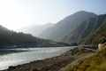

 When Hamid Omar of 4×4 Offroaders Club, Karachi recently completed the rebuilding of the [1948 Ford F1 Pickup](./the_ford_f1_story_from_california_to_karachi.html), the family decided to take it on a long test drive from Karachi all the way to Besham on the Karakorum Highway (a part of the ‘Silk Route’). The trip was, in part, influenced by the invitation of one of their domestics of long standing, Shah Aalam, to visit his ancestral home situated at a mountaintop a few kilometers off Besham in Kohistan. Hamid and his wife Sabiha drove to Lahore on the [newly rebuilt Ford F1](./the_ford_f1_story_from_california_to_karachi.html), followed by Mahera and Khalid Omar in the Toyota Prado.

They reached Lahore on the 14th of October i.e., during Eid holidays. Samina and I joined them, and on Tuesday the 16th, we drove from Lahore to Islamabad. Hamid’s family stayed with his old friend Amjad Mawaz, who had had a road accident some 40 years ago, severely hurting his left leg, now unable to take strenuous walks. Despite this, he was convinced to accompany us, as it was “only a trip to Besham”. Him and his son Shamu, joined the team in their Ford SUV and we all drove to Besham in the late morning of Wednesday, the 17th. We reached PTDC Motel in Besham by late evening and were met by Shah Aalam, his elder brother Shah Nazar and another of Hamid’s domestics, named Sami, and thence started the saga of this trip.

In Islamabad, we changed our original plan of trekking up the mountain trail to going only as far as the vehicles could go (Sami’s village) considering that Amjad with his injury would not be able to undertake the long walk. But while discussing the next day’s plans at the hotel, our hosts (by now their number had grown to no less than half a dozen) convinced us that the trek to their home was a piece of cake and would take no more than a couple of hours or so going one way. Finally, more out of a sense of obligation to our hosts than any real conviction on our part, we decided to undertake the trip next day, “even if it lasted more than a couple of hours”. The plan was that we’d drive first to Sami’s house in Ranwalia Brah Klay village, situated a five minute walk from a motorable road, about 25km from the town of Besham, have lunch there and then climb up to Shah Aalam’s house in Dan, another hour or two’s journey from Sami’s. The next day we’d return to Besham.

It all seemed so uncomplicated, and we were all so relaxed, that it was almost noon the next day when we started, totally unaware of the adventure ahead and, therefore, mostly unprepared for it. It was, of course, decided that we’d all take the bare minimum of luggage with us in view of the eventual hike. Our mental ease at this stage can be well judged from the fact that when my wife wanted to include a torch in the short-listed baggage, I protested strongly on the grounds that it would only add unnecessary weight. After all, who needs a torch on a “day’s hike”. Imagine my consternation then when I had to include two torches, instead of one, just to satisfy her whim, as I thought then. Also, and despite his strong protestations regarding his incapability to undertake a mountain hike without great discomfort, poor Amjad was persuaded to accompany us “as far as comfortable” for him. Of course, he was free to discontinue if and when he felt like it.

We drove in high spirits on the KKH about 25km out of Besham, past the small towns of Shorgrah and Dubair and turned left on a jeepable road to go to Ranwalia Brah Klay and Sami’s house for a well deserved lunch. We met the first of many surprises of this trip, when, close to Ranolia village, we were informed that we cannot drive all the way to our first stop as the approach road had been washed away by recent flash floods. (How recent, we did not ask, but surely not while we were en route!!). Luckily where the road ended, arrangements had been made to park one vehicle in someone’s garage and two on the steep driveway.

Having parked the cars we continued on foot. Luckily also, there were enough villagers in attendance now to carry our luggage. However, the track was totally mountainous, full of boulders of various sizes, winding and forever going up. The presence of an accompanying stream made the walk enjoyable. Soon I discovered that Amjad was in possession of a proper walking stick and, like a child, I demanded one for myself, which was promptly provided by Sabiha who had the second of the available pair. After a good hour’s walk, we finally reached Sami’s house at around 3 pm and got busy taking pictures, walking around the small village and generally feeling happy at our achievements so far. By the time we finished with our lunch, it was close to 4.30 pm. Once again, there was a debate about whether to continue or to stay here for the night, but once again Shah Aalam was there to tell us anew that we only need an hour’s climb to reach his house in Dan. We paid no heed to a lot of other people who strongly advised us against the folly of undertaking the climb so late in the day and eventually it was obligation again that won the argument. Once again Amjad protested, albeit very strongly now, that he being in no condition to undertake a mountain climb after the very strenuous activities of the day so far, should be left behind to take some rest, but to no avail.

Our party of seven was diverse in more ways than one; the four males ranged in ages from a euphoric youngster of 20 to the eldest one touching 67 (i.e., yours truly) and had various physical impediments apart from Amjad’s weak leg. Likewise, the three females included a camera happy youngster (Mahera is a professional documentary maker) and her two middle aged companions. The one thing common in all of us was our complete ignorance of the current venture and our total lack of previous mountain climbing experience of any significance. Also, none of us had proper shoes or equipment for climbing. After crossing a wide waterway, full of boulders of all sizes interspersed with channels of running water, we made a steep climb to walk a dozen yards along a narrow, meandering water channel and then the climb began in earnest. Every one of us was short of breath within the first ten minutes or so and, looking back, we were amazed at the height we had gained in such a short time. The village was already looking like a group of doll-houses. Encouraged by this, we continued climbing up a narrow, steep, zigzag path more suitable for mountain goats than city-dwellers. This almost vertical path either had sharp-edged stones with very slippery surfaces, or loose gravel and thorny bushes were growing on either side of it. At times, it also served as the passageway of mountain streams, making it even more slippery, wet and difficult to climb. At places, the stones were two feet in height, requiring extraordinary skills to climb in one go – the ladies invariably resorting to using both hands and feet to climb them toddler-like. We lost sight of the village very soon and, with it, lost any reference to the height that we were gaining. All that we knew was that we were perpetually going up and up and up. Everyone was exhausted in about an hour and we started pestering our hosts and guides with questions about how far in distance and time we still had to go and when would the track become a little bearable. Their unwavering response all along, and respectively, was about another hour and soon, very soon. I must admit that they were absolutely resolute about these issues throughout the duration of this hike.

We were now climbing in the diffused light of the dusk; the sun had already gone down. Every once in a while we’d be pleased to notice the approaching top, as the destination was “just at the top”, only to find that this was merely another outcrop and the actual summit was farther ahead, much further ahead! By now we had quietly split into three groups: the youngsters being in the lead, the two ladies and self in the middle, with Hamid and Amjad bringing the rear. Our half a dozen hosts cum guides were following their own schedules, but always staying at distances comfortable to us. I also noticed that my two companions were now carrying stout, though rough-cut, tree branches to serve as walking sticks. There were no villages on the mountain, there being not enough room anywhere to build more than one house at a site. Climbing by a location named Darkhaid, we come to another called Ishtial by about 6.30 pm in almost total darkness. We were met by a kindly house owner here who served us ‘sherbet’ (soft drink) from an aluminum “lota” (pot) and, after being told of our intentions took Shah Aalam and his friends to task for planning to put us through a neigh-impossible ordeal in the growing darkness of the night. He also tried to warn us by telling us that, of the few people who ever visited Shah Aalam’s house way up in the mountains, nobody so far had attempted to do so during night time. He suggested that we spend the night with him and start early the next morning, if we must climb up to the peak. Another hastily convened meeting agreed to his proposal, but Shah Aalam was so persistent in saying that the worst was over and that we’d reach his house in the “proverbial” hour now, that a few of us finally relented, while the others joined them out of a sense of companionship. It was, however, unanimously agreed that Amjad had really had enough for the day and would stay here for the night.

Thus started the most unforgettable part of the journey up a never-ending incline of this rugged mountain—- or was it series of mountains? It was pitch dark by now and the going was getting rougher by the foot. Imagine our utter surprise then to find Amjad shortly following us, helped by our Kohistani friend Aalam. Finding him missing from the party, Shah Aalam hastened back to Amjad and told him that we were all planning to abandon our pursuit because of his absence. Poor Amjad was thus emotionally blackmailed once again to join the party. We could only see as far as the range of our small torches would allow, with each passing moment adding to our fatigue. In our haste and inexperience, we had not even distributed our belongings in any rational order, so that if one carrier had all the water bottles, the other had the eatables, while still another was carrying our medicines, etc. The result was that we could neither see each other now, nor could shout for any supply as nobody knew how far the other was. We also became frightfully aware of the sound of falling water emanating from the stream flowing a few hundred feet or so below in a gorge along the track. Even though the stream had faithfully been following the track all along, we became aware of it only now that a deep silence accompanied the total darkness. It was one painful step at a time now along a path that could barely be discerned in the pitch darkness, Our routine could best be described as: climb a few feet in the weak light of a pocket torch, stop for a while to catch your breath, pray that the journey will be over soon, encourage each other that the only way now was up, console yourself that each step was taking you closer to the unknown destination!

There were some advantages, however dubious, of the night climb also, the foremost being that since we could not see where we were going, we did not get as scared as we should have been, although once or twice a member of the team froze with fear when her torch light swayed form the track into the deep gorge along side. The combination of night chill and body heat generated through the exertion of climbing made the temperature ideal and the “parathas” (fried bread) consumed at lunch did not let us starve. With time the mind became numb with fatigue and a survival instinct took over. All of a sudden, we saw numerous torch lights on the other side of the gorge, accompanied by the ferocious barking of dogs. When a few stones followed this commotion, we stopped cold in our tracks. The fact that these people cultivate a lot of enmities in their lifetimes and that nobody climbs up these mountains during the nighttime scared these residents into thinking that they were being subjected to some kind of an ambush. Well, it scared the daylights (or night darkness!!) out of us all right. Then, after a while Samina suddenly stopped and whispered, “Is that a scorpion on the track?” and sure enough there it was, bang in the middle of our passage. This got us thinking about all the creepy crawlies that must be lurking around us in the dark. And how about foxes and jackals and wild dogs, etc.? Not knowing the answers at this stage was itself quite scary, to say the least.

Another long hour passed without any indication of our getting anywhere. By now, all conversation had more or less stopped, and the only driving force must have been the adrenaline supply in our bodies. Nor did the track improve one little bit. When Samina asked our escort about the “promised” straight path, he replied, “But we are on the straight path now madam, it’s just that the earth here is like this”. Beautifully put indeed! All our hopes were dashed by this simple remark and we knew that thinking of an easygoing part of this ascent was a mere dream. So we kept on plodding like robots. At one stage, when we slowed down a bit, Hamid’s group caught up with us and Amjad said, “May we have some light, Fasih”. We realized later that they were only carrying one pocket torch amongst their group of six, making their ordeal even more taxing. As more time passed, a member of our group just squatted on the track and refused to budge another inch, saying, “You go ahead and send me a blanket, if you can. I am spending the night here”. In another hour’s time, we caught up with the lead group. As someone once said, “Chivalry was not dead, madam, I was”, so Samina and I left Sabiha in the care of Mahera to single-mindedly pursue the rest of our ordeal. Our guide took us further up on a zigzag course and presently we came to a cornfield. The corn had ripened and the stalks were as strong as bamboo sticks. Walking through a narrow field of this in pitch darkness was an experience itself. Exhausted as we were, it took the very last reserves of our energy to drag through this fortress of robust, standing sentinels, but we were tremendously relieved to find that it led us to a mountain house where Shah Nazar welcomed us. Thinking that we had finally reached our destination, we simply crashed on the guest room floor and, more or less went into an exhausted coma from which we were roused only by the arrival of the rest of our colleagues in another half an hour’s time.

We got up next morning, somewhat refreshed by the night’s rest to experience a world of extreme tranquility, peace and beauty. The air was so fresh that it almost hurt our lungs and the sky was an unbelievable tone of blue. The view all around us was breath taking and stunningly captivating. We were surely so high that all surrounding mountain peaks appeared much lower. However, we had hardly finished our sumptuous breakfast of parathas, desi ghee and “makkai ki roti (corn bread)” when who would turn up, with a long drawn face, but Shah Aalam to tell us that we were putting up at his brother’s house and that his house at Dan was “just” another half an hour’s climb up the mountain. Once again he started beseeching us to climb up to his house, have lunch there and then start on our way down. According to him, it would take us no more than an hour to get back down to Sami’s house at the base of these mountains. Luckily, better sense prevailed this time and we agreed to the compromise situation of only Mahera and Shamu going with him to his house, while the rest of us would start our downward journey. It took us five and a half hours to get down to Sami’s house. Now that we could see where we were going, we were totally dumbfounded at our ignorance of undertaking such a risky and dangerous climb, and most of it during the night too!! We also learnt anew that going down a mountain track is always more difficult than climbing up it. The knees are the worst sufferers and, after a while, the neck muscles also start aching due the tension of a constant watch on the path. All is well that ends well, as the saying goes, so we all profusely thanked our stars that we had survived this memorable trip without any mishap or injury. Of course, the memories are all ours now to cherish for the rest of our lives (or at least till such time that another such escapade is embarked upon!).

*Note: The area in Kohistan where we went is ‘off the tourist map’ – if anyone wants to visit the place, he or she needs to be invited and accompanied by the locals living there! So do make prior arrangements.*