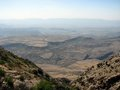
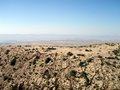
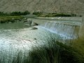
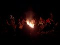

“ /> Salim Khan’s writeup of the Dureji Expedition in January 2007.

The Second Dureji Expedition started off before we even left Karachi. Sajid Dadabhoy was a wee bit over excited about the Off Roading, so he and a friend decided to try out their skills and their vehicles in Phase 8. Unfortunately, Sajid found a big cement block with iron rods embedded in it, left behind by a construction company. He drove over it and managed to cause enough damage to warrant a tow to the workshop. Luckily, Taimur “Winch Man” Mirza was on the prowl that day looking for stuck vehicles to salvage with his mega winch. He got more than he bargained for and had to call up Col. Azmat for help vis-à-vis a proper tow truck!

They were there in the hordes, over 20 of them, packed to the brim, in all colors, shades, models, sizes. From Mini Pajeros to Land Rover Defenders, from souped up CJ-7’s to Toyota Prado’s, carrying families, friends, singles, males, females, the old and the young. They all came from different walks of life, Architects, some Doctors, Engineers, some Businessmen, some Designers, some Consultants, some mechanics, guides, some Tribal Heads and then there were the likes of me………Jack of all Master of none! The participants were:

1. Zulfiqar Bhootani

1. Salim Khan

1. Khalid Omar, Mahera and Friends (lots of them)

1. Ahmed Omar and son

1. Col. Azmat and family

1. Doctor Mansoor and Mr. Mausoof

1. Taimur Mirza and Arif Bilgrami

1. Ali and Raeda

1. Omar Saboor and Terry

1. Omar’s Driver and mechanic

1. Adnan with son and Asad with son

1. Rashid and family

1. Humayun Khan and family

1. Mehmood and family

1. Mehmood’s father and Rod

1. Imran Fatimi and son and Sallo

1. Azhar Khan and friends

The uncertain remained;

18. Humayun Qureshi

19. Omar Qureshi and Taha

20.Sajid Dadabhoy and friend

21. Yes, there were 21 vehicles!

We met at Boat Basin, and surely, the absence of the Hamid Omar was enough to ensure that everyone was there on time. It was a grand sight; all 4×4’s parked in a line, ready and roaring to go. I gave an uninteresting speech, a long monologue on what to expect during the next three days, and then, after each Team Leader had been assigned his pack, we took off with Mr. Zulfiqar Bhootani at the head and I at the Tail. Mahera did a little trick to remind us that she was Hamid’s daughter, and I and Khalid had to wait a little longer for her to arrive, which she finally did!

Like previously, we went over the ICI Bridge, turned right at Gul Bai, on to the RCD Highway towards Hub turning right at the Northern Bypass and finally crossing over to Balochistan from Bund Murad. We got to the Noorani Cross and stopped for some great doodh pati tea, courtesy Zulfiqar Bhootani, while all the vehicles filled up on fuel. At this point, the battle of the Green Giants staged its first encounter. Humayun Khan in his 4.0 L petrol engine Wrangler could take it no more…he wanted some off roading right there and then, and he took off for the closest hillock which most children had climbed. In the first attempt he got half way, reversed and then set off again in low four wheel drive making it to the top. Ahmed Omar in his Green Cj-7 with a 3.5 L Diesel engine was not going to let this challenge go. He took of for the hillock, got to the bottom and decided not to risk the venture but by now the battle had begun!

Tea over, jeeps refueled, we took off for Dureji, our next stop. Omar Saboor’s hair, a few inches longer than it was last trip two months ago, was flaying in the wind as he rode his BJ-40 Toyota and his friend, Terry, had now stood up on the front seat, challenging the oncoming wind. His love for Balochistan had taken deep root, it was “love at first sight” for he never sat down again while the jeep was moving. With them was the “Clicker” a.k.a Richard Seck, a free lance photographer from Canada who had come to “shoot” Pakistan. From the way he was shooting, it seemed he had plenty of batteries and plenty of cameras but half way through the trip he was looking for electricity to re-charge his camera batteries and memory sticks to re-charge the exhausted capacity. His exclamations related to the scenery only made sense when after the trip, we took a look at the photographs he had taken – Richard my man, you have an amazing eye and an amazing camera.

We reached Dureji and once again, Zulfiqar Bhootani proved a great host as tea and biscuits were served in a courtyard surrounded by the most immaculate guest houses that were tastefully furnished. Many of our newcomers were yearning for the Expedition to camp here and therefore, many hearts were broken, tears shed when the call for a move on was issued. Doctor Mansoor changed gear as did his Brother and other passengers. He was driving his open top Cj-7 with a B3 engine and thus the goggles came out with bandanas. They resembled a group of bandits out for a rampage. Doc’s brother, Mausoof, who up till now had looked entirely civilian, appeared more murderous than his adventurous brother!

Prior to departure from Dureji, Zulfiqar and I had a little decision and in the presence of Mini Pajeros, X-Trails and Rav-4’s, we decided that a “little” bit of off roading would be okay rather than a complete off track route. Our camp was still about an hour and a half away and a small stream cradling large rocks underneath the benign water provided a lot of interest as well as photo opportunities.

The camp site was great. Adjacent to the river, in a shallow sandy depression surrounded by small rolling hills, it seemed heaven. Unfortunately, Zulfiqar, in his zeal to show off a little bit more, took me and Doc to check out another camping site which he preferred. Although the other camp site was next to a gorgeous dam in between two mountains, it was too late to change the place and hence Doc radioed for the group to set up camp. And set up camp they did! Even though we had reputable Architects, enamored ex-Army men, certified engineers, successful businessmen, influential oil and gas magnates, prudential designers, but the camp site bore testimony to the fact that “katchi abadis” are not just the forte of the illiterate. There was a haphazard congregation of over 25 tents, some pitched wall to wall to each other. From a vintage point from the top of a rolling hill only 50 yards away, one could see a large expanse of empty land with many tents pitched in one small corner with jeeps parked right next to them. It was as if everyone was scared to be too far from the other. The little space left in between the menagerie was converted in to a fire place. In light of this congestion, I, Zulfiqar and Omar Saboor decided to pitch camp on the hill about 50 yards away.

Food was ready a bit late, but the biryani courtesy Mr. Asim from Korangi No. 3, hit the empty stomachs and tickled everyone’s palate. There were no complaints except from Imran Fatimi, who was more accustomed to the Dubai Fares in which he had routinely participated, but we had no crystal glasses, nor caviar….all we had was some pristine country side with plastic plates and steel glasses, greasy biryani for dinner and even greasier halway puri for the morning. After having described the Dubai Fun Ride in great detail to me and Zulfiqar, he departed the next afternoon in the company of Humayun Qureshi, Omar Qureshi and Sajid Dadabhoy.

Humayun Qureshi was consistently reminded by Taimur Mirza that to leave an expedition mid way was a bad omen while they both watched the mechanic fix Humayun Qureshi’s X-Trail which had blown the oil sump while descending the 4,000 ft mountain. The terror stuck faces of the returning quartet were relieved to find a gas welder in the middle of the wilderness and they once again, bade farewell by me, Taimur and Omar Saboor.

Besides Humayun Qureshi’s X-Trail mishap, the 4,000 ft high Andahar Mountain claimed no other trophies. The 2 hour drive up was punctuated by innumerable stops affected by the trigger happy camera owners. There was clicking every where and I wondered where the celebrities were. After a while, I too started noticing these celebrities. The grand view of the valley below, bordered with steep cliffs laced with jagged rocks cradling shrubs growing out of crevices were all there! The horizon stretched farther than the eye could see, dissolving finally in a misty haze merging the land and sky as if telling us that heaven and earth do meet sometime somewhere.

“ /> Up above on top, it was flat. Flat enough for us all to explore in our jeeps and my fantasy remained to see what lay on the other side, i.e. the western side of the valley. I quietly drove to the other side and found a short decline and then a sharp steel fall. I drove as far as I could safely do down this decline, parked my car and walked down to the edge from where I could see the entire valley laid down below in front of me. There were table top mountains with depressions surrounding them, clear evidence that the prehistoric sea had once splashed these rocks. Far away from the others, there was absolute silence and every tree, every rock, had a story to tell about travelers who had crossed these paths centuries ago. Here, 4,000 ft high, caressed by a chilling breeze, I was being serenaded by a small group of birds when a slow buzzing sound brought me to my senses. This sound was getting closer and closer and it was sharp, pinching, piercing and horrendous. Soon, Doctor Mansoor’s jeep appeared with its loudspeakers, actually installed to facilitate hunting by challenging the manhood of male partridges and lure them with sweet melodies sung by a female partridges, were now regurgitating some ancient tunes that had been recorded while the British still ruled the sub-continent. All of a sudden, the valley down below now seemed just a wide expanse of semi arid desert and nothing more.

After the usual photo session, a couple of oohs and ahhs, a few more photos, a stone gathering session, we headed back to where Zulfiqar had parked, only to be stupefied by the sight of sajjis being carried out by his men from behind a small depression. The goats and been sacrificed, skinned and then a long stake driven through the back and placed near a large fire. If this same sajji had been served at any dinner in Karachi in the manner that I have just explained, few would have touched the meat, but here, day 2 of the expedition, a night out under the open sky in tents and sleeping bags, no bathrooms, chilling cold, rough roads and surrounded by rocks and sand, our survival instincts had sharpened and the fresh air was fueling our hunger…..no one cared about the entire goat barbeque being placed on the white sheet…we all dug in, no exceptions. The liver cooked in gravy sauce served with the Kurras was exquisite cuisine itself and the fresh knob of butter that I discreetly found was presumably “French” I suppose. A word of caution, don’t try this in Karachi, it might not taste the same!

Earlier that morning it was confusion galore. I woke up to see many tents being folded, many vehicles being packed. I could not make anything of it, and so chose to ignore it. We had promised the participants nothing except an expedition that denotes adventure which implies that things can and do not go according to plan, it is not comfortable and facilities are at the most, very basic. I was sure that something had gone wrong during the night but I was in no rush to find out what. All I knew was that I was here to have fun and knew the old guard of the 4×4 Club would remain, so no problem!

If I was confused in the morning at the sights of the tents being packed, I was more perplexed after breakfast at the sight of most of those tents being pitched up again and jeeps being unloaded! What was going on? Apparently, the first night for the first timers, as is always the case, was not the most pleasant. Your comfortable soft bed and pillows, the warm blanket, toilet are all comforts that are not easy to forget especially if your are sleeping on hard ground with only a sleeping bag and any minor urge for calls of nature mean a 100 yd trudge through rock strewn ground, then find a bush large enough to hide you, squatting down while holding a torch, a water can, etc. Nevertheless, the warmth of the sun, the breakfast and the beautiful sights had converted most of the newcomers and thus, only Imran Fatmi, Humayun Qureshi, Omar Qureshi and Sajjid Dadabhoy were intent on returning for various personal reasons, but that too after the trip up the mountain!

“ /> As evening fell on the second day and after our descent we went straight to the “hari pir” dam, the Doc was possessed by the evil spirit of some witch doctor who had harassed residents of the valley centuries ago. Why these evil spirits choose the Doc is another story to be told after the 3rd Dureji Expedition. Nevertheless, the Doc, with dark goggles hiding his mischievous eyes, bandana tied around this head, boots coming up to his knees was now standing next to his jeep and gyrating to a tune only he could hear. From his turns and twists, it seemed the melody was far from harmonious because from the hips down he was twisting like a man, but the torso was shaking and shivering like a professional belly dancer from Lebanon! Zulfiqar’s men inquired whether they should call the local “pir” who is adept at riding people of this evil spirit, but we all explained that City life and its vagaries with pretentious lifestyles has all affected us in some way or the other and the Doc is lucky enough to have shed them and can enjoy life to its fullest… in my mind I was, as were all those watching Doc, gyrating and lurching and twisting and laughing with Doc—and yes, someday, after a few more trips you will find me and many others , doing the same—I only hope so!

The Dam at “hari pir” contained spiritual salvation… Asad Tareen was now beginning to loosen up after all. While Humayun Khan and Ahmad Omar were still involved in the battle of the Green Jeeps, Asad and Khalid were involved in another kind of battle. You have to spend some time with these two to understand what I am talking about. The best example that I can give is that if one of these guys is asked a question today, you can consider yourself lucky if you get an answer by tomorrow…that’s how they are, laid back, cool as ice, in fact chilled! But lo and behold, although Khalid is a hardened nut, Asad was all over the dam, climbing here and there and, relatively, talkative! Here he was on this rock and then on that one, with definite opinions churning out of his mouth at amazing speed. His camera which had been serenely clicking pictures of scenery, was being handed over to all and sundry with orders to click pictures of him, and the poses that he was doing for the lens were absolutely amazing! You had to be there!

“ /> That night, the evil spirit again got the better of Doc who began gyrating, this time more in the Red Indian or Aboriginal style with definite rhythmic foot steps. Khizer’s melodies had finally gotten the best of all of us as it also did the evil spirit, which housed itself in Doc. There was much stomping of feet that night, and I was quick to notice that Doc was not going to let things lie, and therefore, I quietly slipped away to my own tent closely followed by Zulfiqar. We were in no mood to dance the rain dance which went way deep into the moonlit night. Rain dance it was, as the morning sun was welcomed by clouds which slowly faded away, just like the evil spirit slowly slipped away from the Doc.

The morning was a fine one with a slow northern breeze chilling our tired souls. We woke up to complaints by Doc’s mechanic that the shampoo given by Doc to him had made his hair too soft and silky as the bandana would no longer stick in its place on his head. We offered our condolences to the grieving man and advised him never to listen to Doc again. The packing was rather uneventful except the fact that one lone kept on standing till way after breakfast. A groggy Humayun Khan finally emerged from the tent, frantically gathering his wits and when he finally discovered where he was and that we were all going back, he was ready in a second!

We drove back to Dureji, turned left for Outdoor Adventure Camp, had tea there, and took the hard way back to the Noorani Cross. The scenery here was amazing, it even moved the hardened off roaders who have pretty much seen all of Balochistan. Adnan’s Pajero was christened on this route as he hit a large boulder. Evening befell at the Veerabh Dam, where Zulfiqar broke his fast and then began the long sullen drive home! It was all over the excitement of going out into the unknown was now taken over by the yearning to get back home in the shower and the comfortable bed. All were quiet now as they knew the journey was going to end. Some thanking God that they survived, some wondering how come it past by so quickly. All things good and bad do end!

This was my second attempt at organizing a trip with a large number of people and although I thoroughly loved it, there were times when I felt that I had gotten myself into a big mess and confessed the same to Khalid who told me he felt the same way. But during the trip, the smiles on many faces, the oooohs and ahhhs, the guffaffs, the surprised eyes all were enough to convince us that we needed more of these activities in this City of ours.

During every trip I learn many new things. This trip was especially interesting as it consisted of many people who had hardly known each other and had jumped the bandwagon on someone’s cajoling. Each one of us had a whole load of memories to take back with us. Some cherished the colorful sunset with its serenade of tranquility, while others cradled hazy mornings with shadows of mountains looming in the horizon. Some had good memories, others not too good ones and maybe a few had nightmares, nevertheless they all did carry memories. The moment we left the metalled road, the moment I took a deep breath of that fresh clean air, the moment I heard that silence, the moment I saw the first light break at dawn, the moment I walked down the slope in the moonlight, the moment I saw the flicker of the campfire, the moment my hungry stomach smelt the food, the moment my thirsty lips touched the cool water, the moment I reached new heights, the moment I saw my friends smile, the moment I exchanged loud laughter with Doc, the moment I caught Taimur loosing his way, the moment I found Asad loosening up, the moment I saw Terry standing up in the jeep, the moment I heard Khalid say something, the moment Ahmad claimed victory, the moment Khizer was chased by Doc, the moment Azhar almost turned his Pickup turtle, the moment Azhar burst his tyre, the moment he caught a fish, the moment Khizer (other one) started singing his song: these were the moments that lay imprinted in my mind forever… and I, like all others shall carry these memories for a long time to come… whether they be good or bad!

[Click here to see the pictures from this trip.](./index.html)