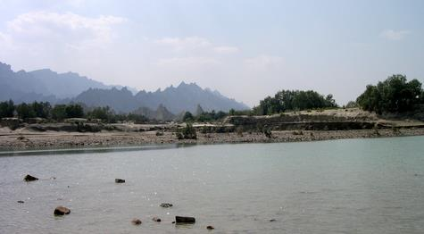
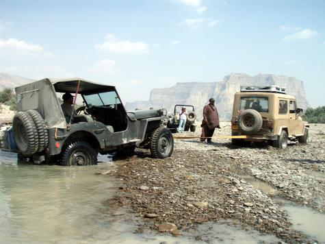

 Leaving the warmth of my sleeping bag reluctantly, I stepped out of the tent to be greeted by a sight that prompted me to get my camera in a vain attempt to capture nature at its best. The pine needle like long leaves of “Gaz”, a native plant that grows along rivers and nallahs in Balochistan, sparkled like a jewel-studded Christmas tree. Dew drops formed at the tips of millions of Gaz leaves glowed in the golden sunlight shying the most expensive and articulately cut diamonds.

The desire to breathe in fresh air, smell of burning firewood, tranquil surroundings, chirpings of birds and an occasional call of a partridge, well hidden somewhere in the jungle along the Hingol River, are reasons good enough for me to visit this unique ecosystem at least twice during the winter season.

Our group comprised of seven vehicles with people from diverse spheres of life; medical doctors, engineers, IT professionals, businessmen, financial managers, filmmakers, bankers, architects and technicians. Leaving the masks of their professional lives behind, these men and women are genuinely interested in conserving nature, wildlife protection, camping and offroading.

Our route was planned along the Hingol River to Aryan, a distance of 35 kilometers, and then turning left, following a water course for 27 kilometers to Goran Gatti Mountain. The park has a unique setting, not only being the largest National Park of Pakistan covering a mind boggling area in excess of 610,439 Hectares or nearly 6200 Sq.Kms., but also the only one with integrated terrestrial and marine habitats. The Hingol River, the largest river outside the Indus river system snakes through the park for over 100 kilometers and forms the link between mountains, valleys, riverine habitats, coastal sand dune areas, estuary and the Arabian Sea.

The river had breached its banks due to a flash flood a month earlier and areas along it were still soft, making our progress extremely slow. Having to make a way avoiding quicksand and eroded landscape was a challenge for men and machines. The slow pace and a late departure from the Wildlife and Forest Departments’ camp office at Aghore forced us to make camp at a suitable place before sunset, much before our planned spot, Aryan.

Unlike other National Parks and Game reserves of Pakistan, where mostly the topography, ecosystems and scenery is similar throughout the designated area, Hingol National Park is diverse.

Every kilometer traveled shows a different vista, traveling 10 kilometers upstream along the river from Aghore, a Coast Guards Check Post and Hingol river bridge, the ancient Hindu Pilgrimage site of Nani Mandar, one of the most revered in Hindu religion lies nestled in a depression of a nearly 800 feet high mountain. A stream flows in front of the Temple through the valley, lush green with grand old trees. Hindus from all over Pakistan visit this temple while those from across the border yearn for an opportunity of a pilgrimage. Since the completion of the Mekran Coastal Highway, more and more worshippers throng the Temple, where cement structures have been made without proper planning ruining the once serene, peaceful place, while all the garbage left behind and noise pollution is having an adverse affect on the wildlife and is a matter of serious concern for the Park Management.

Leaving the road – in fact the only road within the park besides the coastal highway – to Nani Mandar and moving further upstream is where the grandeur of the park starts to unfold. There are no tracks at all and one has to make way through sand dunes, shingled land and at times over boulders while fording the river several times. The guides know the area very well. Traveling another 20 odd kilometers the river passes through the flat land of Aryan.

Discussing our progress of the day around the campfire we decided to keep our camp intact the next morning and move ahead with provisions to return back by sunset. The route to Goran Gatti Mountain skirts left following the bed of a hill torrent that brings water from Goran Gatti and its adjoining areas.

Only one of our guides, Adam, had been to Goran Mountain some years back and that too on a camel back. According to him the progress would be even slower than the track along Hingol.

The Hingol River actually flows along the Ornach – Naal fault line, a confluence of two major tectonic plates namely; the Eurasian plate and the Indian Sub Continent plate, while the Arabian plate also meets these two plates in this area and is in the subduction zone.

Cumulative effects of these plate movements are clearly visible in a north – south direction. The area on the right (east) side of Hingol River is dried mud mountains and hills pushed upwards when the plates collided, and some active Mud Volcanoes still spew out large flows of mud mixed with methane gas. The largest and the highest known active Mud Volcano in the world, Chandragup, is situated within the park boundary along the coast, while there are countless more in the range that runs parallel along the river on the right side. The left side with Jabal Hinglaj and the Goran Gatti Mountain are solid rock. This contrast in the topography, the mud mountains eroded by wind and water action over millennia on one side presenting a unique appearance and the Rocky Mountains displaying layers of strata, signatures of upheaval and formation are awe inspiring.

The journey ahead proved even more difficult as the Jeeps precariously slid down a near vertical descent of about 35 feet down to the riverbed which greeted the vehicles with soft sand apparently seeming like a hard surface. With tyres sinking in sand and the extra power of four wheel drive mode, we managed to proceed and cross the river.

Another fording of the river brought us to the village of Dandel, a small settlement. There are no schools or dispensaries in any of the villages within the park boundaries. The locals cultivate small patches of arable land planting wheat, Jowari and caster seed plants. As one moves further beyond the flat land of Aryan, a wall of mountain stretching from one end of the horizon to the other blocks the way. There between these mountains is Poldat, a V shaped gorge carved through the blocking mountain running a length of approximately 40 kilometers in an East – West direction through which the river emerges.

Our guide informs this is as far as the Jeeps can manage to go. True enough, the river is full of boulders, some as big as two roomed houses. All along, while driving through the narrowing valley I could see pieces of driftwood and other material that the water carries during a flood, stuck in cracks nearly 60 feet above the ground. Imagine a wall of water 60 feet high and a kilometer wide thundering towards you with vertical cliffs on both sides and no place to run – pretty scary indeed. Any unwary trapped in such a situation would end up somewhere deep in the Arabian Sea.

Our return journey was even more difficult; the ground had become softer and resulted in few vehicles getting stuck. Salim Khan however, managed to free his vehicle using his long experience of four wheeling. Khalid Omar fried the clutch disc of his “most powerful Jeep”. Wazir Ahmads 1941 “original” Jeep was given a push and winched out while “Pakistan’s most powerful Jeep” succumbed to the wrath of a ‘fly’: Ahmad Omar was trying to swat a fly that somehow found a way in the Jeep and the vehicle fell in a three feet ditch breaking the rear axle.

Ali handed over the control of Nissan to Raeda to be winched up a slope of nearly 45 degrees, I wonder why? Rashid Maqbool’s Defender had taken a plunge in the river earlier, and accepted being winched up the slope after attempting it once. Mansur Ahmad, “Doc” orchestrated the winching up of 6 vehicles with precision. Which vehicle made it up on its own; I leave it for you to guess.

While the park is situated on a tectonic plate boundary, it also has the unique distinction of being located at the converging area of three zoogeographical regions including the African, more precisely Ethiopian plant and animal species like Acacia Senegal, Euphorbia caducifolia and Commiphora, Chinkara Gazelle, Cairo spiny mouse, Sandgrouse and Larks. The Palarctric Region which includes Europe-North Africa-Northern Asia, with resident and migratory species such as Sindh Ibex, Afghan Urial, Partridges and like Houbara Bustard and Brown-necked Raven. Oriental Region being third stretches from South East Asia to Pakistan with species like the Bengal Fox, Indian Porcupine and Peninsular Desert Wolf.

Other noteworthy animals that visit or reside within the park are Spot-billed Pelicans, Green and Olive Ridley Turtles, Indian Cobra, Marsh Crocodiles, Leopard, Caracal, Hyena, Afghan Hedgehog and many more.

The recent development of Mekran Coastal Highway linking Karachi with Gawadar Harbour and Industrial Development Zone has given new impetus to the region and has linked Hingol National Park in a modern infrastructure framework. The modernization is bound to have an affect on the ecology of the park and is timely to plan for the development of Hingol National Park in retaining its rightful title of “Jewel of Balochistan”.

Having seen just the south central part of the park and natural beauty of this pristine land we returned back to Karachi, already planning for yet another camping trip.

*Photographs by Taimur Mirza, Richard Seck, Mahera Omar and Khizar Rashid*
