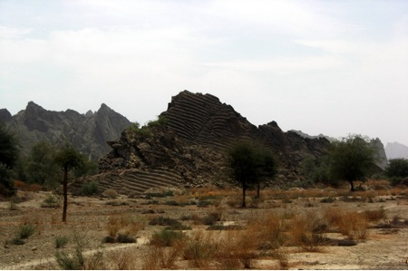

import ImagePair from '../../../../components/content/ImagePair.astro';
import jayshah1 from './jayshah1.jpg';
import jayshah2 from './jayshah2.jpg';

A few years ago, longer than I'd like to think about now, we met Jay Shah, who had come to Pakistan to visit Mata Hinglaj. Our offroad club took him to Hingol, and it was the start of a wonderful friendship. Jay wrote a wonderful writeup of his visit to Pakistan and his travels with the offroad club and his pilgramage to hinglaj, as well as a video of his trip:

[Jay's 2006 Pilgrimage to Hingula Devi in Balochistan, Pakistan](http://vimeo.com/25066797) from [offroadpakistan](http://vimeo.com/offroadpakistan) on [Vimeo](http://vimeo.com).

### Fruits of Unflinching Faith (Total Surrender):

Om Annaya Namah, Om Akkaya Namah.
I prostate to and offer my salutation to my Guru and Gurumata Pujya Annasaheb (Annaji) and Pujya Prashanti (Akkaji) SirDeshpande of Bijapur, Karnataka, India.

<ImagePair
    src1={jayshah1}
    alt1="Param Pujya Shri Annaji – My Guru"
    caption1="Param Pujya Shri Annaji – My Guru"
    src2={jayshah2}
    alt2="Param Pujya Shri Akkaji – My Gurumata"
    caption2="Param Pujya Shri Akkaji – My Gurumata"
/>

Pujya Annaji was a Raj yogi meaning he lived in the world as a Sansari (married life) and enjoyed the life with all the comforts, splendor and the wealth but was totally detached from all of it.  A rare individual. He was the reincarnation of the Gahininath (one of the famous nine Nathas including Gorakhnath - Gorakshanath). All Navnathas are Chrinjive (forever living i.e. w/o death) and are Gupta (not seen). Only Gahininath comes to the Earth in the human form to give total Salvation (Nirvana, Moksha). There are Gurus and Sadgurus (Satguru) but Pujya Annaji was Param Brahm Guru – the one that can give you total salvation and make you one with God. That means, in Hindu Sanatan Dharma, no reincarnation on the Earth ever - Moksha, Nirvana.
This article is not about my Guru and Gurumata but suffice to say that without their blessings and guidance my yatra (pilgrimage) to Shri Hinglaj Mata (Hingula Devi) in Balochistan, Pakistan would not even have been on my radar screen.

I migrated to USA in 1968. My father passed away in 1976 and mom passed away in 1993. My first yatra to Pujya Annaji’s place was in 1997 after safely performing the Char Dham yatra in a private bus with some 35 people with my family members in Ahmedabad and Kanyas from Pujya Upasanibaba’s Ashram in Sakuri, Rahata, Ahmednagar, Maharashtra. This was possible with Pujya Annaji’s full blessings and under the powerful protection of his Vibhuti (holy Ash left after Yagna – Oblation in sacred fire to the God).

After the Char Dham yatra I came to Bijapur and Pujya Annaji asked me to stay in Bijapur for more than a month and told me that now Pujya Annaji is my father, Pujya Akkaji is my mother and I have to come to Bijapur home every year which I have been doing every year since then.

### Do Hinglaj Mata’s Darshan:

Pujya Annaji took Samadhi (left this world) in November 1998 and Gurumata Pujya Akkaji has been guiding me on the spiritual path in my bonus years (after 60 years of age). In 2006, she asked me to do the yatra of Shri Hinglaj Mata (Hingula Devi) in Pakistan. She specifically rejected my plan of coming to India first and then to go to Pakistan after inquiring where in Pakistan is the shrine of Shri Hinglaj Mata and instead asked me to go straight there from New York, USA and so began my most memorable yatra.
The people that I knew including Pujya Akkaji did not know where the Shrine is in Pakistan. Pujya Annaji & Akkaji had gone in early 80s to Pakistan to see a cricket match and his attempt to do the yatra was not supported by the Pakistan Government due to the security consideration in Balochistan (Baluchistan) - the North West Frontier area.

I took the route of Google to search for the location of the Shrine and how to go there. At first I was excited to come across several websites about Hinglaj Mata but there were all hosted in India and were basically by Khastriya (warrior clan), Bhavsar and other clans “singing” praise of the Devi who is their Kuldevi (Goddess of the clan). All said that the Shrine is in Pakistan but no information the location of the Shrine as well as how to reach there. I did learn that there was no regular priest (Pujari) and that the place is desolate. There was a mention some ‘Sangh” (people going to the pilgrimage as a group) arranged twice a year by the Swaminarayan Temple in Karachi. I contacted the Swaminarayan Temple by email and phone call but did not get response.

### Pujya Annaji had different plan for me:

As I continued my Google search I came across a site which had some pictures of the Hingol River and the area near Hinglaj. The website was of 4x4 Offroaders club of Jeep/SUV owners (www.offroadpakistan.com) in Karachi, Pakistan who explore various natural resources of the Mother Nature in Pakistan. On a lark I sent an email to the website admin asking whether they had been to Hinglaj and would they be kind enough to tell me how to go there.
(Note: You may have to cut and paste or type the URLS in this article in your browser if the clicking on them does not work)

I was totally surprised to get a response from Mr. Salman Ali stating, “Aree, Shah saab aap a jao, hum apko Hinglajki yatra karayange (Mr. Shah come on over we will help you make your pilgrimage of Hinglaj.” With such a warm response I decided to go to Karachi. I also came across Mr. Khalid Mahmood - Managing Director of a Pakistan firm Getz Pharma part of an American company indirectly owned by Mr. Warren Buffet – world’s 2nd or 3rd richest person - through Mr. Bhupen Dalal, Chairman of Mullard & Phipps also indirectly owned by Warren Buffet.

Without any reference checking or any in depth understanding of who was Mr. Salman Khan or Mr. Mahmood I decided to be a “Na Jaan na Pahechaan, Mai tera Mehman (without any introduction or references I decided to be their guest). I had not seen their pictures nor did I have any phone conversation!

I talked to the Pakistan Consulate General in New York and he assured me that I would get a visa to go to Pakistan without any problem. So I booked a return ticket to Bombay with Karachi halt for few days on the Pakistan International Airlines (PIA – sometimes jokingly called Pray to Allah airline). I went to the Consulate and sure enough I was given the visa with a halt in Karachi without much of a hassle and with decent courtesy (most of the experiences of the Indian consulate had been rather disappointing in this area however, I must share that the services at the Indian Consulate in New York has improved significantly in last 2 years).

### Flight to Karachi:

With the ticket and visa in hand, with one email of inviting me to come and a promise of taking me to the pilgrimage and most importantly – My Guru and Gurumata’s blessings I left for Karachi. As it is said in India, “Ma ka Bulava Aaya” - Mother’s invitation to visit had come. This would not have been easy if my dear wife Anu did not have faith in Guru and had not supported me. She never objected or showed concern even once except requesting me at the NY airport not to take camera and roam in the Karachi Bazar w/o an escort and foolishly take pictures of women – a real taboo. She did say that I was crazy enough to do just that!

On the other extreme I had a phone call, two hrs before I was to leave for airport, from the management team of the company where I used to work, unanimously requesting me NOT to go. The reason was valid – I was an American citizen with Indian heritage and the USA Consulate in Karachi was bombed by some fundamentalist only 2 days prior to my departure. However my faith in my Guru and Gurumata was far stronger than to worry about such events. My answer was to thank them for their good intention and concern but I would rather die doing this yatra than lose faith in my Guru and Gurumata. I pointed out that my Gurumata told to do this pilgrimage and hence she would protect me and I had nothing to fear.

On March 22nd 2006, I left for Karachi on PIA. I had a very good flight – older plane but clean with good food and very good service by the staff. My fellow seatmate (I forgot the name) had an interesting life. If I recall, he was an architect in USA and had travelled all over the country in his quest for the question - what is this life all about. I don’t whether he found the answer or not but his story was interesting – it showed that fundamentally everyone has this question sooner or later in one’s life, some may eventually find the answer with their Guru’s blessings (Guru krupa). I am still searching for my answer. Even if I do not find the answer I will die peacefully knowing that my Guru took care of me. There is a saying, “Guru, Gobind dono khade, kisko lagu paye. Bina Guru Balihari, Gobind na milo maye (Guru and God are both standing in front of me, who do I prostate to first? Without the blessings of Guru I could not have reached God)”. Meaning Guru comes first before God!

A fellow passenger from Manchester, UK, Harish Kumar in a seat behind me heard me talk about the purpose of my visit as to do to the pilgrimage to Hinglaj Mata. He introduced himself and said that I must visit Lord Shiva’s temple (Ratneshawar Mahadev) on Clifton Beach in Karachi. It was discovered in British rule days (in a “cave” under the ocean). He shared the folklore that there is a direct tunnel from the temple to Hinglaj shrine (I did see the entrance to the closed tunnel at the temple) by which Lord Shiva visits the Sati (Hinglaj Mata). I am glad that he shared the info (as if my Guru was telling me to go to Lord Shiva first before going to Hinglaj Mata).

### Beginning of Pakistani Hospitality

When I landed at Karachi it was almost 1:00 AM in the morning. The airport is beautiful, a fully air conditioned and an expansive building with courteous customs and immigration staff. I whisked through the formalities and came out of the airport in a hot and muggy night. There was a person with a placard with my name. Even though I could have had a car from the Intercontinental Hotel to pick me up from the airport, Mr. Khalid Mahmood insisted that he would send his car to drive me to the hotel. As soon as I settled in the car the phone rang and driver gave me the phone, Ms. Diana John, secretary of Mr. Mahmood, was calling me at 2 AM to see whether I had reached safely or not and she had instructed the driver to give me a phone to be used during my stay in Pakistan with ISD (international dialing) activated and she said that Mr. Mahmood had insisted that I call my dear and near (meaning my wife) to let her know that I had reached safely! I have come to India about 17 times in last 42 years and no one has offered me a cell phone with ISD activated right at the airport! This is just the first instance of the hospitality that Pujya Annaji had arranged for me.
The road to the hotel was a wide and well lit boulevard, lined with trees in the center lane, with no signs of slums anywhere! I reached the hotel and to my surprise I had an upgraded room waiting for me, a larger and better room with the Internet access without my asking for it! I used Skype to call my wife and told her about my welcome so far and she was very happy to hear that.

### Ratneswar Mahadev Temple room with the Tunnel inside

Next morning Ms. Diana John came to the hotel, we had a lunch and she took me to the Ratneswar Mahadev on the Clifton Beach. The legend is that once a son of British officer was walking on the beach with his dog. He threw a ball for the dog to fetch. The dog ran to get it but came back without the ball and was very frightened. The British officer asked his Hindu servant to go see why the dog was frightened. The servant saw a giant person with huge braided hair on his back. He immediately recognized that the Lord Shiva was sitting there. He came back and told his view. An excavation followed and found the temple “cave” under the ocean. The temple was created and is still preserved. They also found an idol of baby Lord Ganesh (Bal Gajanan) sleeping and it is now kept that in a child’s cradle in the temple. You can see the pictures of the temple (and of the entire pilgrimage movie) at [https://picasaweb.google.com/offroadpakistan/MataHinglaj06WithJayShah#](https://picasaweb.google.com/offroadpakistan/MataHinglaj06WithJayShah)

A Parsee business person, an Iranian sect worshipper of Lord Agni (Fire) that left of Persia and settled in India, has converted a part of the beach area in a beautiful garden. I was told by the priest that temple has been preserved and protected by the Government of Pakistan and co-exists peacefully in the community.

There are other Hindu/Sikh temples in Pakistan (apart from the two Shakti  Peethas of the Sati) and one of Shiva’s temple Katas Raj (of Mahabharata time) is being preserved and renovated by the Government of Pakistan as an historic monument at the cost of twenty million rupees.

**You can see more pictures of the temple at http://www.skyscrapercity.com/showthread.php?t=1260661**

After the Darshan of Lord Ratneshwar Mahadev we went to the Empress market (somewhat like Crawford market in Mumbai) in the central market area called Bori Bazar. Some people complained about the traffic and I had to laugh because it was nothing compared the traffic at the Shastri market in Bijapur! I was told by Pujya Akkaji to get 10 Kg. of dry fruit as Prasad (offering) along with Bangles, Chundadi (special cloth) and Sindur - Kumkum (Cinnabar). We bought the dry fruit and twelve coconuts and then went to buy Sindur. The shopkeeper asked me how many grams did I need and started laughing (thinking that I was crazy) when I answered 2.5 Kg. He again verified as to why I needed so much Sindur. I explained that I was going to Hinglaj Mata and everyone in the shop became quite and sober. One customer walked over to verify that I really meant Hinglaj. When I affirmed the destination he told me in a very sober tone, “I have one request, please be very careful, the area is prone to violence.” I thanked him for his concern but I knew that I was totally protected by my Almighty Guru - Pujya Annaji and Gurumata - Pujya Akkaji.

### An enchanted evening - we are vegetarian too

Mr. Khalid Mahmood had invited me that evening for sailing on his boat in the Karachi harbor. Knowing that I had to leave early in the morning for the Pilgrimage I declined and settled for a dinner at his home. I suggested making a light dinner of soup and salad. He laughed heartily and said, “Well, why don’t you tell me that you are vegetarian – we are also vegetarian!” Lo and behold the dinner consisted of a grand feast of Pani Puri, Bhel Puri, Paratha, Subzi, Ragada Pettis and of course Salad and soup among many other delicious items! He and his wife Laila (Lali) both had studied at Rutgers University in New Jersey and had met there. She is a great photographer and she was leaving for Bangkok in the night flight. His lovely daughter Ravi and wonderful boss Luna (his dog) were also there along with his two retired friends: Dr. Shaukat was with famous Rand Corporation (R&D lab in California, USA) who was helping to the victims of the huge Earthquake that had hit Pakistan a year ago and Dr. Atlaf from World Bank who had started a music academy in Islamabad to revive the classical vocal (Gharana) music. We had a very enchanting evening of wonderful music and intellectual/philosophical/spiritual talks. The house was really lovely – somewhat like a Hacienda style with fountain and a Koi fish pond and had all windows were overlooking the atrium but none facing the outside of the building.

### Bollywood Magic

I have to share here how Bollywood works its magic. Somehow we talked about Bollywood and I mentioned that I did not know who Amitab Bacchan was until I saw his movie “Kabhi Khusi, Kabhi Gum.” Laila was shocked to hear that and was upset that I did not know Amitab Bhacchan. She said that she would have to call Mr. Manmohan Singh (Prime Minister of India) right away and tell him not to let me land in Mumbai – how dare I not know Amitab Bhacchan? I was very amused. I had not watched much of Indian movies, though I had heard lot of Indian songs on Binaca Geetmala on my Zenith Trans Oceanic shortwave radio in USA. Sure I knew the works of great Raj Kapoor, Dilip Kumar, Dev Anand, Nargis, Sharmila Tagore, Asha Parekh etc. and of course that of my most favorite - evergreen hero Shammi Kapoor but I did not know anyone who came in Bollywood after 1968. I explained in vain that there are more than six billion people in this world. I am sure that all of Indians in India know him. May be another billion scattered in Middle East, UK, Russia etc. may know him. Raj Kapoor was very popular in Russia when I landed in USA on 4th July 1968, even my barber in NY, who was a Russian, knew Raj Kappor and was delighted to sing “Awara hu…!). I am sure that another four billion do not know who is Mr. Bib B and I am just one of those four billion. I do not think she liked my feeble explanation of why I did not know Mr. Big B.
Here is a personal appeal to Mr. Amitabh Bacchan that if he ever goes to Pakistan then he must visit Mrs. Laila Mahmood – one of his great fans in Pakistan and help me land in India again!

### Crazy American has come for Hinglaj Mata pilgrimage

Next morning Mr. Khalid Omar, son of my host Mr. Hamid Omar came to the hotel to take me to his home to get ready for the Pilgrimage. I collected all the items for the pilgrimage but forgot the coconuts in the room. I knew that there will be a Jeep and 2 people will escort me to the Hinglaj for my yatra. When I reached Mr. Omar’s home I was pleasantly surprised to see not one Jeep but 10 Jeeps/SUVs and some 30 people waiting for me. Supposedly the news spread in the Offroaders Club like a wild fire that some crazy American is coming to go to Hinglaj so everyone joined!

A special vegetarian Aloo Parata etc. was waiting for my breakfast specially prepared by Hamid’s daughter Mahera. Mahera had studied in Boston and she is an accomplished documentary maker. His son Khalid did his MBA in Australia and younger son Abid studied Textile Engineering in USA and Germany. As we travelled to Hinglaj, Hamid shared his life story and I instantly felt that there was some karmic connection between us. Hamid and his wife Sabiha is a lovely couple and for some reason our chemistry jelled extremely well, later on we decided that we must have been brothers in our past lives and Pujya Annaji wanted us to meet each other in this life. Hamid would like to come to Bijapur to my Guru’s home someday. We still keep in touch on regular basis. Hamid had come to Chicago for his cancer treatment later on and I stayed for two weeks with him in Chicago. Kismet (Fate) works in mysterious way. We both feel very close to each other even more than two real brothers. Sabiha also visited us in USA later on. I am in debt to Pujya Annaji for bringing us together.
Our “Sangh” (group) of 30 people left around 9 AM for Hinglaj. Hinglaj Shrine is located near the banks of River Hingol. I understand that some 24 Rivers empty in Hingol River and it is considered holy to take a bath in it just as it is to take a bath in River Ganges to wipe out your sins. Yes, I did get a chance to take a “dip” in the Hingol River the next day!  Hingol also means Sindur (Cinnabar). Hinglaj Shrine is considered as the highest of all 52 Shakti Peethas located in various parts of Pakistan, India, Nepal, Bangladesh, and Shri Lanka (old Bharat Desh - Country).

### Road to Hinglaj Mata Shrine

The Shrine is about 250 Km (150 miles) from Karachi city. A brand new road, recently built with the help of China, connects Karachi to the distant seaport of Gawadar. My host Hamid, as we were traveling with his wife Sabiha, said, “Jay, you will get only half of the Punya (good deed) for doing this pilgrimage.” He explained that. “You have to do Kashtha (hardship on the body) to reach any pilgrimage center to gain Punya. In old days there was no road. It was basically a Desert (Registan) and Rajput Kings and other devotees used to come for the pilgrimage on feet, bullock cart and camels in 40-45 degree Celsius heat and it used to take them many weeks to reach the Shrine. But you are traveling on a brand new road at 80-100 Km/hr in a nice air conditioned SUV and that is no Kastha (difficulty) so how can you get the full credit of doing the Pilgrimage!” He did have a very good point. I have to acknowledge that my Guru made this pilgrimage very easy on me.

Once we left the Karachi border we saw hardly anyone on either side of the road. We did see a group or two of 6-8 nomads with few camels and that’s it.  And so called village in this area consists of few huts.

There was no petrol pump either. Before we left the Karachi border we all stopped to get extra petrol. As we were waiting we saw some beautifully decorated lorries (trucks), very colorful indeed.

")

I do recall seeing some colorful lorries in India when I was a child but I think that art is completely lost in India and is replaced by slogans on the back such as “Jai Matadi,” “Horn OK please,” or some humorous ones as “Buri najarwale tera muh kala (those who look at me with bad intension will be rewarded with black face” etc.
On the way we stopped to see Pakistan Air Force pilots doing practice sorties in their fighter planes. Everyone got out of the car and took picture but I did not dare to take any such picture – I was not ready to go in jail, just in case!
We did not encounter any difficulties even though I was warned by others and saw absolutely no blockade or violence. It was most peaceful travel. On the way we stopped at a roadside tea stall shack (like a run down Dhaba in India). The tea was refreshing. I am sure that the owner must have been delighted to see 10 cars and 30 customers in one swoop!

As we approached the Shrine we saw two hillocks (small hills) on left side of the road. More on them later – it has its own legend. The scenery was breathtaking. During some patches we could see the Arabian Sea coast and beaches in distance but we did not have time to stop. We saw rows of ‘mountain” range on both sides of the road. Amazing thing was that one side was made of real rock and the other side was made of pure sand and mud! The wind had made some beautiful carvings in this range of sand and mud “mountains” – absolutely breathtaking. I almost wanted to run out and play in this mud!

It took us about 2.5 – 3 hrs and we reached Aghore (no idea whether this place has any relation to the Navnathas Sect or not, some followers of tantric rituals of Navnathas are called Aghori, but I suspect that there is some linkage).

We saw the Park Ranger at the campsite office to register our plan to do camping. Hingol area is a designated national park and as such it falls under the care of the forest and range services. One has to register if one wants to go camping in the area. This large park is very meticulously maintained. Just like in USA, one cannot leave an open fire pit or debris, no pollution is allowed including noise pollution – meaning no late night loud parties!

Soon we came across a bridge. It was somewhat washed out. I understood that in Monsoon, the Hingol River can reach 50-60 feet or even higher and almost every year some part of the bridge gets washed out and needs to be rebuilt. We turned right on a dirt road after the bridge and soon encountered a sign “Nani Mandr.”

Muslims (may be Sufi sect?) also revere Hinglaj Mata as “Nani Bibi” (Grandmother), my search so far about the legend of Nani Bibi has been futile. Hopefully someone who reads this article may shed light on it. On the way to the Mandir we came across a little lake (more like large pond) with a wonderful sign of warning to watch out for Crocodiles! This dirt road is about 10 KM and soon we reached the Shrine area.

### Total Surprise

To my utter surprise and against all what I knew about the lack of people in this area, I saw three Volvo buses standing and as we walked to the Shrine we saw about 20 ladies performing and singing Gujarati Graba (dance by a group forming a circle) in praise of the Hinglaj Mataji! You can imagine my jaws dropping to the floor to see people there as I was told that there is not even a priest there and one cannot stay overnight as tigers and other wild animals roam in the mountains there and they do come to the Shrine. It turns out that there are two annual fairs at the site and several thousand people come for the fair and the prayers. With brand new road many will take advantage and do the pilgrimage but sadly the pristine environment may get spoiled. There was no fair at that time but this little group of three Volvo buses had been there for few days, most had gone to the mountain top leaving these ladies performing Garba.

As we started walking towards the Shrine a short man with “Hare Krishna, Hare Ram” scarf on his shirt came running to me (I was in Shorts and T-shirt and have no idea what made him zero on me out all other members of the Offroaders club with me who were in usual pants and shirts) and asked directly whether I was here to do prayers! Again it has to be my Guru doing this. Otherwise I cannot explain why he would zero onto an American for prayers to perform when there were other natives with me. It turned out that he was the priest for the people who had come on the Volvo buses and had studied at well known Sola Vidyapeet (Sanskrit Vedic School) near Ahmedabad, Gujarat for seven years. It was as if Pujya Annaji, my Guru, had even arranged for a Brahmin for me to perform prayers! Considering what I was told by everyone in India and by my Pakistani friends that there is generally no one there, I cannot have any other explanation other than that my Guru had arranged all this for me.

The priest showed us the way. As we moved up the hill he showed us first the temple of Meldi Mata (popular in Gujarat) and then Kali Mata (Goddess Kali). I changed from my Shorts and T-shirt into a Shola (silk wrap around cloth) and took a dip in the water near Goddess Kali. I performed some prayers and then we moved upwards to the Shrine. Again there was a little pond (with very small fishes) near the Shrine and I took a quick bath in it and entered the Shrine.

### Hail and Salutation to Mata Hinglaj

 ")

Originally the “temple” was on open cave and it is still the same way but some devotees, in recent times, now have built a tile floor, a door, and a bell. The priest welcomed me with Conch shell sound and ringing the bell. I am sure it was for welcome of Pujya Annaji who was with me in spirit and not for me. I was delighted to see the bell and rang it loudly for Mataji.

The priest showed me little tunnel like structure under a platform on which Mataji and Bhrirav’s (Lord Shiva) Shaligram and Trishul (Trident) reside.
The priest told that I would have to go through this tunnel before getting Darshan (view) of Mataji. The tunnel is totally dark and is about 2.5 x 3 ft and goes in a semi circle (may be 20 - 30 feet diameter) under the Mataji’s platform and one has to crawl in it –somewhat like in Vaishno Devi but possibly much smaller in size (I have not been to Vaishno Devi  hence I cannot confirm).

### Miracle planned nine years in advance:

I was asked to crawl with nothing on the body including any jewelry or glasses meaning totally naked or I must have a brand new cloth without any stitches! The dilemma was where to get the cloth that was never worn and had no stitches where there are no shops! I decided to crawl naked.

I had no problem taking all my jewelry out and giving to the priest but I just could not take out my wedding ring no matter how hard I tried. I prayed to Mataji to accept this as if my dear wife Anu was coming in the tunnel with me also.

As I was ready to be naked to crawl in the tunnel, I realized that the Shola that I was wearing was exactly met the specs, brand new – never worn and no stitches!
When I visited my Guru’s home first time in 1997 he had given me this brand new silk Shola which I had kept for all these years at his Gadi (Alter) in our home. As I sat in the car to go to the airport for my flight to Karachi, somehow a voice called me and I ran back in the house and grabbed the silk Shola that my Guru had given me. It was brand new without any stitches in it and that is exactly what I was wearing – it is as if my Guru has planned this Pilgrimage for me in 1997 some 9 years ahead of my actual Pilgrimage!

I was all prepared to go in the tunnel. As I entered the tunnel some of my Pakistani friends were not sure whether I should do this knowing that it was totally dark tunnel and it may take me 10-15 minutes or more to crawl in it and that there may be some poisonous snakes or spiders or both! Suffice to see that I was absolutely at peace with myself knowing that my Gurumata asked me to do this pilgrimage so she and my Guru were protecting me. And if a snake did bite me then I would have preferred to die in the lap of Hinglaj Mata instantaneously vs. suffering some cancer like illness in a hospital! No, I did not have the good luck to die in Her lap and I came out of the tunnel without any mishap. As I crawled in the tunnel, people outside kept saying “Jai Mataji” (Salutation to the Mother) and I would respond the same way assuring them that I was just fine.

### Is it seven or is it fourteen birth’s sins?

As I came out the priest told me to do a summersault (it was rather difficult for this tall and fat guy for sure!). He explained that this is a symbolic act signifying that I just came out of the Mother’s womb and that I have taken a new birth now wiping the sins of my last seven births. The experience was just divine. One of my Pakistani friends cracked a joke. He said, “Maharaj, you are mistaken; Jay’s sins of not seven but fourteen births have been wiped out.” The priest was clearly confused and slightly irritated and said that he has studied Shastras (Scriptures) and that it says seven years. My friend explained that since I came from America and I had the American passport and to get that passport I must have done enough Punya (good deeds) to wipe out the sins of seven births and hence seven births for the American passport and seven birth for going through Mataji’s womb makes fourteen births, isn’t it? I am sure that the priest was not very amused as I was.

After this I got back all my jewelry and spectacles to wear. The priest gave me a special necklace made from some shrubs in the area with its own legend tied to Lord Ram. I was told to wear till I die and it should burn with my body and not be taken out. Soon I was led in front of Mataji and Bhairav’s Shaligram. I was just in tears of joy to be in front of Her. The peace and happiness that I experienced cannot be described in words. You must have the faith to experience this bliss. The priest prepared a small fire pit and asked me to put the Bangels and Chundadi on Mataji and put the 10 Kg of dry fruit and 2.5 Kg of Sindur as Prasad. He was about to start his prayers and I requested that I would rather prefer to do the prayers that we do at my Guru’s place if he did not object. He was kind enough to light the lamps for me to do prayers in my way. I was just overjoyed to do the prayers.

There was a person in the Volvo group who is a protocol person at the Karachi airport and he was kind enough to take the movie of my experience at the Shrine. He was so nice that even though he had a day off from his duty he showed up at the airport, waiting for me to whisk me through the formality of immigration and customs, when I left for Mumbai a day after. Again I consider this as my Guru taking care of me. If I get the blessing and permission I would like to go again and not only redo this pilgrimage but do the pilgrimage of another Shakti Peetha in Pakistan same distance from Karachi in opposite direction near the famous Moen-Jo-Daro excavation and Katas Raj temple of Lord Shiva.

Mahera (Hamid Omar’s daughter) has made a documentary of my pilgrimage and someday I will be able to see that after she gets time to do editing in her busy NGO work of saving animals from cruelty in Pakistan. She has done lot of work to help animals who suffered in the recent massive flood in Pakistan in 2010. She recently successfully appealed publicly NOT to slaughter goats on Bakri-Eid and instead donate funds to buy goats to be given to the severely flood stricken families who lost their animals and provide them with milk and livelihood – something worth doing across the Muslim world. The Offroaders Club members have adopted several villages affected by this massive flood and have set up tent cities, food supplies, medical help, medical clinic and a pediatric hospital. As you complete reading this article I will appeal and urge you to donate funds to their humanitarian cause.

### Legend of Hinglaj Mata

Legend is that Sati the daughter of one of the most powerful King Daksha had fallen in love with Lord Shiva and had married Him. Lord Shiva is part of the Trinity –  Lord Brahma (Creator), Lord Vishnu (Sustainer) and Lord Shiva (Destroyer). Lord Shiva lives a simple life of an ascetic in Himalayas with long braided hair, His loin cloth is the skin of a tiger with a cobra in His neck as His garland and surrounded by spirits as His escorts and spends most of time in penance. Obviously the mighty King was not too happy about this marriage. Once there was a meeting of many Sages (Rishises) and Lord Shiva was present there doing his penance with closed eyes. King Daksha came there and all of the Saints and Sages stood up in respect but Lord Shiva was in His penance and He did not notice the King and did not get up. The King felt insulted and decided not to ever invite Lord Shiva to his home.

Later on the King had arranged for a big Yagna and invited everyone with special instruction to come via the Himalayas but did not invite Lord Shiva and Sati. As Sages and other invitees were going through the Himalayas Sati inquired and found out that Her father had arranged for a Yagna. Traditionally, Lord Shiva gets the first seat in any Yagna but He was not invited. She asked Lord Shiva to go to the Yagna but He explained that Her father, in his ego, had not invited them and it is not proper to go where you are not invited. Sati felt that the daughter does not need an invitation to go to Her father’s home and insisted on going. Lord Shiva reluctantly agreed to let Her go with His escorts but He stayed in Himalayas.

When Sati reached Her father’s home, She noticed that Her father purposefully ignored Her and said some insulting chosen words about Her husband – Lord Shiva. Sati realized Her mistake in coming and decided that she cannot go back when Her husband was so badly insulted by Her father and immolated Herself in fire produced by Her Yogic power. The escorts protested and started disrupting the Yagna. There was exchange of curses between the King, chief escort Nandi and Sage Bhrugu who was to conduct the Yagna. Nandi cursed the King that he will have a face of a goat. In the mean time Lord Shiva came to know the sad demise of Her beloved Sati. He produced Veer Bhadra spirit from His hair and asked to go destroy the Yagna and the King. Lord Shiva took the body of Sati in His hands and went in a trance of Tandav Nrutya - a dance that is supposed to be the pre-cursor of the total destruction of the Bhramand (Universe). Veer Bhadra severed the head of the King and the Yagna stopped. People got frightened with the pending total annihilation of the Universe and requested Lord Vishnu to stop Lord Shiva’s dance. Lord Vishnu took His Sudarshan Chakra (Golden Discus) and cut the Sati’s dead body in 52 parts to calm Lord Shiva from His Tandav dance. Lord Bhrama praised Lord Shiva and asked Him to forgive the King and to restart the holy Yagna. Lord Shiva calmed down and took a head of a goat and put on the body of the King and made him alive (Nandi’s curse was thus fulfilled) and took the first seat in the Yagna and let it commence.

The 52 parts of Sati’s body fell in various area of the Bharat Desh. Wherever a part fell a “temple” was created and was called Shakti Peetha (seat of Shakti – consort of Lord Shiva). Ambaji near Mt. Abu, Vaishno Devi etc. are part of these 52 Shakti Peethas. The Brahm (scalp and the forehead) fell at Hinglaj. Sati’s forehead had Sindur (Hingol) and hence the area came to be known as Hingol and the Shrine as Hinglaj. There is another legend involving a King named Hingol but generally the legend explained here is more popular and accepted.

All Shakti Peeta have no idol of Sati, as is generally the case in any temple, and instead there are two Shaligrams (large stones) with two eyes – one Shaligram is for the Sati and other of Bhairav (Lord Shiva). The Hinglaj Shrine is in an open “cave” with two Shaligrams, a Trident and picture depicting Lord Parsuram (reincarnation of Lord Vishnu) who annihilated the Khastriya (Warrior) clan for insulting Brahmins instead of protecting them and the clan heads ran to Hinglaj Mata for protection and Mataji asked Lord Parsuram to stop the annihilation. Legend has it that Lord Ram came here with Queen Sita and brother Laxman for penance after killing King Ravana who was a Brahmin. It is said that in recent times Guru Nanak also has done pilgrimage of Hinglaj Mata and so did the great Sufi poet Rumi.

To learn more about the legend and list of all Shakti Peethas serach for Shakti peethas at  en.wikipedia.org or **cut and paste** this link:  http://en.wikipedia.org/wiki/Shakti_Peethas in your browser.
As I mentioned, this Shrine is also revered by Muslims as Nani Bibi Mandir. My attempts to find the legend behind Nani Bibi have not taken fruit yet. On a Mountain top there is another temple but, due to time constraints, I was not able to go there. There are three water wells also on the mountain top. Two wells have bitter tasting water and the middle one has sweet water. Legend has it that Sita was very thirsty and Lord Ram used His arrow to open the Earth and get the sweet water. Legend of Nani Bibi has similar story that a person used His sword to get the sweet water from the Earth.

As I left Shrine with sad but overjoyed heart the Volvo group people asked me to stay and have dinner with them. Clearly I would have loved to do that but I was with 30 other people and it was getting late to go to the Hingol River bank and set up a camp for the night. In the end I did get to eat Prasad of delicious and famous Dakor Gota!

### Welcome to Sand Dunes, Hingol River and Camping

**:**Our caravan of 30 people and 10 cars left the Shrine to go to the campsite. If you have been on a Dune buggy in Sand Dunes you would visualize what fun it is to go up and down in the sand dunes and seeing the Jeeps and SUVs get stuck in the sand!

The Offroaders were all prepared with a motorized winch and it was amusing to watch the winch do its magic and with little heave-ho get the vehicles out of the sand!

By the time we reached the camp site the Sun was already setting and we had to rush to set up 10 plus tents. After that a fire pit was prepared and a cook who had come with us prepared the dinner for everyone. For me a vegetarian dinner was prepared already. If you have ever done camping then you would know the joy of cooking under the clear sky, staring at millions of twinkling stars and sitting in a circle around the fire pit and chatting about anything and everything! The camaraderie that one builds around the fire pit is very unique and one needs to experience it.

Being a city guy I have not experienced the true Mother Nature with millions of twinkling stars except on some camping trips. This was the most humbling experience to realize how small (not even a speck) we are in the scheme of the Universe created by God and yet we feel that we are the creator – what a solid fallacy, indeed! As the night wore on we retired with our sleeping bags in our tents.

Early in the morning around 5 AM I had to go to for bathroom. I had totally forgotten that I would not have any western style commode in this wilderness. Neither did I have toilet tissue roll nor did I know how to seat in a perfectly balanced squat style in the wilderness. It was an interesting experience to hold on to some brushes, remain balanced while squatting, and use of old newspaper instead of a tissue roll. I think I would rather have had a western commode and toilet tissue paper roll for sure!
Around 6 AM everyone was up and moving about with fresh aroma of tea and coffee being made by the cook.

[caption id="attachment\_560" align="aligncenter" width="454" caption="Morning Tea, Coffee anyone!"][/caption]

Seventy years young Pappu Saheb was using the mirror of his 1947 Jeep for shaving and was boiling two eggs for him.
[caption id="attachment\_559" align="aligncenter" width="344" caption="Pappu Saheb and his WW-II Jeep!"][/caption]

Though I doubt he had been in military ever (he was a country head of Hoechst before he retired) he sure was acting like an independent army Colonel or a General! Crocodile Dundy (Doc) was taking air filters of every car out and was using a pressurized air hose (yes the Offroaders are well prepared for any emergencies) to clean these filters which were full of sand! While he was doing that, bunch of us went to the River Hingol to take a bath. Youngsters had a blast in running and jumping in the River from a rather large stone in the middle of the River. My friends asked to jump in the River Hingol which is as holy as River Ganges. I was timid – seeing all the muddy, slippery slopes and knowing full well that I did not know how to swim I took a safe route and sat on the river bank and just kept pouring cold water on my body. There is nothing like fresh cold water from any river in the early morning to freshen up and remove all the fatigue. It reminded me of bathing in holy Ganges at Haridwar (Hardwar)and at holy Bhima River near Sannati temple of Shri Chandrala (Chandralambha)Parmeshawari in Karnataka, India.

[caption id="attachment\_558" align="aligncenter" width="418" caption="Swimming in the Hingol (Hingula) River"][ River")](./jayshah23.jpg)[/caption]

By now we were all fresh and had some tea and breakfast before we left on the adventure again. Before I left the hotel I had taken a whole basket of fruit with me. I am sure that the divine hand of Pujya Annaji made me do that. It was the Ekadashi day (eleventh day of the Hindu Lunar month) and one is to sustain only on the fruit on that particular Ekadashi. It was Papmochini Ekadashi – Pap means sins and Mochini means that which cuts. So again I had another day of gaining Punya by sustaining only on the fruits and cut my some more of my leftover sins.

Coming back was also an adventure. The Doc (Crocodile Dundee) who used to help everyone else with his tools to unstick other vehicles had his own car get stuck and that not in usual sand dunes but on dried mud patches on the River bank. We all had fun teasing him about his driving abilities!

[caption id="attachment\_557" align="aligncenter" width="401" caption="The Doc gets stuck in mud pies!"][/caption]

Finally we all got going and at a great spot we stopped and lined up all 10 cars in one line and the occupants of the cars had to stand in front of it to take a grand group picture. It is indeed a memorable picture. It is a picture to be seen. This “Sangh” of Pujya Annaji was far better that Jashwant Singh’s (an ex-minister of the Central Government of India) Kafla (group) that he took on his yatra to Hinglaj few months earlier with heavy police and military escorts and lots of media coverage as an historic trip. Guru’s protection is far mightier than all these police and military escorts!

[caption id="attachment\_556" align="aligncenter" width="505" caption="Group picture – Author is at the left most in golden color Kurta."][/caption]

### World’s largest live mud volcano:

On the way back to Karachi we made two stops. First stop was at the two “hills” that I mentioned earlier. They are actually world’s largest live mud volcanoes. It actually spits cool mud which streams down from the top to the bottom of the hill. The large volcano is named Chandragup (or Chandragupt) and the smaller one is called Rani.

[caption id="attachment\_555" align="aligncenter" width="479" caption="World’s largest live mud volcano"][/caption]

The younger folks had fun running up the Chandragup (pretty steep and tall) while more adventurous folks took their Jeep, in reverse, on the slopes to go to the top.

[caption id="attachment\_554" align="aligncenter" width="428" caption="Jeep going up in the reverse gear!"][/caption]

Someone told me that one of the fellows did fall in the mud at the top of the volcano. I am sure he had a real cool bath! I stayed safe and climbed up the smaller Rani volcano to the top. It was amazing to see the bubbling mud on the large opening of the volcano. The escaping Hydrogen Sulfide gas created big bubbles making it look live lava. This is a site to be seen. Legend has it that one has to drop a coconut in the volcano. If it comes back then it is a proof that the person is a kind person with clean and good heart – a pious person, if it sinks then….stay away from the person! I think Pujya Annaji wanted me to do more Punyas before I can take this test and not embarrass me in front of my newly found friends and brother Hamid and hence had made me forget the twelve coconuts at the hotel!

By this time it was almost 3 PM and we headed back to Karachi with an obligatory stop at the tea stall  (Dhaba )for a refreshing cup of tea while watching the beautiful red Sun setting in the horizon and mulling over the incredible experience.

**Nothing else can compare to this incredible pilgrimage made against all odds but made so easy and simple by grace and blessings of Hingula Devi, my Guru and Gurumata, support and blessings for my departed dear parents, my dear wife and kids, and other devotees..**

Next day I left on PIA for Mumbai. As I mentioned earlier, the person who took my movie at the Shrine was waiting for (on his off day) at the airport to whisk me through the immigration and customs formalities! On the flight I sat next a couple who was going to India to see their relatives and chatted about their fond memories of India before the partition in 1947.

### Acknowledgment & Power of total faith (surrender):

As a closing note I want to express my gratitude to my Guru and Gurumata for making this incredible pilgrimage a smooth and memorable experience and giving me my brother from past life Mr. Hamid Omar. I thank the entire Offroaders club members, in particular to Mr. Salman Ali for the warmest invitation email and Mr. Khalid Mahmood for their fantastic hospitality. Importantly I want to thank my dear wife Anu, my daughter and son Meera and Sameer who whole heartedly supported me in this adventure to an unknown and possibly dangerous territory. Without Anu’s support and her faith in Guru this would have been very difficult yatra indeed.

One does not/should not ask anything from Guru and God; they will give you/have already given more that one’s qualification.

This pilgrimage proved that one’s unflinching faith in one’s Guru  & God makes anything and everything possible and totally effortless.

May you have the blessings of Mata Hinglaj (Nani Bibi), Pujya Annaji and Pujya Akkaji.

Love
Jay Shah, [jayanu@gmail.com](mailto:jayanu@gmail.com)
March 31, 2011

### I also want to do this pilgrimage

Can you do the same pilgrimage? If you are Indian citizen then due to the current state of relations, the process to get the visa to visit Hinglaj Shrine is very cumbersome. Same is true for Pakistani citizen wishing to come for pilgrimage to India. Typically thre are three types of visa (all restricted in scope of travel) 1) Business Visa when a company does the paperwork to invite 2) Marriage or death of blood relative and 3) sightseeing but each of them are limited to a given city/area and must register with local police and cannot go to other regions w/o having approved visa.

For Indian citizen, as I understand it, one has to first get permission from the Indian government and then of Pakistan government. Also if you do get visa then it is restricted for certain days and certain areas and clearly not for all regions of Pakistan. You also have to register, as I understand it, at local police station once you arrive in Pakistan after the immigration and customs formalities. I was told that this about the same process for a Pakistani citizen to visit India.

Being in American citizen I had zero problems in getting visa and without any restriction (now I understand why my Gurumata insisted to go to Hinglaj Mata Shrine directly from USA vs. coming to India first!).

I pray to Hingula Devi to change this state of affairs. I urge you to write to both governments to make the process smoother and open up the privilege to do this holy pilgrimage.

Though I was unsuccessful in getting any response from the Swaminarayan Madir in Karachi; they do organize the Hinglaj Yatra twice a year. I was given the following contacts but I did not have much luck. You may have more luck and Matajis blessings. My Guru’s blessings made my Yatra a very unique one. Main Person in Pakistan who is dealing in Hinglaj Yatra Teerath After NAVRATRI (FESTIVAL OF NINE DAYS) (October) People Doing this Yatra . For Visiting Yatra contact Main Person Pakistan Mr Veera Mal K. Dewani ji

**Veera Mal K.Dewani                                        Sunder Das K.Dewani**
Chief organizer                                                 Office secretary
Shri HInglaj Sewa Mandir                                 Shri Hinglaj Sewa Mandir
House No.100 Swami Narain temple estate      A-30 Amir House
M.A Jinnah Road                                              Civil Lines F.J Road,opp. PACC Cantt.Station
Karachi, Pakistan                                              Karachi, Pakistan
Tel:0092-213-2624485                                                 Tel:0092-213-5218109 0092-213-5652433
**Suneel Parwani,                                              Narinder H.Thawrnai,**
Associate Organizer,                                         31-M,
P. O. Box No : 25047,                                       Laxmi Industrial Estate,
Dubai - U. A.E                                                   New Link Road, Andheri ( W ),
Tel : 971- 4353-1986                                        Mumbai - 400 053.
Fax : 971-4353-0394                                         Tel : 91-22-632 3319
Mobile : 971-505643430                                              Fax : 91-22-636 0310
E-Mail : heenadxb@usa.net

### Some interesting pictures and stories on the Internet (some may not be there anymore)

* http://en.wikipedia.org/wiki/Hinglaj
* [http://www.dawn.com/2011/04/25/pilgrimage-to-balochistan-hinglaj-mata-temple.html?pid=19137](http://www.dawn.com/2011/04/25/pilgrimage-to-balochistan-hinglaj-mata-temple.html?pid=19137%20)
* http://srnnews.townhall.com/photos/view/media__culture/1003/a_pakistani_hindu_devotee_strikes_a_bell_while_entering_the_shri_hinglaj_mata_temple_in_balochistan_province/f01d6dc0-93d0-4310-8594-bbc753b927d8
* http://news.nationalpost.com/photo_gallery/photos-of-the-day-april-25-2011/
* Some more pictures - http://www.hinduofuniverse.com/hou/hinglaj-yatra-history.html
* (most of the pictures you find in Goggle are basically taken from the Offroaders website but without giving credit to them! )
* Temples in Pakistan - http://www.pakistanhinducouncil.org/temples.asp
* Swaminarayan Temple in Karachi - http://swaminarayankarachi.blogspot.com
* Krishna Mandir in Thar -[http://www.youtube.com/watch?v=Osgydy0xNrU&feature=player\_embedded#!](http://www.youtube.com/watch?v=Osgydy0xNrU&feature=player_embedded%23!%20)
* Interesting Mind Map of Temple : http://www.pakistan-karachi.info/Hinglaj
* http://www.allvoices.com/contributed-news/6779468-the-hinglaj-mandir
* Pictures around the temple - http://templeschurches.com/hinglaj
* Pakistan Hindu Post - http://pakistanhindupost.blogspot.com/2010/03/bbc-news-in-pictures-hindus-in-pakistan.html
* Mud Volcano - http://pakistaniat.com/2007/03/02/mud-volcanoes-volcano-balochistan-baluchistan-hingol-offroad-makran-pasni-hinglaj
* Hinglaj Mata Mandir Yatra 2009 from Cantt Station Mandir Karachi - http://www.savevid.com/video/hinglaj-mata-mandir-yatra-2009-from-cantt-station-mandir-karachi.html
* Ma’s Songs - http://www.songz.co/HINGLAJ_MATA.html
* Some You Tube Videos
* [http://www.youtube.com/watch?v=LgBuT94hxgY&feature=related](http://www.youtube.com/watch?v=LgBuT94hxgY&feature=related%20)
* [www.youtube.com/watch?v=55xa2Di7YQA](www.youtube.com/watch)
* Bhakti songs - http://www.youtube.com/watch?v=iRkAsmxrFWk

### Final thoughts (misconceptions)

Though this article is all about faith and Guru’s blessings I would share some thoughts and try to remove some misconceptions.

I gave a presentation of this pilgrimage to Rotary Club in Baroda, India in 2007. I took a poll as to how many in the audience of about 60 people had gone to Mumbai, Nepal, Singapore, UK, and USA. It ranged from about 50% for USA to almost 100% for Mumbai. When I asked how many had gone to Pakistan the answer was as expected - zero. I asked that in that case how you know Pakistan or Pakistani people and their attitudes. Obvious answer was from the TV and newspaper. I requested them to recognize that these are media outlets and they may not always be unbiased and in such sensitive relations not fully beyond influence by Government or special interest groups. I urged them to open their minds, learn as much about Pakistan and her people as possible from independent sources, and not get swayed by some populist slogans.
Mind is a precious resource to be wasted by keeping it closed.

I make the same appeal to all of you the readers. And it is not just about Pakistan or India but it is about any individual, organization, religion or even countries – keep an open mind, don’t pass judgment without reading and learning.
I am **not** naïve to suggest that each and everyone in Pakistan is Pro India or Pro Indians. Just as it is **not** case in India about the attitude towards Pakistan.  There are elements that have extreme views of Islam that want to stay faithful to their interpretation of the Holy Book that are very much different than what the world is all about.  Forgetting that most of the religions evolve over the time and the so called “rules” are appropriate for the time it was written. Only the basic tenets remain fixed (call it 10 commandments or whatever).  However lumping the majority of the people with these extremes and painting the a picture of the entire nation and her population dominated by these extreme views and acts does no justice to the nation, her people and yourself. We can end up missing the forest for the trees.

> *Believe nothing, no matter where you read it, or who said it, no matter if I said it, unless it agrees with your own reason and your own common sense. – Gautam Buddha*

I was very much impressed by the massive, very clean, fully air-conditioned Karachi airport with very courteous staff at the airport and on the PIA flight. The road to the hotel was void of any slums, lined with trees in the center lane of the boulevard. I was treated with the highest level of hospitality from the door man of the hotel all the way to the Managing Director of a firm. I think that this hospitality either equaled or exceeded the famous hospitality of Saurashtra (Kathiawad) and was almost like the legendary hospitality of Pathans (Pasthuns – Kabuliwala)) of the Khyber Pass.
I was told that people would rather have the democracy vs. military rule but in the same breath they said that whenever there was a democratic rule it was mainly to fill the Swiss bank accounts of the leaders and whenever there was a military rule they would see improvement in the infrastructure of roads, rivers, trains, telecommunications etc. vs. Swiss Bank accounts being filled up.

Lot of people told me that they look up to India as to how she has progressed by quantum jumps though both countries gained independence at the same time. My taxi driver told me that though there are Urdu TV channels but many watch some 30 plus channels from India. As I mentioned earlier I saw that Hindu temples are maintained for most of its parts and the Government is restoring some of the historic temples under World Heritage. In general, I did not encounter any hostility against India from public. Sure there are fanatics (like in India too) but they are a very small - 3-5% of the population. Unfortunately they are loud and the silent majority has not yet taken a stand and possibly the military uses that population to its advantage but it is detrimental to the society in general.

My host for the Pilgrimage Mr. Hamid Omar and MD of Getz Pharma Mr. Khalid Mohamed had an AK-47 totting guards at their home. They mentioned that in past their wives could roam in streets of Karachi at 2 AM in the morning with no problem and now it is unthinkable. One of the reasons for this, I was told, is the sudden drop of support for Mujahidin created by US funding to fight the Russians in Afghanistan. When Russia left, USA dropped all the funding and support but left lot of ammunition in the arms of the leaderless and directionless Mujahidin that the Pak Army possibly found to be useful for infiltration in India held Kashmir. Unfortunately that created Osama Bin Laden and Al-Qaeda as a leader and organization that bit back not only America, Western Countries and India but is now threatening the internal security of Pakistan itself.

I hope and pray to the Almighty to bring true peace to Pakistan with peaceful and strong collaborative relationship with India. Such a state can create a mighty cultural, commercial, and military power in Asia and the world. May peace prevail everywhere and may Lord give Sadbuddhi (good thinking) to everyone. I am hopeful that various attempts by general population on both sides will accelerate and make the Aman-ki-Asha dream a reality and allow millions of Mata Hinglaj devotees to do their Pilgrimage.

I pray to Hingula Devi for improved relations between India and Pakistan soon. There are still people of my age who do have fond memories of their childhood in undivided India. Younger generation grew up without this and under misguided views of each other and they may not be emotionally interested in improved relationships.

### An Appeal:

Here by I appeal to the political, military, cultural, business and religious leader of both countries to reconcile and create a peaceful, prosperous, and powerful region. I also appeal to the youths on both sides to remove misconceptions and work collectively to make this region and peaceful and prospering region of the world.
If you enjoyed this article and the video then I urge you to donate to the humanitarian work done by the Offroaders club. It is an organization with labor of love and every penny donated gets used for the work and no administrative expense or middleman cuts like in many of the Government and private donation channels. You can read about some of their selfless efforts at http://offroadpakistan.org

Please tell Mr. Hamid Omar ([hamid.omar@offroadpakistan.com](mailto:hamid.omar@offroadpakistan.com)) of your desire to donate for the humanitarian cause or to Ms. Mahera Omar ([mahera.omar@pawspakistan.org](mailto:mahera.omar@pawspakistan.org)) to save animals from cruelty. Even INR 100 or US $10 will go a long way. For those who are in USA Hamid and Mahera can show you how to send funds to 501C tax deductible organization. Do not hold back! Mahera’s work Pakisatn Animal Welfare can be seen at http://pawspakistan.org

*An idea that is developed and put into action is more important than an idea that exists only as an idea. – Gautam Buddha*

Love and Peace.

*[Click here to download the PDF version for easier reading and printing.](/downloads/Fruits_of_Unflinching_Faith.pdf)*
