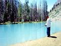

“

It all began when the Omar family was in Islamabad for the Winter Vacations. They stayed with Azam Jaffar, the mastermind who made up the Great Idea. It was a dark and dreamy night, with the rain and high winds buffeting the sides of the building. With no electricity there was nothing to do. It was then that Azam Jaffar came up with the Great Idea. He and Hamid Omar sweated for hours over a map under the suffocating heat of a candle (DarkSucker). Throughout the night they sat there hunched over the map. Then in the morning, as soon as the electricity came back, Azam Jaffar jumped and shouted, “Eureka, we have perfected the Great Idea.”

The Great Idea was to make a trip to the Northern Areas of Pakistan by jeep. It was to begin from the coastal city of Karachi, from there a rush to Rahim Yar Khan in Punjab and onward to the quaint city of Lahore. The capital Islamabad, from where the trip was to really begin. Going through Mingora in Swat Valley to Chitral, a major station in the Northern Areas, and from there to the famous valleys, Kalas, Mastooj, Phander and finally the main destination, Tirich Mir, a small town above the polo grounds of Shandur Pass. Then back to Karachi following the same route.

Most of the time the Trippez would stay in PTDC Rest Houses, and a few days in their own camps in the middle of nowhere. The food was to be brought on the way and some was taken along for energy rations.

### The Jeeps:

Four jeeps were conned into going on with the Great Idea. Intensive preparations transformed the Jeeps into Heavy Duty Off Road 4×4 Vehicles, basically All Terrain Vehicles (ATV). They are as follows:

Jeep #4: M-52, Willy’s Jeep.\*

Profile: Gray soft top, and white body.

2.4 liter turbodiesel engine.

Bridgestone Desert Dueler Tires, fully loaded with AC, stereo, pedestal fan and Super Heavy Duty Winch etc. Overall the Most Powerful and Bestest Jeep.

Driver’s Profile: Mr. Hamid Omar, Most Powerful and Most Skillful Driver of Baluchistan and Sindh Desert conditions. This trip is his first time in the mountains by jeep. Comments: “I’m not worried about this being my first time. As you know I am the most powerful and Most Skilled Driver, and I’ll be driving the most powerful and Bestest jeep in the entire universe.”

Jeep#3: CJ-7\*

Profile: Beige soft top, golden body.

3.2 liter diesel engine. Loaded with A.C, Plush Bucket seats, Stereo, extra lighter sockets, Bridgestone Desert Dueler tires.

Driver’s Profile: Dr. Mansur Ahmed.

Tooth Picker (Maxillofacial Surgeon) by Profession. Gun toting, bearded bird hunter: will go to extremes to hunt birds, (has not yet found out that they are extinct). Most experienced in mountain driving; and has thrown 3 people and the dog out of his jeep.

Jeep#2: CJ-5\*

Profile: Gray soft top, off-white body.

3.2 liter diesel engine. Fully loaded with AC, Stereo, Super Bumper (sticker) and Winch. Bridgestone Desert Dueler tires.

Driver’s Profile: Mr. Taimur Mirza. Has some experience in mountain driving, especially on paved roads. Extensive experience in Sindh and Baluchistan conditions, and under fire in Karachi. Fastest driver of the lot.

Jeep#1: Suzuki Potohar\*

Profile: Hard top, white body.

Most loaded jeep with AC, refrigerator, generator, and the most windows, not to forget the 999cc. petrol engine.

Driver’s Profile: Captain Rizwan Yousuf of the PIA. Has some experience of mountain driving in the same jeep, and the only person to have drowned his jeep in a fast running icy river. Most miles traveled (by air).

Now it is up to you to decide who is the best of the lot, the best driver, and the best jeep. BTW the ranking system (given above) has four as the highest and 1 as the lowest—4×4 ranking system.

### The rest of the Trippez:

**The Omar’s family:**

Sabiha Omar, navigator and back seat driver, not to mention the fastest driver when given a chance. Mahera Omar, expert video photographer and wannabe veterinarian, Khalid Omar, 16, the tall guy, an Abid Omar, 14, the top sailor and the wizard who made al this possible.

**The Doc’s:**

Susan Ahmed, the genuine foreigner, needs a permit to enter Northern Pakistan, Salman Ahmed, 15, swimmer and karate master, Sikander Ahmed, 9, the blue eyed fast talker, Anika Ahmed, the most innocent and curious of the lot.

**The Mirza family:**

Patricia Hillfram, the bualess mother with the youngest children, Tanya Mirza, the cute 9 year old, and Sheheryar Mirza, the inquisitive 5 year old.

**The captain and co:**

Shazia Yousuf, the badminton playing fitness freak, Yusuf Ali, 10, a chip of the old block, and Saif Razwan, 8, the cute kid.

*This article was written in early summer 1995 during the preparations for our 5 week long trip to Chitral.*