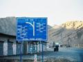

“ /> Wherin the author writes about a road trip from Karachi to Quetta, and then on to Ziarat to see the snow, and lastly the famed Bolan Pass. Covered a grand total of 2000 kilometers and [seven film rolls](./index.html) in 4 days.

Quetta is exactly 700 kilometers from Clifton, making it about 12 hours by road so it’s best to leave early so to arrive while it’s still light. The roads are extremely unpredictable, and at night you have to drive extra slow and cautious. This can extend the driving time by 4-5 hours, so instead of 11 hours you’re looking at 15-16 hours! Buses do make it in about 12 hours regardless of the time they leave Karachi, but comparing one’s time to those professional road demons is madness. The size and weight of the larger buses allow them to take bumps and bad roads at speeds which would completely destroy any car or 4×4 vehicle.

Feb 2nd: Left the house at 7:40am. The streets are completely empty – its Eid day and people are getting ready for namaz. The advantages of leaving on a public holiday are manifold. There is hardly any traffic on the roads – we passed a net total of 2 vehicles on the way to Quetta. One of the surest ways to waste time is stuck in the choking diesel exhaust of a thirty year old truck struggling to overtake a tractor towing produce bound for the market. Again and again.

Anyways, getting back to our journey which is still in Karachi: As you get off Mai Kolachi the road gets progressively worse. At places it completely disappears. The construction of the Northern Bypass should relieve a lot of heavy traffic and the road just might survive for more than 4 months before looking like the Americans had just bombed it. The road to Hub is also in a terrible state. They just can’t seem to make a road which can survive more than 6 months. At one time the FWO had a reputation for being one of the few organizations in the country who do outstanding work, but even they follow the old adage of when in rome do as the romans do.

The scenery rolls by fast, morphing from the nothingness of Karachi into a semi arid desert, then slowly the hills start rising and get bigger and bigger approaching Quetta.

Traffic is non existent, due to the Eid holidays. We only see two accidents on the way. One is a overturned oil tanker. Luckily everyone escaped unhurt. It?s a miracle the oil didn?t explode, for the tanker was fully loaded. The driver blames it on the tie-rod. Every accident I?ve seen on the roads is usually blamed on the tie rod. What happens is that after a long series of gentle curves, one comes along which seems just the same, but is far more treacherous. Once the vehicle is into the turn only than does the driver realize that the turn is sharper than it appears. Smaller vehicles manage, but on loaded vehicles the sudden load on the tire-rod causes it to snap and the momentum takes it over the edge. Proper road markings could save a lot of lives on the highway.

The other accident is a double container truck involved in a head on collision with some another vehicle. The truck is still there all smashed up in a ditch off the road. The other vehicle doesn?t exist any longer. Yet more reason as to why size matters on the road.

It’s now the afternoon, and we?re in Kalat. Suddenly, there is snow on the hills along the way!! At first I couldn?t believe my eyes! Soon there was snow right by the roadside so we stopped. The weather starts getting cold, and by the evening got freezing. After Karachi, it seems we?re in a foreign country now, what with the cold and the snow.

Approaching Lak Pass the mountains get bigger, and the climb steeper. Lak Pass is about 25 kilometers from Quetta, and has marvelous views from the top. Heavy vehicles really slow down on the steep incline, crawling along in first gear, and if there is a lot of traffic it takes more than half an hour to drive over the pass.

**Day 2:** It’s morning, and we?re heading of to Ziarat. The road was closed till recently because of recent snowfalls, but the hotel assures us that its open now. Ziarat is about 3 hours from Quetta, and just an hour into the drive there?s snow on ground in patches. Who would have thought that there?s so much snow just 10 hours from Karachi!

It?s the day after as I write this. Ziarat is amazing in the wintertime. I?ve been there twice before in the summer, but with the snow it?s a completely new experience. The swiss Alps hardly compare. (Well they are a lot bigger). The mountains don?t seem very tall, for the road itself is quite high as it winds up from Quetta, but most of the peaks are snowcapped, and some way into the drive there is snow everywhere.

Ziarat itself has four feet of snow in places. The Quaid-e-Azam residency looks picturesque any time of the year, but now it looked marvelous framed in the pure white snow with icicles hanging from the balconies glistening in the sun.

**Day 3:** The other interesting drive near Quetta is the Bolan Pass. It?s about an hour and a half from Quetta, on the way to Sibi. The old British railway track is right next to the road, and is an amazing work of construction. It goes through numerous tunnels in the mountainside and a number of bridges. The track has hardly been maintained since after partition but is still in excellent shape – a testament to British engineering. The train has two engines coupled for the Bolan Pass, and just barely manages to crawl up the steeper inclines. They are still using the British built locomotives, and it?s worthwhile waiting at the pass to get a look at them.

About 25 kilometers from the pass, is the turning for the mazaar of Pir Ghaib. Last time we planned to go there we had to cancel because there was a 5000 strong devotees? camp at the mazaar. This time while the Lashkar had moved on, there was a dakoo/bandit camp, and we were told that it?s definitely not safe to go there, especially with women. Still, while the mazar itself is not so noteworthy, the area is very picturesque. There is a waterfall going into a small lake (pond) and lots of greenery. The surrounding area is very dry, so it?s like an oasis in the desert.

**Day 4:** We’re headed back now. Suprisingly enough, driving from Quetta to Karachi is just like driving from Karachi to Quetta. So theres not much to say about it. At the end of the trip, despite such a hective schedule, everyone is refreshed. The drive is relaxing, for there is no rush now.

Quotes:

* “It was out of this world!” – MO

* “We will do everything for Afghani Tikkas…” – Yaseen

* “The most fabulous drive…” – SO

### Miscellanea

**Food:** You really can’t go wrong with food in Quetta. Head for the Afghani Tikka restaurants in the middle of the city for some amazing food. For recommendations, the best thing is to just ask a local to guide you, or wander around the bazaar till you come across something appealing. Don’t expect to find good food in any of the hotels here though. Liaquat baazar has a lot of eating places, mostly good. Afghani tikkas are especially good. So is the fish, even it comes all the way from Karachi.

If you’re feeling cold, there are there green balls from Afghanistan available which will fix that very fast. I figure they must be some sort of mild drug, because not much else besides alcohol has that effect.

**Shopping:** For general knick knacks, the Dolphin Bakery has just about everything. Liaquat Bazaar and Suraj Gang bazaar have just about everything. No trip to Quetta is complete without a trip to the Russian bazaar, which has all sorts of everything from everywhere duty free. Car enthusiast should head straight to the shershah of Quetta – it is about ten times the size of shershah in Karachi! Every imaginable car part and accessory is available there. Some people drive especially to Quetta for car parts.

**Lodging:** Lourdes Hotel in Quetta is one of the oldest hotels in Pakistan, and is highly recommended. All sorts of interesting people stay here – as evident by the guest book and the stickers left behind by tour groups. There are a number of good budget hotels in Quetta, and a lot of not so good ones also. See Footprints Pakistan for a list.

**Getting there:** Depending on how you decide to travel, driving on Pakistani highways has a number of completely different dimensions and experiences. While not an offroad journey per se, a drive through Baluchistan always has a lot of marvelous scenery. If you take a bus to Quetta, then you miss out on the drive as the bus hardly stops, speeding by everything. Bus virgins will be busy clutching on for dear life and watching the road ahead for their next near death experience to notice much of the scenery speeding by at 140 km/h. On good stretches we were driving along at 120km/h, yet we were still being overtaken by the larger buses!

There is the [train](http://www.paknet.com.pk/users/anjum/train.html) and of course the plane, but neither are very exciting.

The Lonely Planet’s entry on Quetta:

bq.. The capital and only place of any size in the parched, barren province of Baluchistan may be light on ancient monuments but it’s fit to bursting with a vigorous blend of peoples, wide tree-lined boulevards and sterling British architecture. Even more compelling, Pakistan’s fruitbowl has a dramatic setting, with a mountainous backdrop on all sides. And unlike Karachi, most sights can be easily walked in a day. Don’t miss the impressive Archaeological Museum of Baluchistan, the fort or the city’s many colourful bazaars – great places to pick up marble, onyx and some of the finest carpets in Pakistan.

Just outside Quetta are the postcard-perfect Hanna Lake, plenty of picnic spots in Urak Valley, and the protected Hazarganji Chiltan National Park. Also near Quetta is the refreshingly cool hill station of Ziarat, which is both a restful destination and a good base for trekking or mountaineering.

Quetta is a hefty distance from any other major town and a whopping 1000km (620mi) from Islamabad. The geographic obstacles, however, are not as worrying as the frontier mentality that thrives in the isolated conditions: general lawlessness, intertribal frictions and guns make for a volatile mixture. Theoretically tourists are allowed to travel anywhere, but in practice local authorities cannot guarantee your safety. You can avoid some of the problems by flying into Quetta on a domestic flight. Failing that, air-conditioned buses and trains can be taken for the long hauls, and minibuses for the shorter trips.

[See pictures of the trip over here](./index.html).

*Note to self:* Always keep a travelogue. Things to be remembered and noted stay that that way.