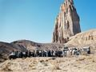

“ />

The knowledge of a monolith almost 900 feet high in the remote region of Baluchistan was based on a narrative by Captain G.P. Tate in his book on travels in Baluchistan and published in 1892. An effort worth every second of the long journey from Karachi to see this Natural Wonder almost at the Pak-Afghan border north of Nok-Kundi, would be remembered by all our members. The topography en-route to the Neza of this area varies to such an extent where one encounters one of the largest salt pan approximately 125 miles wide by 150 miles long a salt crusted flat ground stretching for miles in all directions, the Oases of Mashkel, the extinct volcano called Miri Mountain, a sight to see both in the satellite image by Nasa and yourself, the cascading sand dunes of Kharan, and above all the vastness and open space, un-tampered by modern technology.

Reproduced below is the narrative of Captain G.P. Tate.

Narrative of Captain G.P. Tate who visited Neza-e-Sultan in 1892:

bq.. We devoted two days to examine a very remarkable feature in the Koh-e-Sultan Mountains, known far and wide as the Neza, or the iron shod staff of Pir Sultan. This landmark had been first seen by Sir Charles MacGreggor and his traveling companion, Captain Lockwood, in 1877, and fifteen years subsequently I had sighted it from the heights of Jalk, very nearly a hundred miles to the South of the Sultan Group.

Amir Chah was the nearest point from which we could visit the Neza, and on the afternoon following the night of our arrival at the wells we started on this side expedition. Our route lay up the stream which drained the Westernmost of the ruined and weather-worn craters of which the Koh-e-Sultan is composed. The head of this water-course drains a catchment area, the limits of which are formed by a series of remarkable cliffs and pinnacles of volcanic agglomerates, which in themselves are very striking natural features. Everything else is dwarfed, however, by the presence of a monolith of size. The cone that at one time enclosed the chimney of the volcano within which this great mass of agglomerates was cast has completely disappeared. The softer and more friable material has long since been eroded by the action of the elements, leaving the cast of the chimney almost unaffected by their ravages.

The Neza towers to a height of 670 feet above the low watershed, on the crest of which it rises as from a pedestal; the hills that form the watershed in their turn, about 250 feet higher than the floor of the ancient crater, which still forms a circular bowl pierced by the stream up which we marched. In plan this giants “staff” is roughly a right angled triangle, the two sides facing west and south, while the base fronts the north-east. The last face of the Neza shows very clearly the effect of the action of the elements, being seamed with longitudinal fissures as if the material on that side had been less able to withstand the long-continued exposure to the climate. On the other two sides many of the included boulders have become loosened, and have fallen, leaving empty cavities which pit the surface of the rock.

After a very toilsome journey, lasting till near midnight, we reached a point about a mile from the Neza, and there we dined and formed our bivouac. It was a brilliant moonlit night, and the shaft of the great mass of agglomerates standing out against the dark blue sky oppressed our minds by its towering height and vast dimensions. The description we had read of this stupendous natural column in Sir Charles MacGreggor’s book entirely failed to convey the impression we derived from our visit to the Neza, and it would have been a misfortune if we had not availed ourselves of the opportunity of seeing it. Our long and wearisome ride up the Gami Chah Mullah and back to Amir Chah was, we considered, amply recompensed by the sight we obtained of what is certainly one of Nature’s curiosities.

*(Contributed by: **Taimur Mirza**)*