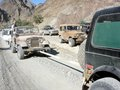
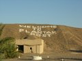

The following is a [diary entry](http://overland-underwater.com/index.php?blog=5&title=broken_jeeps_but_no_broken_spirits&more=1&c=1&tb=1&pb=1) I’d written for [Alex, Maz and Martin](http://www.overland-underwater.com/index.php?title=team) for their [journal](http://www.overland-underwater.com/index.php?blog=5) as they drove through Pakistan. *Updated for posting here.*

Back in March Alex had contacted us – he was trying to get some information on Pakistan, and had stumbled across our website, offroadpakistan.com, where he left a [post on our forums:](./viewtopic.php) *“Hi. I was hoping that I could use the collective knowledge on this forum to offer our team any advice/suggestions/routes/must see & do’s for a visit through Pakistan?”*

The emails flew back and forth, and we ended up deciding to [meet up at Taftan](./east_meets_west_in_kohitaftan_on_the_pak.html) on the Iran-Pakistan border, and drive through the Baluchistan desert down to Karachi. We had been planning a trip to these areas for some time, so this was a good reason to stop procrastinating and finally go, and at the same time the overland-underwater group would get to experience the less traveled parts of Pakistan.

Thus began the marathon dinner meetings of the members and finally with consent of all a route plan was carefully chalked out: Karachi – Quetta – Dalbandin – Taftan – Mashkel – Palantak – Panjgur – Khuzdar – Karachi, leaving on the18th and returning on 27th November 2005. Planning a trip, especially to Balochistan entails careful thinking and preparations. Unlike the roads leading towards Punjab and NWFP which have literally thousands of places to eat, Baluchistan has very few and at great distances. We had to prepare lists of foodstuff required for the 10 day trip, cooking utensils, gas cylinders, mirch masalas, cooking oil, water and host of other items. It’s like moving a complete functioning kitchen and not forgetting the tents, sleeping bags, blankets, pillows, etc., etc. leaving barely enough room for us to literally crawl in Jeeps.

Taimur Mirza’s jeep was being rebuilt this whole while, and was still in the process when we finally left in the morning, with a few bits and bobs still not functioning properly, like the brakes and so on! He finally drove off from the workshop at night, the day before leaving!

The road from Wad onwards is just fabulous; you can drive at an average speed of over 100 kms and at this constant speed we were in Quetta by 8 in the evening. Lourdes is one of the oldest hotels of Quetta and our second home in Quetta, where most of the staff members know us all very well. A spacious lawn with tall Quetta pines, patches of colorful flowers and comfortable rooms and ample parking space in front of the rooms makes packing and un-packing of the vehicles a lot easier. Quetta Valley is about 4500 feet high, so it was quite cold there!

We had kept a day extra in Quetta, so everyone was up early and ready either to hit the Russian market or the Victorinox Shop selling Swiss Army knives or the Zarghoon market where you can find parts for the latest vehicles. We also had to buy provisions, supplies and other items for our traveling kitchen not forgetting the gas cylinders that needed to be filled. Taimur Mirza installed a brake booster for 350 rupees (5.5 US dollars) – which fixed his brakes, and I bought new brake lights for my Willys Jeep (M38) and headlights for the Cherokee. We all left for dinner, and after much driving around reached the Afghan Sakhi hotel, where we had a grand dinner – it’s highly recommended!

We finally left for Dalbandin next morning, at 11am from Quetta. We almost made it out of Quetta when Papu Sahib’s 1941 Ford jeep got stuck in third gear and wouldn’t shift out despite frantic efforts. Doc went back and got a mechanic with a Jeep, and we decided to head on to Dalbandin. Pupo Sahib will catch up with us later once his jeep is fixed. Offroad or onroad, his average speed is 40 mph, so once we get off the road no one can catch up! Right after Quetta the road goes through some amazing scenery, and cloudy skies broke up the harsh sunlight.

Had a bit of a fiasco regarding our night stay at Dalbandin, but it worked out finally and we ended sleeping in the living room of a guesthouse! We left Dalbandin after a hearty brunch at the FC post there, and headed straight to the PSO petrol pump there. Like the last time we were there, the owner had two diesel pumps, one selling Irani fuel at Rs 24/litre, and the other one selling so called Pakistani diesel at Rs 38/litre. Human pysche is such that even though there is zero chance of it being Pakistani diesel we’re still paying more for it!

It rained in this area after about 7 years, so as we left for Nok Kundi the scenery was really nice. After a stop for tea at Nok Kundi, we drove straight to Taftan, which is another 130 kilometers from Nok Kundi. The terrain is flat with the Koh-e-Sultan range on our right and Hamoun-e-Mashkel on our left. Neza-e-Sultan is visible from the road and reminded most of us of our visit earlier. We stopped on the highway to take a closer look at the Neze-e-Sultan through binocolaurs, and after much pointing most people got a glimpse. Driving to Taftan from Nok Kundi, we saw flashes of light on the other side of the mountains towards the Afghan border. Sikander the ‘DRA’ thinks that “Red flashed means the American’s are still bombing the Tally’s man!”.

Slogan of the day by TM: “This is a Jeep thing you wouldn’t know about it”.

We arrived at the PTDC motel in Taftan just before dark. We had been expecting the Overland-Underwater group to have reached Taftan in the early evening, but they weren’t there yet – they had gotten stopped at the border. After some phone calls we established that they had arrived late at the border, so were now going to cross over from Iran in the morning.

PTDC Motel Taftan is a one man show; leased out to a Bengali who opted to stay as a Pakistani in 1971 is the manager, receptionist, telephone operator, doorman, cook, waiter, sweeper, bootlegger – the list is unending. The place is in shambles, a shame for Pakistan. After we had checked in, everyone was busy in something or the other. Hanif Choudhry staged a Coup-de-etat in the kitchen and had the cook from Bhiriya Road (a small town in Sindh) demoted to an assistant which upset him visibly. While this was going on, the hotel owner was trying to make samosa’s for all of Taftan in that tiny kitchen – it’s a miracle everyone got to eat. While the chicken korma was being cooked Aamir Bilal smuggled half of it to the room for approval of mirch masala by the ‘orange juice sipping squad’ all of whom kept ranting and raving with ‘wah’ ‘wah’ (very very good!!) being heard all over the Motel.

TM: We were informed that two vehicles had arrived at the Iranian side of the crossing but had to stop overnight as the time difference between Pakistan and Iran was not accounted for by the travellers, with both check posts closing before the other. The next morning it was time for a closer look at the vehicles for any signs of breakages and Khalid and Doc were busy fixing their vehicles when two Land Cruisers fully laden with all possible camping/offroading gear appeared through the main gate of PTDC Motel. A young lady and two gentlemen walked out to meet us; the West Meets the East. After the preliminaries of welcoming and intro’s we invited the trio for a quick breakfast and left for Saindak to see the Fort and residence of General Dyer – yes, the infamous orchestrator of Jaranwala Massacre – now in use of the Frontier Constabulary. The Saindak Copper and Gold Mine Project produces ore for further refinement in China.

Martin: “The Iranian’s finally let us out of their country and after the Pakistani formalities we met the Karachi crowd at 11am or so Pakistani time. They had kindly waited for us – then waited some more while we had tea before setting off to the Saindak fort.”

We left for Saindak fort, but Doc’s jeep broke a fan belt just outside Taftan, so Imad and I went back with him to fix it. The rest continued on to Saindak fort. We fixed the Jeep double quick and met the others for lunch at Saindak. They had already toured the fort and General Dyer’s residence. The Frontier Corps is using the fort as their regional headquarters, and are restoring it. The copper mines were shut while we were there, but we were able to get some ore samples which are composed of gold, copper, silver, marble, etc. – which we broke up into pieces and took back as souvenirs. We’ve had them for over three months now and they’re still shining brightly!

We headed back to Taftan, where we spent the night at the PTDC motel. Next day we left for Qilla Ladgasht. After so long on the road we were eager for some offroad driving. We headed down the highway partway to Nok Kundi, then turned off into the Mashkell desert (which is technically a salt flat). Alex: “There’s nothing like getting off the beaten track and putting the cars through their paces”. The

Doc: “The trip so far has been great fun, onroad and offroad”

We arrived at Qilla Ladgasht in the early evening, well in time to set up camp under the date palms. It took us a couple of hours to get everything setup, while Maz, Martin & Alex watched us for a while then proceeded to setup their tents in a couple of minutes!

Imad: Qilla Ladgasht to Palantak – After spending a night out under the stars at our 5-star campsite, it was finally time to proceed on towards Panjgur. I had been waiting looking forward to some ‘wheeling for a while but the last day’s high speed 2-wheel drive desert run had been anything but; 120km across a smooth salt pan with a few rutted tracks crisscrossing our paths thrown in for some white knuckle moments but mostly uneventful driving. I hoped to see some more challenging surfaces to drive on today, but as they say, “Be careful what you wish for – you just might get it”.

The terrain leading out of the Qilla was far worse than the previous day’s flat desert. The desert was full of gullies cut by rushing rainwater and tracks we were to drive on had been completely torn up by fuel smuggling pickups into the most horrific washboard surface known to man. Think speed bumps strategically positioned to cycle your suspension through its full range of movement plus a little bit more. Maybe if you drove at a constant 80-90km regardless of what came your way you would be able to glide smoothly over them. Not a realistic option for us, especially considering the weight we were carrying.

About 10 km into the day’s drive, I was busy dodging the bumpy parts by pulling off the track and seeking the soft sandy patches where the Jamboree does really well. The drive was going really well and I was getting a good feeling about the drive ahead – this stuff really demanded a lot of concentration and attention to pick out the right line. I had just pulled back onto the track, running straight at a rather deep looking sandy patch. No problem, I thought. Simple 2-1 downshift and I’ll be out as smooth as I came in. As I eased the shifter forward into 1st and let out the clutch, the CJ surged forward, then suddenly lost drive as it had slipped into neutral. However, a quick check revealed I was still in gear, 4 hi, hubs locked, but I wasn’t going anywhere. The engine was spinning freely as if in neutral.

All sorts of possible scenarios of drivetrain carnage ran through my mind… broken driveshaft, stripped gears in the t-case, broken input or output shafts, slipped something here or there, shattered clutch, could be anything. A quick visual check yielded no clues. I could put the fuel situation on hold for now, since it was quite clear I would have to be towed until at least Palantak. Whatever needed to be fixed would have to wait until we were done traveling for the day.

We quickly hooked up a tow strap between Doc’s CJ and the Jamboree and set off again. The terrain now started becoming hilly; not exactly tow-friendly. Through dips and over bluffs, the Jamboree faithfully followed Doc’s CJ, delivering a reassuring tug on the tow strap coming out of every dip, as if to say, “Hey I’m still back here!”

However, the whole tugging and snapping routine became a bit much for the tow strap, and it snapped coming up an incline, taking out the tail light on Doc’s CJ along with it. Doc was visibly not-exactly-pleased with the proceedings, and we rigged up 2 straps this time.

“ /> Several kilometers later, Doc’s CJ also started showing signs of fatigue. The front shocks and various other bits of the suspension began failing and it became clear he wouldn’t be able to tow any longer. So now Khalid stepped up to the plate in the green CJ-7. I was initially worried about the auto transmission in the green Jeep being able to handle to extra load of pulling another Jeep over such rough terrain, but any fears were soon dispelled. Not only did the auto make the towing a whole lot smoother, it was also much more powerful and we soon found ourselves overtaking everyone else.

“ /> Shortly after sundown and a whole day of being towed over the most awful terrain, we arrived at Palantak. True to its reputation, Palantak is no more than a couple of buildings located in an oasis in the Mashkhell Desert. Siddiq and Alam immediately started on dinner preparations, while everyone else got washed and cleaned up to settle down after a day of arguably the worst driving we’d ever seen.

After dinner, I had a discussion with some of our gearheads as to what the problem with the Jamboree could be, and how to tackle it. We were certain now that something in either the transfer case or the clutch had failed, and any attempts to fix it would not be fruitful unless we had access to replacement parts.

I guess I no longer had to worry about running out of fuel now. Repairs would not be possible before we got to Panjgur. Since no one had imagined that the route charted out for our best off-road adventure ever would lead us over the worst terrain we had ever seen, what awaited us tomorrow was anyone’s guess. My guess was, “It’s nowhere close to being over yet!”

Panjgur: Like most towns in Baluchistan, Panjgur is a rundown, backward little place that no traveler would care for very much. However, after being towed fifteen feet behind a speeding Jeep with 32” tyres chucking out rocks at subsonic speeds at my face, Panjgur was a sight for sore eyes. Paved roads, the prospect of finding a mechanic to fix the Jamboree… life was starting to look good.

We got to the guesthouse and unloaded the jeeps in a hurry. It was getting late and we needed to find a mechanic ASAP. After unloading a rather large mountain of stuff from the Jamboree and Doc’s CJ, we rigged up the tow strap once again and set off for the army compound where the mechanics would start on the jeeps right away.

The next morning brought a mad but rather unsuccessful rush to locate the right spares. Turned out that the Jamboree’s clutch disc had snapped into two pieces; catastrophic failure the likes of which even my mechanic has never seen before. Doc’s CJ could still plod on, but it was game over for the Jamboree. A truck was arranged to take it back to Karachi along with all the stuff we would no longer need. The driving that I had so looked forward to was over for me, but I wasn’t exactly complaining either about staying dust-free in Martin’s Land Cruiser.

On to Khuzdar: By noon we had set off for Khuzdar via an alternative route taking us through Nag and Besima. Our departure from Panjgur was well-timed – the cold north wind from Afghanistan met us just as we stopped for tea in Nag. We were thankful for not being caught by the weather while we were still camping. By the time we hit the main RCD highway to turn south towards Khuzdar, the guys in open jeeps were beginning to turn blue. It was here that we bid farewell to our faithful escort of 16 Pakistan Army jawans, many of whom had developed a great rapport with our group.

We were temporarily inconvenienced in Khuzdar, when the manager at the BMC guesthouse let us know that he had no prior knowledge of our impending arrival. Even then, he was kind enough to accommodate us. Hot showers, which we all take for granted every day, were a luxury we could finally have after the last few days in the desert. Everyone made a beeline for the bathrooms to shed the caked on dust and sweat.

Khuzdar to Karachi: The morning started as it usually does on such trips. People shuffling around, some packing their stuff, some waiting for a chance to use the bathroom, others heading to the dining area for breakfast. No departure from Khuzdar is complete without a morning group photo, and today was no exception. Trying to get everyone to stay still for a couple of minutes is more difficult than herding sheep, but doable. After making a customary fuel stop at the PSO pump up the road, we finally set out for Karachi. The RCD highway soon turned to a battered, rutted and potholed surface once we crossed Wadh. The weather also started turning more humid as we descended into the coastal basin. More traffic appeared on the roads, complete with burned and rusted out relics of wrecks past. At one point, we also saw a tractor trailer rig hanging halfway off the road over the hillside in mid-air as if it were a stunt prop from a Hollywood movie too. Sure enough, we were heading back to civilization, happy and sad at the same time, but glad to have been through it all, and glad to have gotten the chance to tell others about it.

At the end of the trip, Doc was a bit down: “I am depressed today… no more dust, no more bumps for a while… will wait for our next trip.”

Alex: “Thanks to everyone and we head off with superb memories of a great visit”.

Maz summed it up best : “It was a bril trip, excellent fun and great people to spend it with. We have made some very special friends in a short space of time”. The same from all of us too!

The [original diary is over at the Overland-Underwater website](http://overland-underwater.com/index.php?blog=5&title=broken_jeeps_but_no_broken_spirits&more=1&c=1&tb=1&pb=1).

Click here to see the pictures from this trip. <http://offroadpakistan.com/pictures/taftan_plantak_2005/>