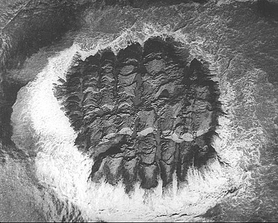

In 1945 when there was an earthquake off the Mekran coast which resulted in thousands of deaths from the subsequent tidal waves, or tsusami as they would now be called. There were reports from aircraft flying in from the west of volcanic eruptions in Las Bela province, Baluchistan. I didn’t believe the volcanic eruption story as the geology wasn’t right so I and friend Peter Wolf took leave and went on a private expedition to see what had happened.

Late in 1945 Peter Woolf and I were lowly LACs stationed at Korangi Creek RAF flying boat base some miles from Karachi. The creek is part of the Indus Delta and I was a Coxswain, 2nd Class, amongst those whose job it was to usher these aircraft about whilst they were on the water. I�ve now forgotten what Peter did but shortly after the following events I went to Redhills, Madras and he went off on a met. officer training course. The next time we met was in London.

Peter and I had been planning to do something venturesome with the leave that we were due – a personal expedition westward along the sparsely inhabited Mekran coast of Las Bela State, Baluchistan � but had abandoned the notion being unable to organise the necessary camels. We had decided instead to explore creeks of the Delta in Herman, the sailing dinghy that the station had somehow accumulated. When news came through on 28th November that a major earthquake had seriously affected the coast we resurrected the Mekran plan, this time enlisting the help of the Wazir of Las Bela.

The Wazir had an office in Karachi which he attended every now and then. We were lucky to catch him. Maybe he was pulling our legs but he seemed puzzled as to why we should need his help. “Why don’t you just take a tank?” he asked. But he provided a Laissez Passer, and I doubt that we would have got far without it.

We borrowed a tent from Karachi Technical College via my friend Maneck B Pithawalla, Professor of Geography, a shotgun from the Korangi Armoury, and drew �K rations� from the Korangi cookhouse. These were boxed emergency rations for British forces, and were quite interesting, much more so than the US version, containing such things as tinned stew, genuine cheese, that wartime luxury Spam, cigarettes and excellent canned Dundee cake.

Peter and I started separately on 2nd December 1945 having fixed to meet at 11.15 at Lea Market, Karachi. Camels still hadn�t organised and further negotiations at the market got nowhere but we decided to leave anyway by bus for the Hab River and see what could be done there. We waited for the 3 pm bus, sitting on the ration boxes in case somebody wanted to take off with them or, more importantly, the shotgun. It set off at 3.45 reaching the Hab at 5 pm, an amazing feat for a vehicle in such a decrepit state. On the way there was a diversion to catch “a tumba” – whatever that was.

At the Hab, which is the boundary between Sind and Baluchistan and was also border of Las Bela, the Wazir�s Laissez Passer began to work miracles. We never knew what it actually said but it started by mustering a camel to take the gear across the river to a Dak bungalow on the other side. We paddled after it. Overnight a message was sent by the Dak Keeper to a village 8 miles away, resulting in 3 camels turning up in the morning complete with driver, a sepoy, and two others. The rates for camels turn out to be at much more digestible levels than we had been quoted in Karachi: 8 annas per day for a carrying camel, and one rupee for a riding camel, the price including the driver.

The road finished at the Hab although a motorable track continued. We didn�t use it, taking a camel route through the Pabb Range, not easy going in gullies and defiles, to Bawani at about 6 miles where there are wells and runic tombs. Maybe Alexander came this way. The track continued by the Lak Beddoc “Pass” to Naka Charalai, where we arrived at about 5 pm., mightily glad to do so, not being used to this kind of exercise, either the sitting on camels or rough walking.

There was a Dak Bungalow at Charalai but we were put up in a mud hut. By now we were on familiar terms with our retinue, Peter Woolf holding Sindhi/English lessons with Jammu and Suleiman, and I with the Naib, an old man who appreciated that camel riding brings aches and pains to the inexperienced.

A new set of camels took us to Sonmiani, the going being easier at the outset through fairly fertile land, toughening later over large dunes, across saline wastes and occasional thickets of scrub. An Englishman had been purported to live from time to time at Ambagh en route and to have developed an �English garden� but the place was found in decay with the bungalow ruined and roofless.

Sonmiani is said to mean Port of Gold and was at one time important but silted up and had much declined. If �gold� actually means gold it would hardly have been exported from here but could have come in with the dhows from Africa. We arrived at about 4.30 and were put up in style at the Sonmiani Dak. We had numbers of visitors and got accounts of the “zalzalla”. After the earthquake shocks a light was seen over the mountains in the direction of Hinglaj and fell on the sea, burning in two parts for about half an hour. A man who had been at Ormara described how he had been catching fish about 3 miles from the town but decided to take to higher ground when the water became increasingly agitated, thus saving himself from the tidal wave that followed. He then hurried back to Ormara and found it destroyed. He learned that the quake had caused two houses to collapse and catch fire. Men ran to fight the flames but the ground opened and water gushed forth, drowning two. This water was sweet at first but later salty. The tidal wave that followed drowned about 80 persons who had not run to higher ground. Pasni, another place along the coast is now only approachable by sea, the track having been washed away.

In coastal groundwaters fresh water floats on the higher density salt water and hence as they get squeezed out it is expectable that fresh water comes up first. The accounts clearly suggest that the main quake was offshore. I could not get a clear idea of how long it was after the main shock that the wave arrived; obviously at least some minutes. It carried on down the coast drowning thousands[1] in low-lying parts. Near Korangi Camp it engulfed the village of Dabbo drowning about 100, including Musso’s (a Korangi foreman) mother and his three sons.

At Korangi Camp it had scarcely been noticed perhaps because I was on duty that night and asleep as we were permitted to be unless an aircraft was due which practically never happened after dark.. Some of those crews had difficulty landing even in daytime. The creek is protected by a bar with winding channel and substantial sandbanks. Nevertheless a marker buoy and a couple of moored Catalina floats had gone adrift so there must have been a considerable surge up the Creek.. The camp itself is built on a cliff top and unaffected. The tsunami was noted right to Bombay and beyond, even as far as the Seychelles

On the 5th the new camels didn�t turn up until 10.40. The route took us through Damb, a village and present port about 4 miles from Sonmiani, which boats can now only reach at high water. We got to Phat at about 4 o�clock. This is in the middle of a scrub area but we’d been through much salt marsh wastes. We were heading for Liari, getting there about 8 pm, in darkness and thoroughly exhausted. The guest house was a mud hut again. Here we had a typical ration meal of herrings, tomatoes, cheese, pork loaf, tea and biscuits. The lantern we carried by now was not working properly and when the shade broke we gave it away using a butki that we’d invented ourselves. It was an Erinmore tobacco tin with some paraffin in, and a scrap of cloth as wick, fed through a hole punched in the lid. Initially the lid tended to blow off as the temperature increased but we resolved this by doubling up on the lid.

In the morning whilst waiting for the camels we were shown round Liari by the Munchi, a couple of other officials, and the schoolmaster together with his 7 pupils. There were about 12 shops in the bazaar, one of which had a magnificent woven dhurri , only 50 rupees but we reluctantly gave it a miss which I have regretted ever since. A 20-camel train arrived at this time. The loads were weighed at scales which had a standard weight of a stone and piece of iron said to be 2 maunds (1 maund = 82 lbs).

The first 5 miles after Liari were in green scrub but at Baddo entered a dry sandy desert with scanty scrub. A strong wind raised a lot of dust, so much sometimes that we could only see a few yards. Pitched camp at 6 pm, the first time we’d used the tent, and were glad we�d stocked up with water some miles back at Charari as there was none here.

**7th.** We were now approaching the Haro Range. Clearly visible were what we took as mudflows down some slopes, some evidently more recent from their darker colour. We headed first for Kandewari where we arrived about 2.30. It appeared quite important on the map, and is since it has a well, but otherwise consists of a two-roomed mud hut.

We had only been at Kandewari a few minutes when a splendid camel came up bearing the Naib of Liari and another fellow evidently his Major Domo. He had been to Aghor where there was a ration wagon from Karachi. We had seen its tracks. The road from Aghor to Ormara via Buzi has been destroyed and the food was taken onward by camel train. The Naib filched some of the K rations that we had given to our drivers and wanted 10 of our cartridges but we fobbed him off by producing the map and discussing that. I was invited up onto the Naib�s magnificent camel for a gallop across the desert. It nearly split me in half. Peter had thought to join in on one of our camels but the saddle came adrift and he finished the gallop clinging on under the camel’s neck. All told we were somewhat glad when the Naib left. Our own camels then also set out back for Liari, we having made arrangements for more. An old man turned up with a kettle full of goats milk refusing payment but accepting cigarettes.

**8th.** Camel men arrive at 8. The track gradually converges with the southern spur of the Haro Range and we meet up with earthquake cracks in the desert floor. One long fissure opened to as wide as 4 ft in places. After the first outcrops of the range we encountered a stony plain, the lower Phor Valley. Here there is a large graveyard of cairns and some decayed runic tombs. Down in the dry watercourse we turned north to a well where a family lives sheltered by only a few branches. From here we crossed to mud volcanoes rising from a barren mud flat. The largest, Chandragup rises about 300 ft. The other two are smaller and named Ramagup[2] and Ranagup. One of this pair is extinct whilst that to the east is slightly active � a little water having recently issued on it�s western side. The lower slopes are pitted with vents in the dried mud which contains many pieces of calcite. Towards the top of Chandragup itself there are fewer vents and the sides become quite steep. Some fresh mud, only partially dried, formed thin flows from the top. The crater itself is about 20 ft across with liquid mud about a foot below the brim. Every 30 seconds or so a large bubble appears on the surface and bursts. A most unpleasant place � very eerie.

The extinct crater to the SW is about 15 ft deep, A layer of mud dust covers the floor.

Overnighted in a grass hut overlooking Sapat Bay, delightful spot. Within a few minutes of arrival, milk, firewood, mats and water had been brought. Tried to organise a boat to take us to the Hingol, but again more than we could afford.

**9nth.** This morning a boatman turned up with whom we did do a deal. Agreed Rs 100 to take us to a place called Kund, wait 4 days and then return us to Gadani, back along the coast. A man was sent off to meet us at Kund with camels. We knew him. He was the sipahi attached to the Kandewari Chauki so we were confident that he�d be there. In fact, throughout the trip everybody stuck with their agreements. The boat was about 30 ft, two masted but only one put to use. A large stranded boat was pointed out to us, put ashore by the tidal wave, 10 men had been lost from it.

At Kund we were received like lords. The entrance is hardly noticeable from the sea. Boats are drawn up on the beach in a break in the rocky shore. People ran out, seized ours and hauled it up. We were invited up to a brick building but startled everyone by first going for a swim. Later we held a general conference about the earthquake. It emerged that Chanay Mt. on the left bank of the Hingol ‘burned’ for three days. The mountain is about 2 miles from Gwand Bent – about 9 miles from Kunderach and near the Rt bank of the Hingol. There had been a rock fall or fissure at Buzi. Two boats had been thrown ashore at Kund.

It does not seem that the Gup volcanoes ignited but that the 3-day conflagration was at Sham Mt (Chanay?) near the Hingol. It has been reported that mud islands temporarily formed off the coast. One of these seems to have ‘burned’ for about half an hour. This relates to what we heard earlier on.

We pitched camp behind the village and then ran a surgery for people with gashes and other ailments. This finished our supply of aspirin and sulphanilamide, and also our cigarettes. Someone presented us with a beautiful fish and baked it for us over the fire. We were now cooking exclusively over wood fires having lost a vital bit of the Primus. The wood fires turned out to be much better.

**10th.** We’d passed the mouth of the Hingol in the boat so now headed back inland and eastwards on dusty trails and amongst many sandhills to Aghor, a few huts, where the river leaves the rocky hills. Nearby is the �fortified island� in the Hingol mentioned by Stein in his Archaeological Tour in Geodresia. The river course is about � mile wide here and mainly dry at this time. We forded the flowing part, about 2 ft deep, on our camels.

At Aghor we found the truck that had carried relief supplies from Karachi. It had broken down, beaten by the non-roads. Repairs nearly finished, the driver expected to start back the next day. The supplies had gone on by camel.

The Hingol valley has fantastic scenery of towering cliffs, pinnacles and buttresses, the river winding between. Bypassing Kunderach we eventually camped at a delightful riverside spot near Gwand Bent. Nearby was the biggest fracture we�d yet seen with a vertical displacement commonly 2ft and up to 4 ft between the sides. This was at least � mi long. There were numerous subsidiary cracks in the alluvial floor; a small island like hill was extensively broken up, and there had been many rock falls about.

**11th.** We attempted to get up Sham, the mountain which was claimed to have had the fiery eruption but failed, eventually being trapped in a defile with sides too steep and crumbly to risk. Some of the cliffs and slopes are of dried mud and in part we were dealing with eroded mud volcano scenery. Our sipahi who had been a linesman on a telegraph line that had once run nearby reckoned it would take 15 hours to get to the key spot. Maybe he didn�t want to make the attempt either. Returning, we broke camp at 2.30 and turned back for Hinglaj.

Hinglaj is about 2 miles into a pleasant side valley that we had already passed. The track was difficult for the camels, one of which fell so we pitched camp on a small clearing and continued on foot to the Hindu shrine, Mai Nani. Under a protecting overhanging cliff there is a cool, clear spring-fed pool in front of the shrine, some coloured stones and a raised earthenware hearth for the sacred fire. It is on a platform under which there is a tunnel through which pilgrims must pass. Hasham, our sipahi, a Muslim was duly respectful requiring that we took off our shoes, which we did, and told us that photographs were not permitted. He mentioned that there is a Muslim shrine on top of one of the hills nearby but did not suggest a visit.

**12th.** From somewhere came a rather old man, Morad Kalir, who was in rather bad shape. He�d had an accident, falling out of a tree whilst collecting unt kahna. No bones broken but severely bruised and some cuts. We patched him up as best we could, put him on a camel and got him to Aghor where he wanted to be left. We ourselves continued back to Kund where everybody seemed delighted to see us. Now confirmed in the medical business we opened up clinic in the evening and dealt with a variety of cuts and abrasions. One man had a cut on his forehead where he�d been struck by a falling rock. It was already repairing well. He�d plugged it with camel dung which had worked splendidly. This is a tip worth remembering.

**13th.** Our boat was launched at 9 am and after friendly farewells we were on our way in light airs to Gadani in company at first with another boat which rapidly went ahead as it was using both it�s masts. The wind got up at 2 pm and we overhauled our companion as it had reduced sail. The wind dropped again and we were given a tow for a spell but then abandoned. Night fell, the heavens ablaze with stars. Albash and Morad, the crew, sang lovely little songs. We were as things had been for a thousand years.

**14th.** Arrived at Gadani at 3 pm. This is a straggling place protected by a small promontory to the SW. We all repaired to the char shop for refreshments whilst a camel was mustered to bring the gear. Louri, our skipper, assisted in putting up the tent near the Munshi�s place and then said goodbye with smiles and handshakes. A good friendly man who knew his business, which goes for practically everybody we�d met. To live in that environment you have to know what you are doing.

**15th.** This morning we had to negotiate with camel people to take us back to the Hab. These weren�t so good and friendly, at least until the deal was struck. We had to threaten them with the wrath of the Wazir. Left at 11 am and arrived at the Karachi side of the Hab at 4.30. The Karachi bus turned up shortly afterwards and took us to the city. Here we were tackled by a young man who had been waiting for us, heaven knows for how long. He was B.G Deshpande MSc who, with a colleague were the advance party from the Geological Survey of India! Much joy that we had connected!. Shortly others from the Survey turned up at the char shop.

Back at the bus stop we were met by an enthusiastic throng. Everybody seemed to know about the trip and we were plied with tea and cake even by the bus driver and our Gadani camel people who somehow or other had managed to turn up. The busman then drove us and our gear to the Imperial where the camp transport started from. Owing to our beards and scruffy condition they didn�t want to board us at first, and the gate guards at Korangi took some persuasion to let Peter in.

The cost of the expedition to us had been Rs 142 Annas 8 for the overland part and Rs 100 for the boat and crew, Kund to Gadani, total 242 rupees, 8 annas..

It had been a tremendous experience, stimulating us into speculating about making our way back to England overland, now that the war was over, either via the Khyber or the Quetta Railway to the Persian border. In those days such a venture would have been perfectly feasible. But it didn�t happen.

**Peter Martin-Kaye, 60 years later**

**Plymouth, England

**

**08 March 2005**

Read the [complete transcription from Peter Martin-Kaye’s diary of his 1945 Mekran trip with Peter Woolf](/downloads/trips/Mekran_Diary.pdf)

fn1. 4000 are reported to have lost their lives

fn2. Ramagup is what I have in the diary but I believe it�s in error for Rajagup. In fact somewhere I�ve seen the largest volcano referred to as Rajagup

#### The earthquake

A “great” earthquake struck the Mekran Coast of Pakistan at 02:56 AM local time on 28 November 1945. A major Indian Ocean-wide tsunami was generated by this earthquake which struck the coast of India and was recorded as far as the Seychelles. ‘ASC 1945 – M8.0, Mekran Coast Earthquake’:http://asc-india.org/gq/19451127\_mekran.htm

“Frozen Earthwaves”. On an island of the Mankran Coast produced by the earthquake.

“ />

The picture above was taken by Sondhi, V.P in 1945. Click the image above for more details.