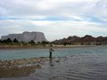

 This was my second trip along the Hingol river in two months, this time with Doc Mansur who had missed the earlier trip due to prior commitments. Azhar Khan was keen to come along for a yet another attempt at hooking a “Mahasher” from “Poldat” a place he had not been able to reach in 4 years and several offroading trips in the area.

 Another gentleman, Mr. Masood whom I met at the gas station and has a beautifully re-built CJ7 - and when I say beautifully it means amazing! A very good job done by Aslam who has a workshop in Liari. Samar Ali Khan, a leading Architect and his son were invited by Doc and I noticed the awe on his face as he saw the grandeur of the Hingol Valley.

 As we passed the town of Winder after topping up with fuel we spotted hundreds of Griffon and Black vultures a little distance from the road. There are scores of poultry farms along this stretch of the RCD Highway and on close inspection I found dead poultry packed in PP bags and dumped in the open space, the stench of decaying poultry had attracted huge numbers of vultures. I debated with my self if the poultry was infected with the deadly ‘avian flu’:http://en.wikipedia.org/wiki/H5N1 and what was the future of the vultures feeding there. The Griffin Vulture is on the endangered species list and fast declining in India and Pakistan due to a medicine given to ailing cattle over the years and has been discovered only recently, these birds have been feeding on dead cattle and dying mysteriously in large numbers.

The weather was very pleasant as we reached Khairoo’s hotel at Aghore where Soomar and his gang were waiting for us and we were on the trail in no time. There were a dozen or so Pelicans in the river below and as we progressed a little further we saw 8 or 9 huge crocs lazing in the sun on the far bank. We wanted to reach our camping site during daylight hours but the track after our previous trip had further deteriorated and slowed our progress while every turn being a new sight for Doc a photo session was the actual cause of delay.

 

Some twenty kilometers on the trail as we drove down from the high embankment onto the river bed we saw three people walking towards us. The two Baloch’s looked familiar, however, the third clad in a well used army pants and equally dusty sweat shirt, visibly disheveled turned out to be an Austrian trekker. He looked pretty disturbed and probably heaved a sigh of relief when he saw the Jeeps and people in western outfits. Wanting to go to Aghore we offered Bergzwerg to take him along with his backpack weighing nearly a ton, but after our trip further up the river. At the campsite, bathed and refreshed, we sat around the campfire and what he narrated to us is partially written [in his diary which is on the net](http://bergzwerg.modblog.com/) at and reproduced here with permission:

### Bergzwerg: trekking in balochestan – 120 km desert

 minibus karachi – bela, in lasbela district, se balochestan.
the plan: visit hingol national park. take vehicle to lak chauki (20 km w/bela) + walk the path along the river to shorap (~ 90km), there take transport to the arabian sea + enjoy for several days.
reality: i’m brought to a place which after asking the locals about distances to known places (they knowing no english, me neither urdu nor baluchi) i supposed to be at the river the path meets south of here. but no way to tell for sure.

found no detailed maps so my map scale is 1: 1,500,000 (1 cm on the map = 15 km in reality). that means no detailed navigation is possible.
got 2 kg rice, 1 kg lentils, 1 kg onions, 1 kg potatoes + some garlic + cooking oil as well as 4.5 l water. the pack is filled to the brim + heavy.

**day 1**
the river has no water, the next waterhole is said to be 10 km from here. it is hot. goat are herded here, some camels. beautiful desert. find the waterholes, camp near one of them. not much distance covered today.

**day 2**
late morning the path forks out of the riverbed, i go have a look + see a nomad camp on the canyon cliff opposite of me i didn’t notice from within the canyon. i rest. unrestive voices and a hysterical woman trying to hold back her husband tell me it’s time to go. 3 men approach with sticks + call me. one waits on the other side of the river, 2 cross to meet me. i approach them. they show me the way to shorap. the path doesn’t follow the meanders of the river. waterholes every once in a while. the water tastes salty, often there are little fish + sometimes even frogs. it is hard to walk in sand + over fields of big river stones.

**day 3**
as people come down the other side of the cliff i leave the campsite. suddenly i notice a man shouting angrily run for me with his small-headed long-handled axe high in the air. no way to run with the pack. i greet him at a distance of 12-15 meters – no reply. i gesture him that i’m about to leave and tell him the destination ‘shorap’. he stops the attack just before reaching me and watches me leave.
from across the riverbed several people come, and one of the men walks some distance with me.
i have no idea if i am where i think i am. verification impossible.

**day 4**
stop carrying water + trust on finding waterholes. one of the sandals breaks but is still usable. it is much too hot for boots. meet a man with a kalashnikov submachine gun. in the evening i rest close to his camp. it is so beautiful here, you gotta see it. sometimes the desert is perfectly silent, missing even insect + bird sounds. here the outside world doesn’t exist. nor does time.
**day 5**
the old man asks me for a piece of clothing against the cold, i give him my army jacket. at noon i meet 3 shepherds at a waterhole who start inspecting my pack immediately. i give them some sewing gear, and at their camp ( 1.5 km into the desert) i get 2 chapatis + water, then chai (tea with milk + sugar). give them more sewing gear. found a waterhole just before nightfall, tasting like petrol. other waterholes are full of goat and camel shit, but i need to rehydrate. also, the water is not really fluid, rather like oil. doesn’t still the thirst. i dream of the rivers + creeks in austria, of oranges + lemons.

**day 6**
tough day. my body refuses to drink the shitty water, i force as much into it as possible.

**day 7**
late afternoon i ask the way in a nomad camp – 5 km to shorap. there they got food + everything. give them all my food + a woolen pullover. today i came across the first larger ponds. looking forward to meet a river with water. loose the camel trail close to where shorap should be – can’t find it. come to the river with water. hear voices on other side, look for crocodiles before crossing. ask for shorap in nomad camp – they’ve never heard this name. i’m served chapati + water, then chai. too late to continue – i stay overnight. dinner is a bowl of milk (sheep + goat) with chapati. give away a shirt.

**day 8**
give them my big 3.5 l water bottle + a wooden bowl + start out to look for shorap. it is unknown in 2 other camps also. got no food or water in the pack, decide to continue to hingol (hinglaj), 20 km south. the river is river from here on, or at least a creek. as the mountains close in on both sides i decide to wash + swim in the river – after a short look for crocodiles, of course. meet a guy who says i can reach hingol until nightfall. next camp a guy says about 10 km or 2-3 hours walk. i lose the tracks of his motorbike every so often + have myself a good hour’s walk in the wrong direction. back to the river + camp.

**day 9**
all damp + dew in the morning. meet some people that send me on the right track, later i lose it again. meet other guys, they give me food in their camp + 2 of them accompany me, carrying my pack. 7 km before hingol we meet 3 jeeps. they are going for a camping trip + take me along. all of the guys speak english + are dressed western style. we go back to the desert. they got tents + plenty food + water. and sittimg at a big campfire we listen to pink floyd’s ‘the wall’ in the middle of nowhere. wow.

**day 10-11**
went back north to where i came from, until it was impossible to continue with the cars. spotted a crocodile where i had been bathing 2 days before. the top guide catches a rare fish in a mountain lake – with perfectly soft meat. on day 11 back to civilization. more crocodiles downriver, and cormorans. we visit the hindu shrine at hinglaj, then they dropped me on the road to bela.

 thanx to the 4×4 Offroaders Club Karachi for the chillout after a hard trek  (see their website for pictures)
the offroaders said non-pakistanis need a permit for baluchestan (off the roads), but i never asked for one.

was it dangerous? not really. i consider pakistan a save country. the conflicts are between the tribes + the government. western people are rather endangered by the war policy of usa + uk, including actions like the attack in bajaur + the cartoons. the peope here are upset.
went back home to bela, as the people were + are extraordinarily nice + kind to me here. the gedroushia-hotel is my place.
 thanx to the people of bela / lasbela-district / balouchestan / pakistan 

---diary ends---

 The next day, after an exhilarating 4×4 drive, winching our way through the river, using the tow straps, cutting through thickets and negotiating between huge boulders we reached a spot beyond which a vehicle can not go any further. A party of 7 left on foot for an hour and a half trek to reach Poldat, the fabled spot for Mahasher. Doc, myself and Masood back tracked and set up camp at a very nice spot along the river and at a safe, yet observable distance from the area where we saw 4 large crocs lest they decided to join us for the dinner which Doc cooked that evening! About sunset we heard the walkie talkie crackling and our party of trekkers was soon visible round the bend with triumphant smiles.

“ /> Azhar Khan had managed to hook a big one even with the fiasco of discovering he had left behind the reels in the Jeep. Desperate and frustrated, he heaved a sigh of relief to find a hand line in his tackle box and in the first cast he accomplished his dream that took him 4 long years. At nearly 3 feet in length the Mahasher was a beauty and with cameras flashing it was soon being prepared for as a starters for the lavish dinner laid out. It most definitely was one of the tastiest fish I have ever had. It was a four course meal, Tamatar gosht was exquisite, chicken drumsticks karahi, boiled rice and a huge roti baked in the Balochi style, ending with Delmonte Mixed fruit with fresh cream as dessert was icing on the cake.

 The next morning we headed back and after a visit to the Nani Mandar we dropped our “rescued Austrian Mr. Bergzwerg” at Zero point on the Coastal Highway/RCD Highway and ensuring a place in a Bus heading for Bela. The drive back on the coastal highway went smoothly as always, and the setting sun provided a nice backdrop!

 We stopped at Hub and discovered a truckers hotel that has a nice sitting arrangement behind in a garden and the wait for mutton karahi was well worth which was cooked to perfection. After a sumptious meal we bid farewell to Azhar Khan and Masood who took the Northern by-pass while Doc and I encountered a truck jam on Mauripur Road and zigzagging through tankers and trailers reached home slightly later than our normal timing.

[Click here to see the pictures](/images/along_the_hingol_06_tm/DSCN1233.JPG "The essential group photo!").