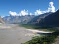
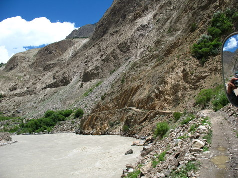
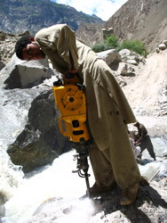

```
This is the day where it all became real – the months of planning, of deciding, debating, preparing – it was all for this day, and here we were, setting off finally! We had two jeeps – one a large loader jeep with all our saman and porters, and one small one for us and our backpacks. The porters set off before us, and soon enough we followed at 7:30am.
```

“ /> The way to Askole is very scenic, it is a really nice drive, the road winding through the mountains, hugging the side on a often too-narrow track which winds it way through farms, then through rockfaces hanging overhead down to the river raging below. In the beginning you pass the Indus, then the later part of the drive is alongside the Braldu river.

```


The road literally hugs the mountain, at places just barely wide enough for the jeep.


```