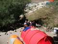
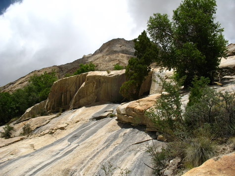
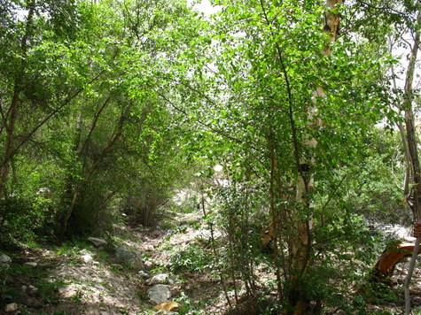

```
There is a rest day at Paiju, after just 2 days of hiking. The rationale being that the first two days are the toughest, so you need a rest, and also after Paiju the going gets even tougher than the already tough going. The Baltoro glacier starts from Paiju, and from this point onwards till we reach back to Paiju we’ll be walking and camping on the Baltoro glacier till Concrodia, where the Godwin Austin glacier starts and heads towards K2.
```

Asad’s knee was really troubling him now – There is a doctor with the British TCF group, so took Asad to him. He gave him painkillers, and advise – which none of us could figure out whether he meant to say to continue walking or to turn back. He recommended Asad should walk one more day at a slow speed to decide himself, which is what we thought made the most sense.

```
“ />  Clothes spread out to dry on our tent…

Melted glacier water is piped down to the campsite, and while in the sun it must have been 10C, the water was at least freezing cold! Still, took a bath, though it was so cold that I got brain freeze.

Pack of biscuits at Paiju after negotiations: 50Rs for being Pakistani, 100Rs for foreigners. Fortified with food, me and Khiz set off to climb Paiju peak, and made it almost 2000 meters up from the campsite, where we got stopped by impenetrable thorn bushes

and slippery rock.



Found out the hard way the value of a good walking stick – without one it’s much harder to climb down, so cut two sticks from the bushes. One served us all the way to K2 and back!


```