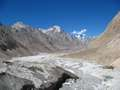
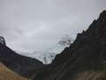
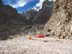

```
Paiju to Liligo is particularly tough – the path goes every which way, and this is one of the longer stages to boot. The day dawned bright (and early), and we set off once again.
```

“ /> We set out from Paiju aiming to reach Khoburtse, but this was perhaps the toughest stage, with the path climbing up and down, up and down, with the ups getting increasingly longer!

```
Asad with his bad leg had it tough, so we went slowly, and soon everyone else who had been camped alongside us shot on ahead.

“ /> We first glimpsed the Trango Towers way off in the distance during this portion, and they remained visible in parts between the mountain peaks all the way to Urdukas. We could just glimpse a camp at the base, at least thats what your guide said it was, it just looked like a black dot to the rest of us.

“ /> “ /> “ />

“ /> We got to Lilligo in the afternoon, by which time not just Asad but everyone else wasn’t willing to go any further. We set up camp there after a bit of argument. The Liligo campsite is a bit sparse, huddled against a overhanging cliff, which looks like it might deposit a few big rocks at any moment on you – and you can’t move away from the cliff as there is a sheer drop on the other side. A stream runs down from the mountain, just-melted glacier water flowing down right by the campside.

A spanish hiker walked into camp later on in the evening, on his way from the Trango towers to Concordia, carrying 30kg’s of everything on his back!

He sat up camp alongside, and we had dinner together.

Baqar told us the story of how the campsite got its name. The badly remembered gist is many years ago, once upon a time there was a hiker called Lily who fell ill at the campsite, and jumped or fell of the mountainside and died. Her guide rushed back to the rest of her group shouting Lily Go! Lily Go! And so it got the name Liligo.

there is more to be added…
```