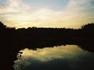
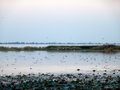
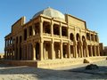

Just outside Karachi in any direction is some marvelous sightseeing country. Most people living in Karachi do not wander far from the city, at most to the beach and back. Those who do travel, go further away to other cities, or all the way north to the mountains. Like just about any large city, the surrounding areas of Karachi have a lot to offer.
The distinguishing features of Karachi which led to the formation of the original fishing village of Kolachi have long since been swallowed up by the increasingly massive population and haphazard unplanned expansion, but moving just a few miles away from the city reveals the natural beauty of the place.
There are a large number of travel guides on Pakistan, and lots of internet sites already up with information on day trips near Karachi. Therefore you won’t find much detail about the places I’m going to write about as the facts are available elsewhere, but a personal account of places near Karachi and whether or not they’re worth seeing.

#### The Sea

The obvious direction is the sea, for which one needs a boat. That can be easily rented along with a crew from Kemari, or Port Qasim. Prices vary according to the size of the boat and the number of people intending to go on it, but if a group is going to split the costs between them, then it is quite affordable for just about anyone. On an average, including food and everything else, it should cost less than a meal at McDonalds per person. For a leisurely trip, crabbing is always fun. You are not going to actually catch any crabs, but the boatman keeps enough crabs on hand and cooks them fresh along with fish. Delicious! A crabbing trip is easy to arrange and can be done just about any day of the week.
For the more hardy, they can arrange to rent a fishing boat at least a day earlier, and leave in the wee hours of the morning to fish. Any activity out on the sea is advisable (and possible) only in the winter months. For fishing you will need to bring your own gear. All sorts of fishing tackle is available at Aziz Agha’s fishing store just off Tariq Road. Anyone you find on Tariq Road should be able to guide you there. An article by him on fishing:
bq.. Earnest Hemingway once said, “I do not know of anything other than fishing that can give a person more enjoyment through life”.
Even on days when fish catching is slow, the excitement of being outdoors is always there. The early morning mist. The foggy and hazy sights of the slowly fading shoreline. The songs of the fluttering seagulls. The dazzling play of light on the water. The sight of dolphins playing in the wild. The whales blowing through their blow holes. The ocean sunfish or the presence of a basking shark in the open waters. The predatory barracuda, breaking the water surface, hunting for some easy prey. The view of an offshore island. The solitude. The wild wilderness away from the noisy city life and the picturesque sunset… All these are adventures that offshore fishing in Karachi offers.
Nature has been generous by blessing our blue waters with a variety of gamefish. From the gigantic marlin and sailfish (ghora machli) yellowfin and big eye tuna (gidder and dawan), wahoo and barred mackerel (gore and surmai), cobia (sangra) queenfish (aal), mahimahi (abroose), barracuda (kund), red snapper and blubberlip snapper (hira and gokh mahi), barramundi (dangri), grouper (ghisser), threadfin (ramas), emperor (mulla), gilthead bream (dandh) ladyfish (bhambore) and loads of other species. The anglers have only to know the where, when, and how of fishing and fish are all there.
> > [Dawn: It’s a water world to behold](http://www.jang.com.pk/thenews/dec2003-weekly/nos-21-12-2003/foo.htm#1)

#### The Beaches

There are also a number of beaches about an hours drive from the center of Karachi. Sandspit, Hawkesbay, Paradise Point, the French Beach etc., are all near and are a favorite spot for picnickers. Unfortunately, all these beaches are getting increasingly crowded and dirty. Just about any local from Karachi can tell you the inside-outside details of the local beaches, so I’m not going to write more about them.
The other direction is towards Baluchistan. On the way there are the most amazing beaches. Unfortunately, the Army and the Navy have taken them over. However, one can go to Gadani where all the shipbreaking used to occur back in the 70’s. There are still a ship or two being slowly broken up there, but it’s a far cry from the bustling activity of days gone by. The Tasman Spirit is the newest addition to Gaddani. It’s not safe to swim there, for there are a large number of wrecks everywhere at Gaddani, but the beach is worth seeing. There is a viewpoint on a small cliff at Gaddani where one can take a vista of the entire beach.
The real diehards can continue past Hub onto the Makran coastal highway. The highway is very scenic & a pleasant drive after the mad traffic and bad roads of Karachi, and one sees the most amazing beaches soon after entering the highway. About 3 hours from Karachi, just stop at any of the beaches along the way.

#### Hub Dam

“
Drive into Hub, the first town in Baluchistan entering from Karachi, then turn right and head for Hub Dam, about an hour’s drive from Karachi. It’s a small industrial town which remains dry and dusty year around, so there really isn’t much there to see. What is worthwhile is a trip to Hub Dam, which is Pakistan’s third largest dam and a [protected wild-life sanctuary](http://www.wildlifeofpakistan.com/sanctuaries.html). In 2003 the water level had fallen [alarmingly low](http://www.dawn.com/2002/08/22/local4.htm), but with the heavy rains last summer the water level is [back up](http://www.jang.com.pk/thenews/jul2003-daily/30-07-2003/metro/k2.htm) once again.
The majority of people from Karachi going to the dam are for duck hunting during the winter. One can hire small boats from the locals to hunt, or to sight-see. It’s strange that such a vast lake is left pretty much untouched by the massive population of Karachi just an hour’s drive away. Hardly anyone but gun toting shikaris and anglers from Karachi go there.
Hub Dam supplies a large percentage of Karachi’s water, but regulated water sports/activities on the lake should not pollute the water. Rawal Dam in Islamabad has a water sports club and also an active sailing club. The locals at Hub Dam warn visitors not to swim there – they warn that there are “wagoo” (crocodiles) in the water. I personally have never seen one there, or come across anyone who has either seen one or known someone else who had. There are people who claim to know someone who knew someone who knew someone else that had heard of yet another someone being bitten by a crocodile, but with so many degrees of separation it’s doubtful. Nevertheless, Khar Game Reserve is not too far away and is home to over 50 crocodiles. It’s quite possible that an escapee or two from the crocodile breeding program made its way to the Dam, and could be breeding in a tributary somewhere.
Regardless of crocodiles and duck hunters, the dam is a wonderful place to explore in a boat. One can get off on one of the small islands or the further shores accessible only by boat for a picnic.

#### Mangroves

These are best seen by hiring a local boat from Port Qasim. A local guide is needed, but the person you hire the boat from will arrange that. The mangroves have been [slowly dying](http://www.american.edu/projects/mandala/TED/karachi.htm) off for years now, and with the oil spill in the summer of 2003 there have been many dire predictions by environmentalists that the Mangroves are going to slowly disappear in a decade or two.
See [Dawn: Protecting the mangroves](http://www.dawn.com/2004/10/19/ed.htm#3). Not only are the mangroves dying due to rampant pollution, but they’re also being chopped down by the timber mafia, and the building mafia as well.

#### The Indus Delta

This requires a local guide or two, for the delta is impossible to navigate otherwise. The best way to explore the delta is in rubber dinghys with outboard motors. Most of the channels are very shallow, and a regular boat cannot make its way through, or will get stuck in the process. You can take a boat from Keti Bandar or Shah Bandar. Rumour has it that the Indus Delta used to be a smugglers paradise once upon many a times. The Indus delta is vast – you can go there for a day trip or spend a week.

#### Chaukandi Tombs

To the east, and slightly to the north about 20 miles from Karachi are the Chaukandi Tombs. There are numerous tombs dating back to the sixteenth and eighteenth centuries.
A visit to the tombs can be combined with a trip to Haleji Lake, as the tombs are on the way to the lake. Head onto the Northen Bypass from Karachi, and just a bit outside the city you’ll see the tombs some ways off the road. There is sometimes even a signboard on the highway marking the tombs.

#### Haleji Lake

“
Haleji is 50 miles from Karachi and about a kilometer off the Thatta road. Back in the days (so I’d been told by those over 40) it was a very popular & beautiful spot, but not any longer. Haleji was famous for fishing but now the fishes are depleted, or not fit to eat. *[more to follow]*
Haleji lake is populated by over 70 species if migratory aquatic birds, including flamingoes, pelicans, herons, egrets and pheasant tailed jacanas as well as marsh crocodiles.

#### Thatta

This can be combined with a visit to the Chaukandi Tombs to make a round trip of about 8-10 hours. It’s a long drive, but extremely interesting. Thatta has a number of places worth visiting, and the city is in the World Heritage List. Alexander the Great stopped here for a short breather while he was about conquering the world. See ‘Travelwebs entry on Thatta’ <http://www.travel.web.pk/destinations/archaeological_sites/thatta.asp>.
Keenjhar lake (also known as Kalri) is just to the west of Thatta. One can bird watch, or just enjoy the water. From ‘Wild Life of Pakistan’ <http://www.wildlifeofpakistan.com/wetlands.htm>:
> A large natural freshwater lake, the largest in Pakistan, with extensive reed-beds, particularly in the shallow western and northern parts. This lake also contains many different species of birds different from Haleji and Hadeiro. Kinjhar Lake supports a very diverse flora and fauna, and is an extremely important breeding, staging and wintering area for a wide variety of waterfowl. Mid-winter waterfowl counts in the four winters 1986/87 to 1989/90 averaged 140,000 (maximum 205,000 in 1987/88).

#### Makli Tombs

Makli is 98 km from Karachi – if you leave 10am, you should arrive by noon. 3 to 4 hours is the time you need to see the tombs etc.
> This is one of the most visually stunning archaelogical sites in Pakistan. Covering 15-1/2 sqaure kilometers, and said to contain over one million tombs, it is considered to be the world’s largest necropolis. The tombs and mausoleums are seen as the most substantial remains of Sind’s greatness between the 14th and 18th centuries, with many belonging to kings, queens, saints, governors, military commanders, philophers and poets.

#### More Information

* [World66.com’s entry on Karachi](http://www.world66.com/asia/southasia/pakistan/Karachi)

**Notes:** Driving times in Pakistan are not accurately reflected by the distance. Road conditions vary to such a great extent that one should not estimate or attempt an average speed of more than 60 km/h on any road or highway in Sindh. There are only a few high speed roads in Pakistan, for which the maximum safe speed is 100-120 km/h. Do take note though, that the laws of physics do not apply to the local buses, except for brief instances now and then during the rare event of an unstoppable object (the bus) colliding with an irresistible force (a loaded truck or a ravine). Intercity buses and commercial traffic travel at extremely high speeds here and under no circumstances should one assert one’s right of way against such a vehicle. The wreckage of crashed and burned vehicles littering highway embankments all over the country is a sobering reminder.
*[A work in progress: A Listing of day trips from ” title=”“>Karachi*