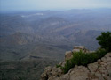

“ /> Ever wanted to have an environment, atmosphere and weather like [Murree](http://www.flickr.com/photos/tags/murree/clusters/) in Sindh? You would think that I have surely gone nuts to say that such a place really exists, but the truth is, it actually does. If you can reach Gorakh Hill you will agree with what I have written above.

Gorakh Hill lies in the Kirthar range that spreads along the border of Sindh and Baluchistan. At 5,500 feet, it is one of the highest peaks in that range. The mountain range has provided the natural geographical distribution for the two provinces. Gorakh Hill is situated in the Johi tehsil of the Dadu district while at the other end lies Wadh in Baluchistan. The weather at the hill in summer is very pleasant, with moderate temperatures during the day, dropping to slightly chilly at night. In winter, however, the temperature goes down to almost -8 to -12 degree centigrade. Being the highest peak in a region, the hill offers a beautiful view of a valley from the top. The area is surrounded by arid mountains with small green pastures at certain points. During the rainy season, one can see various streams of water flowing throughout the area.

Gorakh Hill is accessible from Karachi via either Dadu town or Sehwan Shareef. However, it is best to go to Johi through Sehwan Shareef via Bhan Saeedabad, as this is a shorter route than going through Dadu. Johi is situated at a distance of 40 kms from Sehwan Shareef, while Sehwan Shareef is about 137 kms from Jamshoro. The Indus highway from Jamshoro to Sehwan Shareef is in very good condition. One can enjoy the pleasant drive on this scenic route with the Indus river flowing on the right and a view of the barren mountains on the left. The road condition from Sehwan Shareef onwards is quite poor and one can reach the top only in a 4×4. If you need to rent a 4×4, I recommend you do so in Hyderabad, as we faced problems in arranging a vehicle from Sehwan.

Our experience of exploring Gorakh Hill was full of excitement and adventures. We started our journey from Karachi on the early hours of 13th August 2006 at about 7:30 AM. We reached Sehwan Shareef through Indus Highway at about 12 PM. There we transferred our bags in two double cabin Hiluxes and started our journey towards Johi town. We reached Johi town at about 1:15 PM, had lunch there at Shadabad Welfare Organization (SWO), a local community development NGO that had made all the arrangements for our trip.

From Johi we resumed our journey towards Wahi Pandi, the union council of Johi and the base camp for Gorakh Hill. It is a small village with a population of about 20,000. If you’re interested in having a look at rural Sindh then Wahi Pandi is a perfect place to visit. It is among the few villages of Pakistan which have a clean and clear atmosphere, and where one can find all the basic facilities of life. The outskirts of the village contain a good number of trees called “Beej” in Sindhi. I have seen them for the first time. The ‘jharnas’ of water coming from the top form a considerably wide stream that flows along the side of the village. These trees and the stream presented a pleasant view from the top.

We had a tea break here at the local community library while our Hilux was filled with all the supplies that we needed for the overnight stay. The people here are mostly Baluchis but they mostly speak Siraiki and Sindhi. They are very cooperative and friendly in nature. One can hire the services of guide from here as well.

At 4 PM, we started to move towards our final destination, Gorakh Hill. The road to Gorakh Hill from Wahi Pandi is about 54 kms long and under construction. The journey starts from the valley of Wahi Pandi and gradually ends in the mountain range. The mountains gradually increase in height, offering a beautiful example of the transformation of a valley into the jagged and rugged mountain region. The area is mostly barren with no sign of any trees. One can see only wild bushes on the mountainsides. The mountains have different shapes and figures here. Some of the mountains look similar to the mountain ranges of Utah in the United States.

Due to bad road conditions we covered the 54 km distance in about 5 hours. The track is not dangerous but has few sharp turns in some places. We got trapped at one such turn where work was being carried out to expand the turn. For this purpose the mountain had been blasted with dynamite due to which a huge number of small stones on the track made it impossible for the tyres to grip firmly. Anyways, we managed to overcome this turn with the help of a Pathan driver who was one of the worker of a contractor there.

We reached the top after sunset when there was absolute darkness all around the valley. Since it was the rainy season, we got to see a cool lightning show arranged by the Creator. The climate at the top was cool and we had to wear sweaters or jackets to keep ourselves warm.

There is only one so-called rest house at the top. Out of the two rooms, only one can be used by guests, as the other one is being used as a store room. While the rest house is wired up, there was no electricity, probably due to heavy rains I presume. However, there is a back-up generator in working condition, but no water, so remember take a good amount of with you.

The sunrise is definitely worth viewing here. As the early rays of the sun hit the top one can see the gradual illumination of the beautiful valley of Wahi Pandi towards the east, while the Sindh-Baluchistan border lies visible towards the west. This is also a great trekking destination, as trekkers can explore the valley in almost every direction. The hiking here is relatively easy as the surface is rocky and gently sloped. In fact, Wadh, located in the Khuzdar district of Baluchistan, is a 5-day trek from here.

I want to share some unforgettable events that happened in this trip. They are about the selfless and kind support that was provided to us by almost everyone we met there:

While we were driving back to Wahi Pandi on the way back, one of the Hiluxes suffered a flat tyre just 100 meters from the top. The rest of the group members, including myself, were in the other Hilux that had already moved ahead. Our vehicle’s engine and axle condition were also poor and we had to stop the vehicle just before the sharp turn where we had been trapped yesterday; the track was also blocked here. We waited for the other Hilux to show up but there was no sign of it. Thanks to V-PTCL Wireless Phone, our driver was able to contact the SWO people at Sehwan (at the labour camp near the sharp turn). However, our attempts to contact the rest house were futile, as there was no signal there. We could not do anything but wait for support from base camp.

After three hours we saw three men walking down from the top. I was able to recognize one of them as our cook who had travelled almost 12 kms to inform us of the calamity that had befallen the other Hilux. Now the problem was to send a spare tyre to the top. Our Hilux had already had two flat tyres last night and had no spares on hand. To our rescue came another Hilux which we had seen at the labour camp, waiting there for the road to open. When we told them of our situation, they provided us the tyre without any hesitation. Now the problem was how to send that tyre to the top. For this purpose the people at the labour camp arranged some Baloch natives who knew the short routes to the top. They put the tyre on a man’s back and sent him to the top. These men would have covered the strenuous 12 km distance on foot lugging that heavy wheel up those slopes but fortunately a jeep came by later to give us the good news that road had been opened, and also agreed to pick up the Balochis from the track and give them a ride to the top.

The other unselfish support was shown by the contractor there who was about to blast the mountain with dynamite that day and had asked us to come down by 10 AM at the most. But since one of the vehicles was immobilized because of a flat tyre, he waited for us till 4 PM when the other vehicle finally came down.

Last but not least, I cannot forget the hospitality of the people there, whoever we met, wherever we went. They welcomed us with open hearts and open arms. They served us delicious meals that we would not have thought of and gave us the respect that we do not see even from the blood relations here in the cosmopolitan. They tried to make us as comfortable as they could, and showed us a concept of selfless living that we cityfolk have somewhat forgotten.

Finally, some suggestions for visitors. Although we were the first family to visit the place with women and children, I would still not recommend it as a family resort until a proper road is developed. The area is free from dacoits so there is no security issue. The only issue is the lack of a proper road and supply system. No land-line or mobile phone works at the top, but it was heartening to see V-PTCL Wireless Phone service working there. Again, however, I would suggest that visitors not rely on availability of outside help – instead, they should take all precautionary and safety measures themselves.

Pictures: <http://community.webshots.com/user/umasha79>