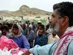
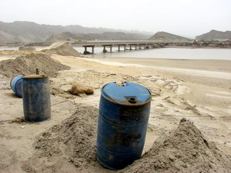
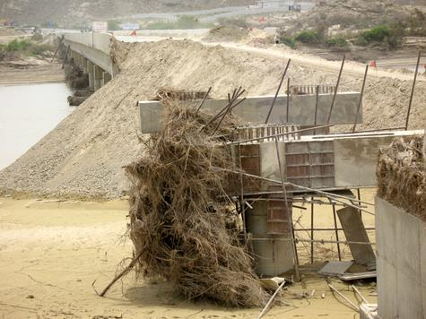
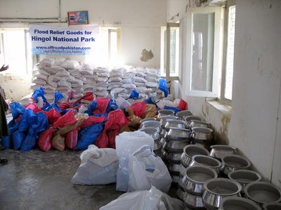
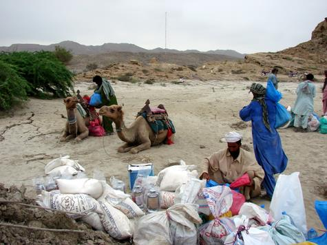
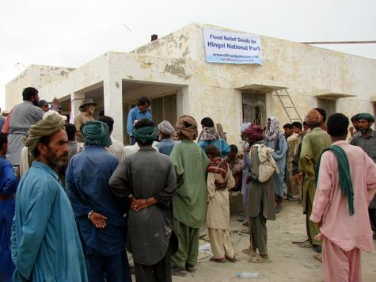
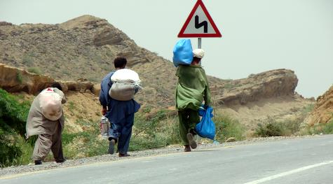
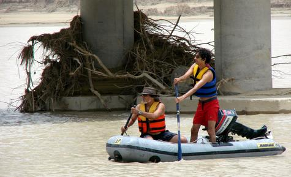
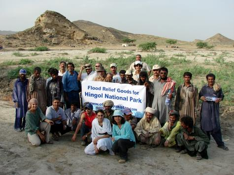

 June 24th, 2007 saw the birth of an insignificant low pressure in the Arabian sea that took a turn for the worse as it developed into a cyclone 03B christened [YEMYEN](http://www.reliefweb.int/rw/RWB.NSF/db900SID/LSGZ-74TGAU?OpenDocument), moving towards the coastal areas of Pakistan. Drawing moisture from the sea it attracted clouds from neighboring regions and soon covered the entire province of Baluchistan with rains unprecedented in living memory. Rain catchment areas in Surab, Naal and Jhao districts overflowed while Arra and Mashkae rivers delivered their share of the deluge into the one source that would take it to the sea: The mighty Hingol.

The Makran Coast, one of the harshest regions on this planet and the only one that nearly defeated Alexander The Great, lies on the coastal belt of southern Pakistan. A semi-desert arid zone with moonscape topography and extremes of temperatures. Summer temperatures can exceed 50 degrees Celsius and winters plunge down to sub zero. In this region and covering an area of 6200 sq. kilometres, is Hingol National Park, the river snaking through, dividing the park. Scattered along the river are settlements of people who have been living within the Park for centuries. Most of them are shepherds who live in harmony with nature. The river has been a lifeline for both humans and wildlife, and both have suffered its wrath and fury in flood which otherwise is a mere stream that disappears at times leaving pools of water. Its many tributaries feed rain water during the summer and winter monsoon rains – that is, if it rains – for this area is prone to long droughts, which also erase the scars left behind after the deluge.

Poldat is a V shaped gorge, nearly two kilometers long and acts like a dam, restricting the flow of river downstream. The water level began to rise in this gorge and rose to nearly 150 feet. At the end of this gorge the river is surrounded by low hills which restrict the width of the river keeping the water level to nearly 80 feet. Now flowing full steam, it raced down towards the flat open landscape washing out all settlements of the area and allowing barely enough time for the villagers to run to safer, higher ground, while witnessing their dwellings, livestock and belongings being swept away by the raging torrent.

Uprooting trees and collecting debris, the torrent flood raced through Haariyan plain wiping out plantations and inundating the land as far as the eye could see. The moonscape changes again with hills rising on the sides of the riverbed obstructing its flow once again. Villagers watched in horror as the level started to rise once again drowning whatever stood firm against the onslaught of the flood. The wall of water racing through the constricted space now charged like a row of steam engines hitting the settlements before Nani Mandar area, luckily the roaring sound of the advancing waters gave ample time to the residents of this area to run to safer grounds with whatever they could grab of their meager belongings while the deluge razed their flimsy shelters.

The final hurdle for the flood merely 500 meters before the Hingol River Bridge at Aghore, a wide gorge carved out by the river over millenia, but not wide enough, created yet another bottleneck. The advancing water hit against the solid section of the mountain and turned right rushing towards the opening, wiping out the road leading to Nani Mandar. This diversion created yet another rise in the level, which sped down towards the bridge. The support pillars of the bridge offered some resistance to the advancing waters but an earth filled section of the bridge still under repairs from the last flood was eroded in no time, thus cutting off this vital link on the coastal highway. The debris carried by the water stuck to the pillars stopping its flow and as the level kept rising the bridge disappeared below the murky slush. This slushy water was rising all the time and as it passed it washed away parts of the construction crew camp and Al-Hassan hotel.

The grand finale of this flood came in the form of maximum high tide +3.5 meters from the ocean, slowing down the merger of water. This resulted in a swing back action which nearly drowned the coast guards camp on the left bank of the river while depositing all the silt in this area. It took nearly a week for the level to drop down to normal, while hundreds of people remained stranded on both sides of the bridge. Hindu Yaatri’s visiting Hinglaaj Maata Temple were stranded there without food and water. Except for 2 yaatri’s who passed away due to illness, there were no casualties.

Army and Navy helicopters rescued people from various parts and dropped relief goods round the clock or as weather permitted. The villagers said they have never seen the river in such a fury as far back as their memory goes. The flood of 2007 in this devastated area, shall remain fresh in peoples memories for years to come.

## 4X4 Offroaders Club Karachi

Flood relief camp at Aghore

14-15 July 2007

In the wake of such devastation, we the members of 4×4 offroaders club (offroadpakistan.com) began a two week long drive to collect relief goods for the flood affected families.

Originally, our members sent out word to all friends and acquaintances for the collection of medicines, but people began sending much more than just medicines. We were flooded by donations in the proverbial blink of an eye. Our homes were filled with packets of food stuffs, medicines, biscuits, bottled water, sacks of atta (wheat flour), rice, sugar, tea, daals (lentils), matches, cooking utensils, powdered milk, fruit juices, cooking oil, salt, hurricane lanterns, cartons upon cartons of medicines and other useful items. A lady went as far as making 100 small packets specially for women consisting of a towel, comb, Vaseline, soap and other feminine items, while Shehryar Mirza willingly gave up his Playstation and sat down to make nearly 450 packets containing biscuits, a packet of juice and some sweets for the children of the area. 

An emergency meeting was called and assignments were given to able bodied youngsters Abid Omar and Yasin Ali to handle the packing and transportation of the goods. Doctor Mansur aka “Doc” canceled his appointments and surgeries and went into “emergency mode”. Hamid Omar took control of making sure every thing was delivered, packed and ready at his factory in time. Tanya Mirza was busy flying emails and text messages to friends, checking on logistics with Abid and Yasin, getting stuff collected and moved to Hamid’s Factory, Mahera Omar was busy preparing video equipment for filming the event, Sabiha Omar was arranging/preparing meals for the trip, making sure none of us collapsed due to hunger. Patricia Mirza was collecting stuff from her friends who had willingly prepared sack loads of domestic goods and a donation of 3 cartons of ORS from a pharmaceutical company head (which proved to be nothing short of being a saviour for all). It was as if we all had joined together like a big family for this special event, responding to the appeal for help by the people of Hingol.

Relief goods were collected for approximately 450 families that included food rations as well as cooking utensils and a lantern for each family. Knowing the locals very well, each packet contained one kg of tea as traditional roti (flat bread) dipped in hot tea is what they enjoy most during the entire course of the day.

A local game warden from the Baluchistan Government, Adam, and a representative of the Bridges and Roads Department, Sumar served as our local guides and friends in the area, while the Park management deputed Mr. Abdur Rahman, Assistant Conservator, to help us in our efforts. Our relief camp included a small medical checkup center, where Dr. Caesp Noshirwan kindly volunteered to distribute medicines to about 500 persons. Most patients had developed allergies to water and heat, while many were dehydrated. The irony of it all was, even after a massive flooding, this area is a desert, and there are almost no sources of clean drinking water. Adam and Sumar were waiting at the Coast Guard camp at Aghore, with scores of men from local villages waiting in the scorching heat for their share of the relief. Those from the village of Pol Dat were called on first, as they had walked about 60 odd kms to get to the bridge where we were handing out rations.

Since the park is not very far out from Karachi and the Hingol Bridge is a mere four to five hours away by car on the Coastal Highway, it was not difficult for us to access the area. For the locals that had come from the inner Hingol region where no vehicles could go, it was a cumbersome journey to make. Since army and government handouts prioritize according to the scale of damage incurred in different areas, the upper region of Baluchistan received a quicker response in the distribution of relief. Thus those villages midway between upper and coastal Baluchistan received less in comparison. The army is working round the clock to respond, and an effort to assist them is being made by NGO’s and other philanthropists.

To scout out the damage, (and for a little bit of adventure!) one of our members, Dr. Mansur Ahmad, had brought two motor powered inflatable boats so that we might cross the river and inspect the damage further down. The locals warned of loose and ravaged crocodiles in the water, waiting, but we went ahead and scouted out the area anyway. Approximately ten feet away from the river bed the mud has turned to clay, and ones feet would continue to sink if one stood still. Driftwood carried by the flood was stuck in pockets of the riverbed and the flow was extremely uneven. Landing on an island embankment, one could see the range of the park and visualize the ‘scars of the storm’ (Courtesy DAWN News!).

Displaced animals have not yet been located, and animal casualties have not been documented. Some Ibex have been spotted in the mountainous region by locals. A more serious problem the floods have created is the displacement of a population of about forty odd marsh crocodiles, locally known as wagoo, in the Hingol bridge vicinity that divides the park. Before the floods, the crocodiles had a small enclave where they lived, and the locals accordingly avoided the area. These crocodiles have now been scattered, leaving the locals fearful of entering the river, if even to cross to the other side. Reports were also made that a few of these giant animals were seen coming out of the ocean, some 10 km away from the bridge vicinity.

The initiative to donate for a good cause, we noticed, is very much present among the people of Karachi. People want to give relief and they want to help others. The only issue is the question of accountability. One hears of stories from the locals as well as in philanthropic circles about government officials leading their trucks loaded with relief goods to their own homes and then on to those it was intended for. There is no guarantee that your donation, your contribution, will actually get to those who need it most. This is what Offroadpakistan offered to the people who donated, we wanted to make a personal delivery. This project was part of one of our larger aims; to create awareness in the community for individual initiative, which plays an important part in nation building. Along with this, community involvement in such projects also creates empathy and compassion, played out in the various friendships our club has developed with locals over the years.

**We are thankful to:**

* Mr. Tariq Ismail, Searle Pharmaceuticals Pakistan
* Nughma & Larry Hillfram
* Sabiha Wahedna
* Saadiyeh Saeed
* Omar Saboor, Progas Pakistan
* Aleezeh Lakhani, Tetley Tea
* Cyra Ali Ahmad
* Khalid & Peng Qureishi
* Veronique Ahmad
* Rubina Shaikh
* Nighat
* Mehmood Nanji, Tapal Tea
* Mehr Anvery
* Mohd Siddique
* Kabir Omar