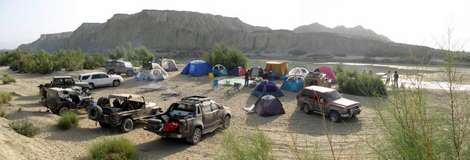

For those of you who haven’t camped out in the wilderness under the open sky, here are some helpful hints and advise.

Firstly, with the 4X4 Offroaders Club of Karachi, you’re going to be camping in the middle of absolutely nowhere! And believe it or not, the camp will not be situated next to Holiday Inn or Avari so here’s what to expect. No toilets. So bring a ‘lota’ or a Coke bottle (filled with water) unless you are used to traveling in Europe or America and can make do with dry tissue paper! Also if you can’t squat, bring a ‘porta potty’. In the deserts of Sindh and dry Baluchistan there is often no water – so bring water.

Baluchistan is a land of extremes (we call that charming) so be prepared for a windy cold night and a humid hot day. To look like a really serious 4X4 off-roader, bring a stupid looking floppy hat and dark glasses. The sun out in the sandy or rocky desert wilderness adds to the charm. Bring clothing that will keep the sun off and sunscreen if you want to avoid sun burns or are afraid of turning dark skinned. T-shirts are great until you can’t tell it is getting cold in the evening because you were so hot in the day. Bring jacket and clothing for all seasons.

**Beverages and lots of bottled water…** bring it, cold in an ice cooler if possible. As mentioned before, nearest hotel or restaurant doesn’t exist, so bring food. The nearest rock maybe too big or too small to sit on so bring a folding chair but if you have no problem squatting then no need and in such case you’ll have the bonus of traveling lighter.

Now a brief introduction to our 4X4 club chef… that’s you. Everyone needs to bring what it takes to prepare his or her own food. You have the option to stay really basic with King Chips, canned fruit and Coke, but most of us bring a gas choola (stove) and cooking utensils and not to forget mentioning, stuff to cook! The ‘stuff’ includes eggs, onions, potatoes and other vegetables, ghee (or cooking oil), dry soup packets, tobasco, pepper, salt, butter, cheese, sausages, frozen meat (often pre-cooked), nans/roti, bread/French bread, tea, coffee, milk, sugar, etc. Hunter beef from ‘Hanifia’ (lasts a few days in a cold icebox) is always a good idea to eat on the move. You also need light to cook dinner by, not candles as they may blow out in the wind, so bring a lantern and a good torch that actually works. On the camping trip you will find that the torch is a most useful gadget to have.

You’ll need some cash on you to contribute towards payment for the guides we hire and it comes handy to buy fuel etc. Fuel up before you leave home. And fuel up again when rest of the 4X4 members stop for fuel. On the way we always stop at a place called “last petrol pump” to top off our tanks.

Unless you plan sleeping in the back seat of your Jeep, for camping you will need a tent (do practice how to pitch it up), ground sheet or ‘durrie’, sleeping bag, sleeping mat and an extra blanket if its winters. Bring your toiletries, medications, water enough to wash up and a small towel to dry off. Do not bring a hair dryer (some do!), curling iron, blender/juicer, washing machine, ‘istry’, etc. unless you are a comedian because we will laugh at you if you do.

If you think there’s no possibility of you having any vehicle breakdown, or injury, leave the tools and your first aid kit at home. Fat chance, vehicles do break down and accidents happen. [Bring some tools and spares, a tow strap and first aid kit](./vehicle_preparations_before_and_after_a_trip.html).

Be prepared for outdoors adventure and be delighted if nothing happens and it turns out to be like a drive to your corner shop! The rule of thumb is, if you don’t bring it – you won’t have it.

Future off-roading plans are sometimes posted on our web site, [offroadpakistan.com](http://offroadpakistan.com)

If you are interested in going do send an email to us, using the contact form linked to above.

#### See also

* [Vehicle Preparations before and after a trip](./vehicle_preparations_before_and_after_a_trip.html)