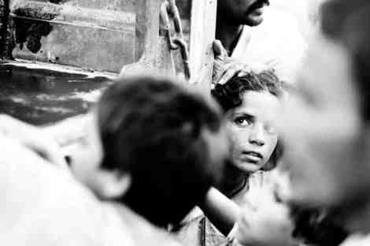
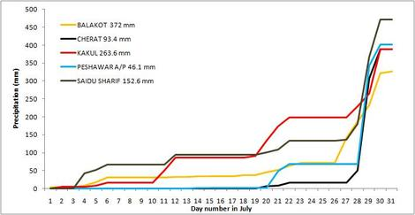
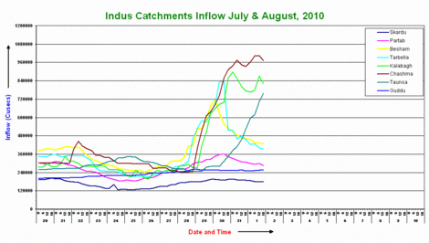
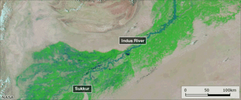
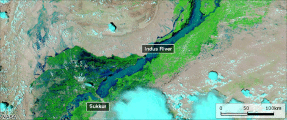
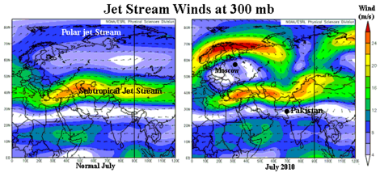
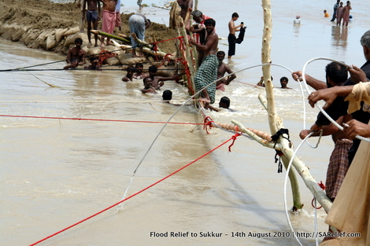

[So](http://www.boston.com/bigpicture/2010/08/continuing_pakistani_floods.html) [far](http://www.boston.com/bigpicture/2010/08/severe_flooding_in_pakistan.html) at least 1,500 killed, [14-20 million affected](http://www.bbc.co.uk/news/world-south-asia-10973725), [3.5 million children at health risk](http://english.aljazeera.net/news/asia/2010/08/2010816112835740506.html), nearly 1 million houses damaged, and $1-2 billion upwards of crop damage. Possibly the low numbers of people killed has resulted in the lackluster international response. [A timeline is here](http://www.bbc.co.uk/news/world-south-asia-10986220).

Most [comprehensive source for information is ReliefWeb’s Pakistan Floods page](http://www.reliefweb.int/rw/dbc.nsf/doc108?OpenForm&emid=FL-2010-000141-PAK&rc=3). Frequent updates on news, situation, maps (lots of maps), and funding.

[Dave’s Landslide Blog](http://daveslandslideblog.blogspot.com/2010/08/floods-in-pakistan.html)—an excellent overview of how the flooding began: The regular seasonal monsoon rains started on July 27th, initially impacting the Khyber-Pakhtoonkhwa province (formerly NWFP). The following graph shows the sudden increase in rainfall in that region from July 29th.

“The loss of life appears to have been the result of a combination of losses in the main rivers and their tributaries, flash floods in upper catchments, collapses of mud brick houses, and landslides.”—[Dave’s Landslide Blog](http://daveslandslideblog.blogspot.com/2010/08/floods-in-pakistan.html).

Downstream the impact of the incredibly heavy rainfall on the Indus River catchment shows increased inflows.

[Daily rainfall records from the Pakistan Meteorological Department](http://www.pakmet.com.pk/FFD/index_files/rainfall_data.htm)—you can map your own data! Compare the rainfall over the July and August 2008 and 2009 with what we see now. The worst seems to be behind us.

[Devastating floods cut off parts of Pakistan](http://www.dawn.com/wps/wcm/connect/dawn-content-library/dawn/news/pakistan/04-more-floods-warning-qs-04): “Shelter, plastic sheeting and household goods are the most important gap. Stocks need to be urgently airlifted to the affected areas.”—DAWN

NASA image before the floods moved south (August 10th)

NASA image one day after(August 11th)

[Dave’s Landslide Blog](http://daveslandslideblog.blogspot.com)—has excellent analysis of rainfall, river levels, and other related info such as:

[The Attabad dam threat](http://daveslandslideblog.blogspot.com/2010/07/can-attabad-fail.html): formed in January 2010 as a result of a landslide. The water level in the dam reached its highest level in mid-July. There has been [some talk of reducing the water level by controlled blasting](http://www.dawn.com/wps/wcm/connect/dawn-content-library/dawn/the-newspaper/national/chinese-proposal-for-attabad-lake-accepted-by-govt-270), but to date nothing has been done. There remains the ptential for the Attabad dam to collapse, but so far the reservoir has been safe from the rainfall.

[Relation with Russian wildfires and the Jetstreams](http://www.wunderground.com/blog/JeffMasters/comment.html?entrynum=1576), at the Dr. Jeff Masters’ WunderBlog at Weather Underground. In simple words, the normal jetstreams that keep separate the hot and dry weather of Pakistan from the cold wet wet weather of Northern Europe (left image) went wonky (right image). This resulted in their normal rainfall being dumped into Pakistan and thus an extremely dry Russia. And this was on top of the regular monsoon rains!

The August 3rd report by Save the Children reports that 32% of households are affected by the floods, 21% of housing structures and 26% of school buildings have been damaged, and standing crops and orchards have been badly damaged (these are the main source of income and food). Link (PDF) to full report: [Rapid Assessment Report of Flood-Affected Communities in Swat District](http://www.reliefweb.int/rw/RWFiles2010.nsf/FilesByRWDocUnidFilename/MYAI-87Z6X3-full_report.pdf/$File/full_report.pdf)

8-12th August 2010 [Analysis of probably flood-affected villages, towns and infrastructure along the Indus River, Sindh Province, Pakistan](http://unosat-maps.web.cern.ch/unosat-maps/PK/FL20100802PAK/UNOSAT_PAK_MOD_Sindh-Damage-Analysis-12August2010_v1_LR.pdf) (large PDF)

[KKH is blocked](http://www.hunzatimes.com/archives/6588) through till mid-September, according to chairman NDMA. Air routes are dependent on the weather, which has been volatile to the extent of severely limited relief efforts. [Donkeys and mules are the way to go](http://pawspakistan.org/2010/08/pakistan-floods-engulf-a-country/). Meanwhile, with food, water and fuel shortages, [hunger strikes Gilgit-Baltistan](http://pamirtimes.net/2010/08/16/hunger-stalking-gilgit-baltistan/), “The vulnerable-to-weather air supply system has failed to provide relief to far flung villages of the region which are worst hit due to flash floods and landslides. Prolonged disruption of the supply routes has the potential to make hundreds of families face starvation in different remote parts of Gilgit-Baltistan.”

[Mothers cry for children missing in floods](http://www.dawn.com/wps/wcm/connect/dawn-content-library/dawn/news/pakistan/12-mothers+cry+for+children+missing+in+floods--bi-03) “”My husband worked for years to build our house but now there is nothing left. We did not manage to salvage anything except some clothes,” she said.”

[National Disaster Management Authority](http://ndma.gov.pk/)—Not much here, expect maybe the [comparison with other disasters PDF](http://ndma.gov.pk/Documents/flood_2010/flood_comparison.pdf).

[PakMet Pakistan Meterological Department](http://www.pakmet.com.pk/)—Lots here, browse around for [high-resolution GIS maps](http://www.pakmet.com.pk/FloodMap/Floodwar/floodwar-01.html), [flood warnings](http://www.pakmet.com.pk/FFD/index_files/fbc.htm),  [rainfall data](http://www.pakmet.com.pk/FFD/index_files/rainfall_data.htm), and much more from their [Flood Forecasting Division](http://www.pakmet.com.pk/FFD/cp/floodpage0.asp). Especially interesting are the [six-hourly hydrographs](http://www.pakmet.com.pk/FFD/index_files/hydro.htm). [Inflow at Sukkur](http://www.pakmet.com.pk/FFD/index_files/inflow/sukk.htm) seems to be leveling off.

[Pakistan after the flood](http://ko.offroadpakistan.com/2010/08/of_flood_duds_and_places_in_between.html), a longer-term perspective: “The waters will recede, and life will go back to what it was. The real problem isn’t the flood, it’s the fact that life will return back to where it was before the floods, and that the entire effort of the country and it’s many ‘allies’ is directed to that end.”

**What can you do to help?**

Donate your time, efforts (or money) to your own efforts (as many are doing), or to any of the local or international organizations involved with the flood relief efforts. [Offroad Pakistan together with the Motorsports Club of Pakistan](./flood_relief.html) is involved with the relief efforts, [details](http://teeth.com.pk/blog/2010/08/14/live-tracking) [at](http://teeth.com.pk/blog/2010/08/11/some-thoughts-into-planning-for-the-flood-relief-in-sindh) [Awab Alvi’s blog](http://teeth.com.pk/blog/) and [Faisal Kapadia’s blog](http://deadpanthoughts.com/2010/08/pkflood-field-updates/), and [how](http://teeth.com.pk/blog/2010/08/10/pakistan-flood-relief-campaign-donate-generously) to [donate here](http://www.sarelief.com/). Pictures of the [efforts here](http://www.facebook.com/album.php?aid=206912&id=500836195) and [here](http://www.facebook.com/album.php?aid=476665&id=714140584).

A more complete [list of relief organisations](http://pakistan.wikia.com/wiki/Floods_2010).

Image sources: Ali Khurshid for the photos, Dave’s Landslide Blog for the graphs, and other websites linked within.