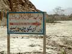

 i.e frequently asked questions about the Hingol. We’ve missed quite a few, so feel free to add your question in the comments, and we’ll update this FAQ soonest. Read on….

#### Is it possible to reach the Hingol River without a Jeep?

Since the Coastal Highway has been completed, the journey has become a pleasant 4 hour (260 km) highway drive. Previously the trip involved a full day of jeeping to reach the river. Now any vehicle can make the journey easily. To get to the Coastal Highway, you take the RCD Highway (Hub River Road) out of Karachi to Hub (35 km), and onward past Windar (85 km). The turnoff point to the Highway is well marked about 10 km short of Uthal. Hang a left at the big big board which says Makran Coastal Highway and tell your passengers to hang on as you press the go pedal. If you see a sign saying Uthal or Bela, stop, smack yourself on the head, and head back.

#### Some advice

However, though the Coastal Highway is open to traffic, some travel precautions are advised such as carrying ample water (for you and your vehicle) and emergency food. There ~~are now proper fuel stops along the highway, so make sure you get a tank~~full at Windar- is one petrol pump just short of Windar, and none after—so this will be yuour last tankful of ‘Pakistani’ fuel, though you might be able to get Irani fuel at places. For the sake of your car, you are advised to stay away from that sludge. Depending on your fuel capacity, you might want to carry extra fuel—especially if you want to make the side trips to the Volcanoes and the Mandir.

#### more advice

Be very, very, very careful driving on the coastal highway. The smooth road stretching into the horizon will make any speed you’re going to seem far too slow, but there are donkey carts, children running across it, buses coming the wrong way, and trucks with no lights… not to mention the fools trying to outrun stupidity. You will see remains on either side of the highway, a veritable hall of infamy of the fast and furious. Oh, and check the political situation before heading out to Baluchistan.

#### Is there any accommodation at the Hingol River?

In remote places in Pakistan, you’re generally unlikely to find any accommodation and Hingol is no exception. There is a Pakistan Coast Guard Post at the river (Aghor Camp), and if you have some ‘know’ with the Coast Guard they may let you stay. There is also a local chai/khanna hotel owned by Mr. XXX at the river. If you find their charpois uncomortable, you will be best off camping. Before setting up camp, let both the Coast Guard and the hotel-wala know about your intentions.
There is now a government resthouse at Agore being completed in 2011, but staying there is between you and the government.

#### How do I get to the Mud Volcanoes?

‘ The turn off to the Mud Volcanoes is 38 km (check on GPS and include GPS map) short of Hingol River and is marked by a small blue sign (about 1 foot wide) saying “Sapt Post”. The color on the sign board will vary, but the road will take you straight to the coast guard camp at Sapt. Turn off the road at this sign towards the sea and follow the tracks. Here, a saying goes, “all tracks lead to Chandra Gupt.” Be advised that the Mud Volcanoes are not visible from here as low hills block the view. In fact, often it is hard to spot the Volcanoes bacause of poor visibility (the coastal area is prone to sandstorms). If the visibility is good, you should be able to spot Chandra Gupt – but don’t head straight for it, follow the dirt track as it curves to the left. If you can’t find the mud volcanoes, curse the writers of the FAQ (or stick pins in voodoo dolls) and hope you can at least find the road!
For this trip, you’d be advised to take a 4×4 or a vehicle with high clearance. Precaution: If it has rained in the area recently, you’ll soon find your vehicle up to the floorboards in mud and yourself walking home!

#### How do I reach Nani Mandir aka Mata Hinglaj?

 A track towards the right just short of the Hingol River Bridge and next to the Coast Gaurd checkpost leads to the Nani Mandir. Since Indian Foreign Minister Jaswant Singh’s visit in early 2006, much of the route has been paved and a car can eaily make the journey. The Mandir is XX km from the bridge, and is a pleasant drive by the river.

#### What is this Nani Mandir aka Mata Hinglaj?

 Click on this here picture...

#### Is the Hingol River accessible by public transport?

Buses and donkey carts ply this route in the evening, so one could reach the river by public transport. But for the sites around the river, you’d have to have your own transport. Failing that, you can get off at the river, and walk to Nani Mander. It’s about a 3, max 4 hour easy walk from the road.

#### Are there any other points of interest around the Hingol River?

On both sides of the road by the Coast Gaurd checkpost you can see graves dating back to 4.4 billion B.C. (well, at least the dirt on them). There is also Kund Malir, a fishing village about 15 km from the river with lovely views of the coast, and is a great place to swim at the beach. You can fish at the beach (or at the river!) and catch many big fish. Be sure to take a frying pan or a chest of ice. Theres also the drive over the Buzi Pass towards Ormara and beyond for some breathtaking landscapes.

#### Whats the deal with the Princess of Good Hope?

This is a rock outcrop along the Buzi Pass (beyond the Hingol River) that resembles a lady standing upright in a royal pose. It was christianed the “Princess of Good Hope” by Angelina Jolie during her trip along the coast in 2002 (?) as part of her campaign as Goodwill Ambasador to the United Nations.
There is another formation called Sleeping Beauty which can been seen from Aghor Camp facing away from the sea after sunset. This is a silehoutte which is only visible at night. Then there’s also the Sphinx, but thats for you to spot.

#### Can I go crazy with me firearms and hunt down all the deer?

No! This area is part of the Hingol National Park, one of the largest wildlife preservation projects in Pakistan. There are very few deer left in the area (only two around the Mud Volcanoes). Game wardens patrol the area. The sort of people who hunt in national parks generally don’t know how to read, so this portion is redundant, but still if you know any such individuals please stop them.
The sainted Pakistan govt. has alloted the Hingol National Park to a few individuals hailing from across the Arabian sea for their hunting pleasure, so they would be greatly upset if you killed the wildlife. You don’t want them upset at you.

#### So is there anything else crazy that I could do there?

 You could swim in the river when the 12 feet long crocodiles are around and lose a limb or a life. These are not Australian crocs which happily let you stick your head into their mouths, so be careful. Please don't take your car for a swim like the landy above is the crocs don't like cards driving over their homes!
Or you could try to drive over the old Buzi Pass and expect to have your vehicle thouroughly stuck with no help coming. Ever. The coastguard reckons it can’t be done no more, so please inform us if you complete that trip.

#### this is pansy stuff! What about us hard core types?

Well, we recently came across an Austrian who had hiked all the way down the Hingol from so far up river we don’t even know where. Only took 12 days. You could hire a local or two, along with camels to carry your stuff if you want to take it easy. Just keep following the Hingol till you hit the highway, from where you can catch a bus back to the city. See [the diary of the Austrian for more info](http://bergzwerg.modblog.com/?show=blogview&blog_id=809261).
You could also hire a few camels and set out from Hub towards Hingol. This is a nice week long journey, and highly recommended if you liked Lawrence of Arabia – just stay away from the road and you’ll be all set.

#### So now I know what to expect there, but is it worth the trip?

Yes, for views of an unparallaled coastline, for majestic rock formations and the grandest of canyons, for the ultimate beaches with clean sand. And for the potential for offroading. However, if you have a friend with a nice big HDTV you can always tune into the Travel channel…

#### oh no! this can’t be the end, surely?

Nope! Please add your questions and suggestions below using the comment form at the bottom of this page, and we’ll update this FAQ soonest.