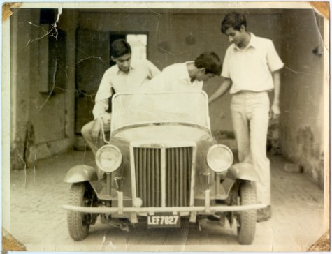
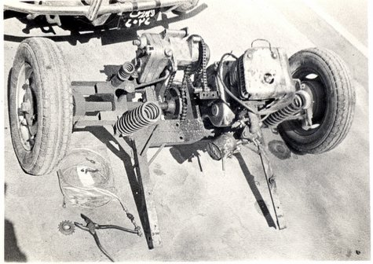
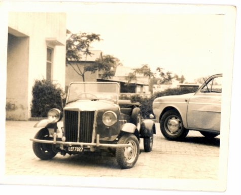
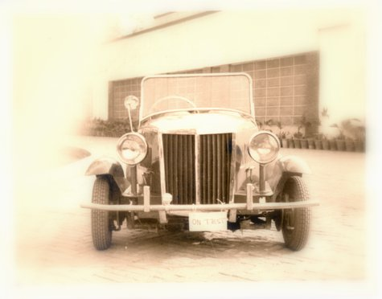
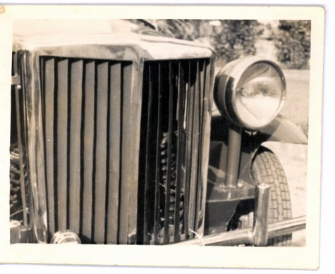
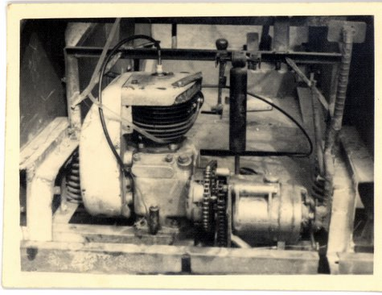

The very first car built & registered in Pakistan.

This is the first car ever made and registered in Pakistan. It was designed and built by Hamid Omar in 1967.

The chassis was built from angle iron left over from transmission tower construction.

Metal body was all hand built.
It had a 200cc rope start pump engine.
The cruising speed was 40 mph.
Lambrettra scooter tyres.
Was in regular daily use for over 10 years.
Was registered with great difficulty in Lahore in 1968. There is a story behind this, told by Hamid Omar:

When I went to get this car registered, they wanted the Bill of Lading, the import documentations like the B/L (bill of lading), country, manufacturer. Since the car was made here, none of these papers were there, and they said that it is no car can be registered without these documents. There was no precedent – so at that time after lots of trips to various govt. offices, Lahore’s DIG Traffic finally agreed to inspect the car. He took a test drive around the block, and then gave the order to have it registered.

I used the car for two years in Lahore and then three years in Karachi. Then Ahmad Omar used it for 3 years, then Taimur Mumtaz used it for a further two years.

Sabiha Omar:

> We would go to movie theatres in this car. This car was very popular, especially amongst the youngsters. It was also ‘illegal’ to built cars back then in Pakistan. Thus the difficulty in registration.

Hamid Omar:

> In IBA, four of us would pile into this car to drive from the hostel to the camp. In those days, IBA used to be outside Karachi, so four us would pile into the car and drive to the city.

Originally the car had a soft top, but then for the rest of its life the top was never used. Only two people could sit inside with the top on, so without the top, an additional two would be sitting on the rear ‘dikki’.

!(big)http://offroadpakistan.com/images/red\_car/scan0017.jpg 388×475!
A closeup of the side of the car as the paint job is being completed.
!(big)http://offroadpakistan.com/images/red\_car/scan0006.jpg 362×475!
Details of the engine, transmission, and the rear suspension of the car.

At the workshop of the mechanic in Lahore where the final engine tuning and other other mechanical work was being done.

!(big)http://offroadpakistan.com/images/red\_car/scan0019.jpg 351×475!

