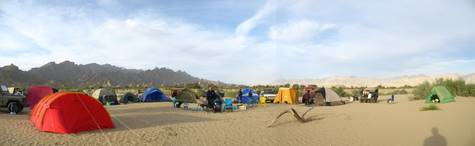

There are camping lists, and then there are camping lists. This is one of those. There is the minimalistic school of thought which believes in grabbing just a shotgun and a wallet and heading off into the bush – but if like us, you get off the city to take a break and enjoy, than it’s nice to have all the essentials (and more!) along.
Keep this in mind – You must take everything you might possibly need from home – there is nothing (except oxygen) available on the way! Be prepared to change tires, dig your 4×4 out from a lot of mud, and other such goodies.
Road trips don’t require much preparation, but 4×4 trips off the beaten track are a different thing altogether. There is no help available off the highway, so the vehicle has to be in good shape and the driver must be well prepared to deal with any eventuality.

### Camping Supplies – Essential

* **Tent:** A good tent is essential, as snakes are (actually not) common where we are camping. Snakes do not chomp through Nylon or netting (even though they can, if they just tried) – so your tent must close up all the way, to seal it from snakes, scorpions, and other such characters.
* **Drinking Water:** You must bring enough drinking water to last all the occupants of your vehicle for all the days you’re out there.
* **Water:** For cleaning up, putting in the radiator, going to the loo, etc.
* **Sleeping bag:** Always good to have a sleeping bag.
* **Torch:** One for each occupant of your vehicle, plus an extra kept in the vehicle.
* **Durrie:** Plastic mat, or some such thing to put on the floor outside your tent, and one inside.
* **Swiss army knife:** Or a separate can opener and a knife.
* **Chocolate/Candy:** Or some other energy bomb. Driving for hours depletes your energy level, so a substance high in calories, salt, sugar and fat is always good.
* **Camp chair:** Nice to have, but a Durrie is a good enough alternative. Stools are also an option. People who persistently steal other ppl’s chairs will be thrown to the crocs. If there are no crocs, then hyenas are plentiful.

#### Camping supplies – Personal

This is stuff which is good to have along:

1. Eyeglasses & spare eyeglasses – if you need them
2. Contact lens
3. Dark glasses – essential! Get powered sunglasses made if u need them.
4. Cap – to keep the sun out. This is Pakistan, the sun plays a large role here!
5. Sun block – or in a couple of hours you will have enough dust on you to act as sunblock. Though you will need one in the northern areas where there isn’t much dust.
6. Shoes
7. Light rain proof jacket – it gets surprisingly cold outdoors, and it can rain anytime – so always have a waterproof jacket handy.
8. Clothes – this can range from just what you have on to a change for each day. At one least one change is necessary for when you fall into a swamp or some such other mishap.
9. Small towel – after swimming and washing up – if there is water around.
10. Personal clothes bag – to keep all the above in!

#### Toiletries

1. Soap
2. Shampoo
3. Hairbrush
4. Hand & body lotion
5. Tooth brush & toothpaste
6. Shaving kit – or you can make like He-Man (or she-woman)
7. The toiletries mostly found in a brown paper bag.

#### Stuff for the vehicle

The [real vehicle list is here](./vehicle_preparations_before_and_after_a_trip.html) – the following are just a few extra items to take along!

1. Flashlight
2. Binoculars
3. Battery cells for all the battery eating stuff you’re taking along
4. Walkie talkies to communicate with each other.
5. Water in disposable bottles for washing -up
6. Tissue paper
7. Two Durrees – to sit on during the many stops along the way, and to put outside your tent.
8. Cleaning cloth
9. Windscreen wiper

#### First Aid Box

This is such an important item it gets it’s own heading!

1. Prescription medicines
2. Panadol Extra – for all around relief and the extra stands for “extra caffeine” which is always a good thing to have.
3. Panadol CF - For those pesky coughs and Flus
4. Anti-Allergy – any [Antihistamine](http://en.wikipedia.org/wiki/Antihistamine)  – this is essential, as you never know
5. [Buscopan](http://en.wikipedia.org/wiki/Butylscopolamine) – or your other favorite stomach medicine.
6. Smecta – a stomach med which you dissolve in water and drink – I like this one.
7. [Flagyl](http://en.wikipedia.org/wiki/Metronidazole) – In 2007 I was going hiking, and the day before we were setting of from Skardu I got food poisoining from overripe fruit – an American hiker recommeded 4 Flagyls – he said it was like an atom bomb for the stomach, and lo and behold it cleared out everything!
8. Antiseptics – like dettol etc.
9. Bandages, sticky plaster and what not
10. A basic first aid manual

There is lot more stuff I am missing out here…

#### Gadgetry

For those moments when *“A rock pile ceases to be a rock pile the moment a single man contemplates it, bearing within him the image of a cathedral.”* – Antoine de St. Exupery

1. Camera
2. Video camera

But beware of concentrating to much on taking photos!
> “A way of certifying experience, taking photographs is also a way of refusing it – by limiting experience to a search for the photogenic, by converting experience into an image, a souvenir. Travel becomes a strategy for accumulating photographs.” -Susan Sontag

#### The Eats i.e Real Food

Everyone has to arrange for his (and their passengers) food. One idea is to get food canned for all the dinners. For the first night, freshly cooked food will last you till the night if kept in an icebox. Beverages and lots of bottled water… enough for everyone in your vehicle. As mentioned before, the nearest hotel or restaurant doesn’t exist, so bring food.
Now a brief introduction to our 4X4 club chef… that’s you. Everyone needs to bring what it takes to prepare his or her own food. You have the option to stay really basic with Chips, canned fruit and Coke, but most of us bring a gas choola (stove) and cooking utensils and not to forget mentioning, stuff to cook! The ‘stuff’ includes eggs, onions, potatoes and other vegetables, ghee (or cooking oil), dry soup packets, tobasco, pepper, salt, butter, cheese, sausages, frozen meat (often pre-cooked), nans/roti, bread/French bread, tea, coffee, milk, sugar, etc. Hunter beef from ‘Hanifia’ (lasts a few days in a cold icebox) is always a good idea to eat on the move. You also need light to cook dinner by, not candles as they may blow out in the wind, so bring a lantern and a good torch that actually works. On the camping trip you will find that the torch is a most useful gadget to have.
A sample food list:
**Breakfast:** Eggs, cheese, jam, French bread (lasts a week or so), tinned food, and so on.
**Lunch:** Bring cooked food for the first days lunch. For the other days, there will be no lunch per so, so keep snacks to eat while on the go. We have late breakfast and early dinner, so no time is left for lunch! A good snack is hunter beef, bread, chips, and so on.
**Dinner:** Canned food, warmed up, soup, noodles, etc. It is possible that we might get hot meals at 1 or 2 camps, in which case the canned food will be save for the chance that we break down in the middle of the desert. My suggestion – keep 2 cans of food for each dinner.

1. Lots of drinking water – at least 2 liters per person per day, and then some extra.
2. Tea/coffee & mugs in a basket or box
3. Pots and pans to cook in, that is if you cook – nothing like fresh food!
4. Plates to eat on – I prefer paper plates, others like steel, as that gives them something to clean…
5. Veggies – onions, potatoes, garlic, ginger, carrots,
6. Meat for the carnivores
7. Rice
8. Flour – to make roti
9. Bread
10. Cheese
11. Milk in tetra packs
12. Soup – wonderful to have around a campfire, especially in the winters

Real food depends on how long you’re going for – if it’s just a day or two, you can put it in a ice box and heat it over a campfire. If you’re going for longer, you can cook the food in advance and get it canned – that’s very convenient – saves the hassle of cooking at camp.

#### Munchies

*Plural noun, Food for snacking.* This is different from real food, which you will find in the list above, or on a farm, the stuff growing on the ground or the 4 legged animals eating it. The Munchies refer to stuff so far removed from the real food chain that it can no longer be called food, and while it’s bad for you a few days won’t kill you, and it tastes good to boot!

1. Juice
2. Cold Drinks – you will need an icebox to provide the cold part of the cold drink.
3. Biscuits/cookies
4. Chips/crisps
5. Chewing gum
6. Chocolates
7. Slims – this is a chili chip available in Karachi – it’s the holy grail of chilli chips, especially since they have no quality control and the recipe is so secret even the slims people have lost it – but once in a blue moon when they hit the right concoction it’s heavenly.
8. Mints – you will need a breath freshener
9. Cigarettes for those aiming to hit the cancer jackpot

Before you head off on a shopping spree based on this list, remember: Be friendly to the environment. Leave behind only footprints, tire tracks and your Swiss army knife – unlike your memories the tracks will fade away and the knife will come in handy for the next passerby.
This is just the personal list, see [the vehicle preparation list as well](./vehicle_preparations_before_and_after_a_trip.html) to stock up on goodies for your vehicle. This is a camping list designed for vehicular camping – if you’re going hiking, see [this list instead](./k2_base_camp_hike_planning.html).